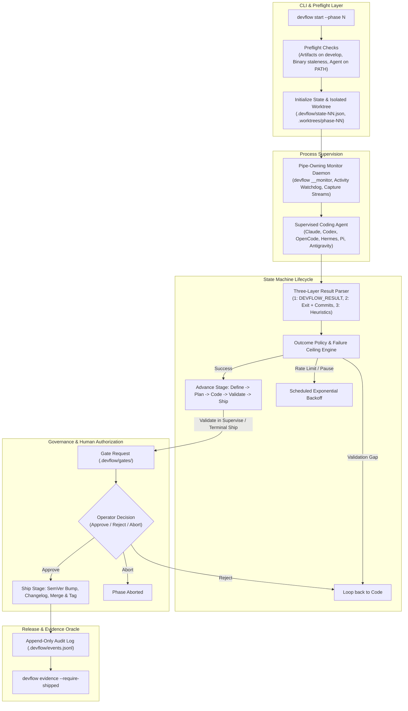

# DevFlow Feature Catalog & Test Audit Matrix

> **Living Document Notice:** This document is maintained as the authoritative, verified catalog of all features, capabilities, operational invariants, and test coverage across the DevFlow repository. It is designed for two purposes: (1) rapid conceptual orientation and audit by operators and AI agents, and (2) systematic regression and coverage auditing as complexity is added to DevFlow. Format is 100% compliant with Python-Markdown and Material for MkDocs.

## 1. Executive Overview & System Architecture

DevFlow is an opinionated development workflow automation system built in Rust. It orchestrates autonomous coding agents through a deterministic, evidence-grounded lifecycle (`Define -> Plan -> Code -> Validate -> Ship`), enforcing Git isolation via worktrees, process supervision via a pipe-owning background daemon, multi-layer result verification, and human gate authorization.

### System Metrics at a Glance

| Dimension | Count / Metric | Description |
| :--- | :--- | :--- |
| **Total Verified Tests** | **1190** | 100% passing across workspace (`cargo test`) |
| **Core Library Unit Tests** | **736** | `devflow-core` in-tree module tests (`src/**/*.rs`) |
| **Core Integration Tests** | **12** | `crates/devflow-core/tests/*.rs` (4 test binaries) |
| **CLI Unit Tests** | **348** | `devflow-cli` in-tree module tests (`src/**/*.rs`) |
| **CLI Integration Tests** | **94** | `crates/devflow-cli/tests/*.rs` (20 test binaries) |
| **Architectural Domains** | **8** | Workflow, Agents, Monitor, Outcomes, Gates, Git, Release, CLI |
| **Supported Agent Drivers** | **6** | Claude Code, OpenAI Codex, OpenCode, Hermes, Pi, Antigravity |
| **Target Crates** | **2** | `devflow-core` (workflow engine), `devflow` (CLI binary) |

### Architectural Pipeline Flow



---

## 2. Hierarchical Feature Catalog & Test Audit Mapping

The catalog below is partitioned into **8 architectural subsystems**. Each subsystem details:
1. **Functional Capabilities & Invariants**: What the feature does, what constraints it enforces, and edge-case behaviors.
2. **Core Source Modules**: The primary Rust source files owning the functionality.
3. **Secondary Test Audit Mapping**: Every single test function in the repository that exercises that subsystem, its target, and what specific behavior or negative control it proves.

### Subsystem Index

| Domain | Focus Area | Subsystem Components | Total Verified Tests |
| :--- | :--- | :--- | :--- |
| [Domain 1: Workflow Engine & State Machine](#domain-1-workflow-engine--state-machine) | Core finite state machine, phase numbering (integers and dec... | 7 components | **173 tests** |
| [Domain 2: Agent Drivers & Execution Contracts](#domain-2-agent-drivers--execution-contracts) | Universal agent adapter abstraction, CLI execution command b... | 8 components | **123 tests** |
| [Domain 3: Process Supervision & Monitor Daemon](#domain-3-process-supervision--monitor-daemon) | Detached monitor process (`devflow __monitor`), streaming st... | 4 components | **46 tests** |
| [Domain 4: Result Parsing & Outcome Decision Engine](#domain-4-result-parsing--outcome-decision-engine) | Three-layer hierarchical result parser, rate limit detection... | 3 components | **273 tests** |
| [Domain 5: Human Gate Coordination & Multi-Root Governance](#domain-5-human-gate-coordination--multi-root-governance) | File-based gate protocol (`.devflow/gates/`), human actions ... | 4 components | **61 tests** |
| [Domain 6: Git Operations & Worktree Isolation Engine](#domain-6-git-operations--worktree-isolation-engine) | GitFlow branching lifecycle, worktree isolation (`.worktrees... | 2 components | **52 tests** |
| [Domain 7: Release Engineering & Ship Automation](#domain-7-release-engineering--ship-automation) | Multi-language SemVer detection and bumping, conventional co... | 4 components | **85 tests** |
| [Domain 8: CLI Commands, Operator Tooling & Preflight](#domain-8-cli-commands,-operator-tooling--preflight) | Top-level command dispatching, preflight readiness checks, b... | 8 components | **377 tests** |

---

## Domain 1: Workflow Engine & State Machine

> **Domain Scope:** Core finite state machine, phase numbering (integers and decimal subphases), stage ordering, execution modes (Auto/Supervise), atomic state persistence, per-phase locking, verification probes, audit events, and crash recovery.

**Verified Test Count:** 173 tests

### Phase Identification & Decimal Subphase Mechanics

**Source Implementation:** `crates/devflow-core/src/phase_id.rs`

#### Core Capabilities & Invariants
- Supports both integer phases (e.g., 1, 35) and decimal subphases (e.g., 999.5).
- Formats integer phases zero-padded (e.g., '01', '07') and decimal phases with explicit minor (e.g., '999.5').
- Ensures decimal subphases never share files, worktree paths, branch names, or locks with integer siblings.
- Implements Display, FromStr, Ord, Eq, and Serde serialization.

#### Verified Test Mapping (19 tests)

| Target Suite | Test Function | Verified Behavior / Invariant |
| :--- | :--- | :--- |
| `devflow-core (lib)` | `phase_id::tests::a_decimal_phase_serializes_as_a_string` | A decimal phase serializes as a string |
| `devflow-core (lib)` | `phase_id::tests::a_phase_does_not_match_its_decimal_sibling` | A phase does not match its decimal sibling |
| `devflow-core (lib)` | `phase_id::tests::an_absent_or_malformed_phase_field_reads_as_none` | An absent or malformed phase field reads as none |
| `devflow-core (lib)` | `phase_id::tests::an_integer_phase_still_serializes_as_a_number` | An integer phase still serializes as a number |
| `devflow-core (lib)` | `phase_id::tests::deserializes_both_persisted_shapes` | Deserializes both persisted shapes |
| `devflow-core (lib)` | `phase_id::tests::display_ignores_width_specifiers` | Display ignores width specifiers |
| `devflow-core (lib)` | `phase_id::tests::display_is_the_unpadded_label` | Display is the unpadded label |
| `devflow-core (lib)` | `phase_id::tests::gsd_computes_the_same_phase_branch_name_when_available` | Gsd computes the same phase branch name when available |
| `devflow-core (lib)` | `phase_id::tests::orders_a_decimal_phase_after_its_major` | Orders a decimal phase after its major |
| `devflow-core (lib)` | `phase_id::tests::padded_is_the_path_form` | Padded is the path form |
| `devflow-core (lib)` | `phase_id::tests::parses_a_decimal_phase` | Parses a decimal phase |
| `devflow-core (lib)` | `phase_id::tests::parses_an_integer_phase` | Parses an integer phase |
| `devflow-core (lib)` | `phase_id::tests::phase_branch_name_matches_the_convention_gsd_computes` | Phase branch name matches the convention gsd computes |
| `devflow-core (lib)` | `phase_id::tests::reads_a_phase_field_in_either_shape` | Reads a phase field in either shape |
| `devflow-core (lib)` | `phase_id::tests::rejects_what_is_not_a_phase_number` | Rejects what is not a phase number |
| `devflow-core (lib)` | `phase_id::tests::round_trips_through_json` | Round trips through json |
| `integration (decimal_phase_paths)` | `a_decimal_phase_never_shares_a_path_with_its_integer_sibling` | A decimal phase never shares a path with its integer sibling |
| `integration (decimal_phase_paths)` | `a_decimal_phase_spells_its_paths_with_the_minor_number` | A decimal phase spells its paths with the minor number |
| `integration (decimal_phase_paths)` | `an_integer_phase_keeps_its_pre_widening_paths` | An integer phase keeps its pre widening paths |

### Stage Lifecycle & State Machine Transitions

**Source Implementation:** `crates/devflow-core/src/stage.rs`

#### Core Capabilities & Invariants
- Defines the strict 5-stage pipeline: Define -> Plan -> Code -> Validate -> Ship.
- Stage transitions are strictly unidirectional forward with loopbacks from Validate/Ship to Code.
- Enforces valid stage ordering and next_stage resolution.
- Parses stages case-insensitively and formats display names.

#### Verified Test Mapping (7 tests)

| Target Suite | Test Function | Verified Behavior / Invariant |
| :--- | :--- | :--- |
| `devflow-core (lib)` | `stage::tests::agent_stages_are_define_plan_code` | Agent stages are define plan code |
| `devflow-core (lib)` | `stage::tests::display_is_lowercase` | Display is lowercase |
| `devflow-core (lib)` | `stage::tests::from_str_round_trips_display_and_rejects_unknown` | From str round trips display and rejects unknown |
| `devflow-core (lib)` | `stage::tests::gate_stages_are_validate_and_ship` | Gate stages are validate and ship |
| `devflow-core (lib)` | `stage::tests::gsd_commands_match_stage` | Gsd commands match stage |
| `devflow-core (lib)` | `stage::tests::next_walks_linear_chain_then_terminates` | Next walks linear chain then terminates |
| `devflow-core (lib)` | `stage::tests::serde_round_trips_each_stage` | Serde round trips each stage |

### Execution Modes & Gating Policies

**Source Implementation:** `crates/devflow-core/src/mode.rs`

#### Core Capabilities & Invariants
- Auto Mode: advances unattended through Define, Plan, Code, and Validate; pauses only at terminal Ship gate (unless --yes-ship is set).
- Supervise Mode: introduces a mandatory human review gate at Validate before advancing.
- Tracks consecutive failure streaks and halts workflow if max failure ceiling (e.g., 5) is exceeded.
- Manages failure loopback decisions and state progression.

#### Verified Test Mapping (15 tests)

| Target Suite | Test Function | Verified Behavior / Invariant |
| :--- | :--- | :--- |
| `devflow-core (lib)` | `mode::tests::auto_does_not_gate_validate_until_failure_threshold` | Auto does not gate validate until failure threshold |
| `devflow-core (lib)` | `mode::tests::auto_loops_validate_supervise_does_not` | Auto loops validate supervise does not |
| `devflow-core (lib)` | `mode::tests::consecutive_reset_fires_on_every_other_transition` | Consecutive reset fires on every other transition |
| `devflow-core (lib)` | `mode::tests::consecutive_reset_skips_the_code_to_validate_hop` | Consecutive reset skips the code to validate hop |
| `devflow-core (lib)` | `mode::tests::display_round_trips_through_from_str` | Display round trips through from str |
| `devflow-core (lib)` | `mode::tests::from_str_accepts_canonical_and_alias` | From str accepts canonical and alias |
| `devflow-core (lib)` | `mode::tests::from_str_rejects_unknown` | From str rejects unknown |
| `devflow-core (lib)` | `mode::tests::made_progress_requires_a_strictly_higher_count` | Made progress requires a strictly higher count |
| `devflow-core (lib)` | `mode::tests::made_progress_treats_no_prior_record_as_progress` | Made progress treats no prior record as progress |
| `devflow-core (lib)` | `mode::tests::non_gate_stages_never_gate` | Non gate stages never gate |
| `devflow-core (lib)` | `mode::tests::phase_failure_ceiling_gates_at_the_ceiling_not_below_it` | Phase failure ceiling gates at the ceiling not below it |
| `devflow-core (lib)` | `mode::tests::phase_failure_ceiling_predicate_agrees_with_should_gate` | Phase failure ceiling predicate agrees with should gate |
| `devflow-core (lib)` | `mode::tests::phase_failure_ceiling_reached_has_the_same_boundary` | Phase failure ceiling reached has the same boundary |
| `devflow-core (lib)` | `mode::tests::ship_always_gates_in_both_modes` | Ship always gates in both modes |
| `devflow-core (lib)` | `mode::tests::supervise_always_gates_validate` | Supervise always gates validate |

### Per-Phase State Persistence & Schema Isolation

**Source Implementation:** `crates/devflow-core/src/state.rs`, `crates/devflow-core/src/workflow.rs`

#### Core Capabilities & Invariants
- Every phase maintains independent state in `.devflow/state-{NN}.json`.
- Writes use atomic temp-file rename to prevent corruption during system crashes.
- State tracks phase, stage, agent kind, mode, worktree path, monitor PID, gate pending flag, and failure budgets.
- Carries forward per-phase Validate failure counts across restarts while resetting per-run counters.
- Automatically scaffolds `.devflow/` with `.gitignore *` protection to prevent committing runtime state.
- Auto-migrates legacy single-state schemas without data loss.

#### Verified Test Mapping (61 tests)

| Target Suite | Test Function | Verified Behavior / Invariant |
| :--- | :--- | :--- |
| `devflow-core (lib)` | `state::tests::agent_from_str_accepts_canonical_and_aliases` | Agent from str accepts canonical and aliases |
| `devflow-core (lib)` | `state::tests::agent_from_str_rejects_unknown` | Agent from str rejects unknown |
| `devflow-core (lib)` | `state::tests::agent_kind_antigravity_display_is_lowercase` | Agent kind antigravity display is lowercase |
| `devflow-core (lib)` | `state::tests::agent_kind_antigravity_driver_for_resolves` | Agent kind antigravity driver for resolves |
| `devflow-core (lib)` | `state::tests::agent_kind_antigravity_error_message_lists_it` | Agent kind antigravity error message lists it |
| `devflow-core (lib)` | `state::tests::agent_kind_antigravity_from_str_is_case_insensitive` | Agent kind antigravity from str is case insensitive |
| `devflow-core (lib)` | `state::tests::agent_kind_antigravity_serde_round_trips_lowercase` | Agent kind antigravity serde round trips lowercase |
| `devflow-core (lib)` | `state::tests::agent_kind_hermes_display_is_lowercase` | Agent kind hermes display is lowercase |
| `devflow-core (lib)` | `state::tests::agent_kind_hermes_driver_for_resolves` | Agent kind hermes driver for resolves |
| `devflow-core (lib)` | `state::tests::agent_kind_hermes_error_message_lists_it` | Agent kind hermes error message lists it |
| `devflow-core (lib)` | `state::tests::agent_kind_hermes_from_str_is_case_insensitive` | Agent kind hermes from str is case insensitive |
| `devflow-core (lib)` | `state::tests::agent_kind_hermes_serde_round_trips_lowercase` | Agent kind hermes serde round trips lowercase |
| `devflow-core (lib)` | `state::tests::agent_name_and_display` | Agent name and display |
| `devflow-core (lib)` | `state::tests::checkpoint_resumes_absent_from_json_defaults_to_zero` | Checkpoint resumes absent from json defaults to zero |
| `devflow-core (lib)` | `state::tests::checkpoint_resumes_round_trips_through_serde` | Checkpoint resumes round trips through serde |
| `devflow-core (lib)` | `state::tests::consecutive_failures_persists_across_advance_calls` | Consecutive failures persists across advance calls |
| `devflow-core (lib)` | `state::tests::infra_failures_absent_from_json_defaults_to_zero` | Infra failures absent from json defaults to zero |
| `devflow-core (lib)` | `state::tests::infra_failures_round_trips_through_serde` | Infra failures round trips through serde |
| `devflow-core (lib)` | `state::tests::last_validate_failure_commit_count_absent_from_json_defaults_to_none` | Last validate failure commit count absent from json defaults to none |
| `devflow-core (lib)` | `state::tests::last_validate_failure_commit_count_round_trips_through_serde` | Last validate failure commit count round trips through serde |
| `devflow-core (lib)` | `state::tests::last_verification_fingerprint_absent_from_json_defaults_to_none` | Last verification fingerprint absent from json defaults to none |
| `devflow-core (lib)` | `state::tests::last_verification_fingerprint_round_trips_through_serde` | Last verification fingerprint round trips through serde |
| `devflow-core (lib)` | `state::tests::monitor_pid_absent_from_json_defaults_to_none` | Monitor pid absent from json defaults to none |
| `devflow-core (lib)` | `state::tests::monitor_pid_round_trips_through_serde` | Monitor pid round trips through serde |
| `devflow-core (lib)` | `state::tests::new_state_starts_at_define` | New state starts at define |
| `devflow-core (lib)` | `state::tests::phase_validate_failures_absent_from_json_defaults_to_zero` | Phase validate failures absent from json defaults to zero |
| `devflow-core (lib)` | `state::tests::phase_validate_failures_round_trips_through_serde` | Phase validate failures round trips through serde |
| `devflow-core (lib)` | `state::tests::preflight_retries_round_trips_through_serde` | Preflight retries round trips through serde |
| `devflow-core (lib)` | `state::tests::session_id_absent_from_json_defaults_to_none` | Session id absent from json defaults to none |
| `devflow-core (lib)` | `state::tests::session_id_round_trips_through_serde` | Session id round trips through serde |
| `devflow-core (lib)` | `state::tests::state_serde_round_trips` | State serde round trips |
| `devflow-core (lib)` | `state::tests::stop_fields_absent_from_json_default` | Stop fields absent from json default |
| `devflow-core (lib)` | `state::tests::stop_fields_round_trip_through_serde` | Stop fields round trip through serde |
| `devflow-core (lib)` | `state::tests::verification_baseline_captured_round_trips_through_serde` | Verification baseline captured round trips through serde |
| `devflow-core (lib)` | `state::tests::verification_run_nonce_absent_from_json_defaults_to_none` | Verification run nonce absent from json defaults to none |
| `devflow-core (lib)` | `state::tests::verification_run_nonce_round_trips_through_serde` | Verification run nonce round trips through serde |
| `devflow-core (lib)` | `state::tests::yes_ship_absent_from_json_defaults_to_false` | Yes ship absent from json defaults to false |
| `devflow-core (lib)` | `state::tests::yes_ship_round_trips_through_serde` | Yes ship round trips through serde |
| `devflow-core (lib)` | `workflow::tests::clear_only_touches_its_own_phase` | Clear only touches its own phase |
| `devflow-core (lib)` | `workflow::tests::clear_removes_state_and_is_idempotent` | Clear removes state and is idempotent |
| `devflow-core (lib)` | `workflow::tests::ensure_devflow_dir_concurrent_calls_both_succeed` | Ensure devflow dir concurrent calls both succeed |
| `devflow-core (lib)` | `workflow::tests::ensure_devflow_dir_is_idempotent_and_preserves_existing_gitignore` | Ensure devflow dir is idempotent and preserves existing gitignore |
| `devflow-core (lib)` | `workflow::tests::ensure_devflow_dir_on_nested_subpath_marks_the_devflow_ancestor` | Ensure devflow dir on nested subpath marks the devflow ancestor |
| `devflow-core (lib)` | `workflow::tests::ensure_devflow_dir_on_relative_devflow_leaf_path_marks_it` | Ensure devflow dir on relative devflow leaf path marks it |
| `devflow-core (lib)` | `workflow::tests::ensure_devflow_dir_preserves_foreign_gitignore_content` | Ensure devflow dir preserves foreign gitignore content |
| `devflow-core (lib)` | `workflow::tests::ensure_devflow_dir_without_a_devflow_ancestor_only_creates_dirs` | Ensure devflow dir without a devflow ancestor only creates dirs |
| `devflow-core (lib)` | `workflow::tests::ensure_devflow_dir_writes_star_gitignore` | Ensure devflow dir writes star gitignore |
| `devflow-core (lib)` | `workflow::tests::legacy_migration_never_overwrites_existing_per_phase_state` | Legacy migration never overwrites existing per phase state |
| `devflow-core (lib)` | `workflow::tests::legacy_state_json_migrates_on_list` | Legacy state json migrates on list |
| `devflow-core (lib)` | `workflow::tests::legacy_state_json_migrates_on_load` | Legacy state json migrates on load |
| `devflow-core (lib)` | `workflow::tests::list_states_empty_when_no_devflow_dir` | List states empty when no devflow dir |
| `devflow-core (lib)` | `workflow::tests::list_states_enumerates_sorted_by_phase` | List states enumerates sorted by phase |
| `devflow-core (lib)` | `workflow::tests::list_states_skips_corrupt_files` | List states skips corrupt files |
| `devflow-core (lib)` | `workflow::tests::load_missing_state_errors` | Load missing state errors |
| `devflow-core (lib)` | `workflow::tests::migrate_legacy_state_warning_names_recovery_command` | Migrate legacy state warning names recovery command |
| `devflow-core (lib)` | `workflow::tests::paths_are_per_phase_under_devflow_dir` | Paths are per phase under devflow dir |
| `devflow-core (lib)` | `workflow::tests::save_state_writes_atomically_and_leaves_no_temp` | Save state writes atomically and leaves no temp |
| `devflow-core (lib)` | `workflow::tests::save_then_load_round_trips` | Save then load round trips |
| `devflow-core (lib)` | `workflow::tests::two_phases_states_coexist_without_clobbering` | Two phases states coexist without clobbering |
| `integration (devflow_dir_gitignore)` | `all_seven_devflow_constructors_produce_the_gitignore` | All seven devflow constructors produce the gitignore |
| `integration (devflow_dir_gitignore)` | `git_add_all_no_longer_sweeps_devflow_into_a_commit` | Git add all no longer sweeps devflow into a commit |

### Process Locking & Mutual Exclusion

**Source Implementation:** `crates/devflow-core/src/lock.rs`

#### Core Capabilities & Invariants
- Enforces per-phase concurrency lock (`.devflow/lock-{NN}`) to prevent duplicate agents.
- Provides project-wide lock (`.devflow/checkout.lock`) serializing critical Git operations.
- Detects stale locks by verifying PID liveliness in the OS process table via libc.
- Acquires locks with bounded timeout; releases safely via RAII LockGuard.

#### Verified Test Mapping (15 tests)

| Target Suite | Test Function | Verified Behavior / Invariant |
| :--- | :--- | :--- |
| `devflow-core (lib)` | `lock::tests::acquire_creates_devflow_directory_when_absent` | Acquire creates devflow directory when absent |
| `devflow-core (lib)` | `lock::tests::acquire_creates_lock_and_records_pid` | Acquire creates lock and records pid |
| `devflow-core (lib)` | `lock::tests::acquire_reclaims_lock_from_dead_holder` | Acquire reclaims lock from dead holder |
| `devflow-core (lib)` | `lock::tests::acquire_reclaims_lock_with_corrupt_pid` | Acquire reclaims lock with corrupt pid |
| `devflow-core (lib)` | `lock::tests::acquire_reclaims_lock_with_pid_zero` | Acquire reclaims lock with pid zero |
| `devflow-core (lib)` | `lock::tests::different_phases_do_not_contend` | Different phases do not contend |
| `devflow-core (lib)` | `lock::tests::dropping_guard_releases_lock` | Dropping guard releases lock |
| `devflow-core (lib)` | `lock::tests::holder_cleans_up_empty_lock_file` | Holder cleans up empty lock file |
| `devflow-core (lib)` | `lock::tests::holder_is_none_without_lock_file` | Holder is none without lock file |
| `devflow-core (lib)` | `lock::tests::project_lock_blocking_times_out_against_live_holder` | Project lock blocking times out against live holder |
| `devflow-core (lib)` | `lock::tests::project_lock_blocking_waits_for_release` | Project lock blocking waits for release |
| `devflow-core (lib)` | `lock::tests::project_lock_contends_with_itself` | Project lock contends with itself |
| `devflow-core (lib)` | `lock::tests::project_lock_is_independent_of_phase_locks` | Project lock is independent of phase locks |
| `devflow-core (lib)` | `lock::tests::remove_stale_locks_keeps_live_holder_and_sweeps_dead` | Remove stale locks keeps live holder and sweeps dead |
| `devflow-core (lib)` | `lock::tests::second_acquire_is_contended` | Second acquire is contended |

### Plan Verification Probes & Human Checkpoints

**Source Implementation:** `crates/devflow-core/src/verify.rs`

#### Core Capabilities & Invariants
- Parses Layer 0 `external_verify` commands from plan frontmatter.
- Executes verification probes hermetically from project root before accepting stage completion.
- Detects `human_only_checkpoint` attributes in plans to halt unattended execution for physical verification.

#### Verified Test Mapping (19 tests)

| Target Suite | Test Function | Verified Behavior / Invariant |
| :--- | :--- | :--- |
| `devflow-core (lib)` | `verify::tests::approval_parser_accepts_only_nonempty_json_command_arrays` | Approval parser accepts only nonempty json command arrays |
| `devflow-core (lib)` | `verify::tests::human_only_checkpoint_detects_the_gate_marker_on_a_task_tag` | Human only checkpoint detects the gate marker on a task tag |
| `devflow-core (lib)` | `verify::tests::human_only_checkpoint_detects_the_human_action_type_on_a_task_tag` | Human only checkpoint detects the human action type on a task tag |
| `devflow-core (lib)` | `verify::tests::human_only_checkpoint_ignores_a_marker_mentioned_only_in_prose` | Human only checkpoint ignores a marker mentioned only in prose |
| `devflow-core (lib)` | `verify::tests::human_only_checkpoint_ignores_an_ordinary_blocking_gate` | Human only checkpoint ignores an ordinary blocking gate |
| `devflow-core (lib)` | `verify::tests::human_only_checkpoint_is_false_for_a_phase_with_no_plans` | Human only checkpoint is false for a phase with no plans |
| `devflow-core (lib)` | `verify::tests::human_only_checkpoint_still_matches_a_task_tag_inside_a_fenced_example` | Human only checkpoint still matches a task tag inside a fenced example |
| `devflow-core (lib)` | `verify::tests::ignores_empty_external_verify_commands` | Ignores empty external verify commands |
| `devflow-core (lib)` | `verify::tests::ignores_external_verify_outside_frontmatter` | Ignores external verify outside frontmatter |
| `devflow-core (lib)` | `verify::tests::phase_has_blocking_human_checkpoint_detects_declared_gate` | Phase has blocking human checkpoint detects declared gate |
| `devflow-core (lib)` | `verify::tests::phase_has_blocking_human_checkpoint_false_for_missing_phase_directory` | Phase has blocking human checkpoint false for missing phase directory |
| `devflow-core (lib)` | `verify::tests::phase_has_blocking_human_checkpoint_false_for_plain_blocking_gate` | Phase has blocking human checkpoint false for plain blocking gate |
| `devflow-core (lib)` | `verify::tests::phase_has_blocking_human_checkpoint_false_when_no_gate_attribute` | Phase has blocking human checkpoint false when no gate attribute |
| `devflow-core (lib)` | `verify::tests::phase_has_blocking_human_checkpoint_ignores_non_plan_files` | Phase has blocking human checkpoint ignores non plan files |
| `devflow-core (lib)` | `verify::tests::phase_has_blocking_human_checkpoint_reads_the_execution_root_in_worktree_mode` | Phase has blocking human checkpoint reads the execution root in worktree mode |
| `devflow-core (lib)` | `verify::tests::phase_has_blocking_human_checkpoint_still_reads_the_project_root_without_a_worktree` | Phase has blocking human checkpoint still reads the project root without a worktree |
| `devflow-core (lib)` | `verify::tests::phase_has_blocking_human_checkpoint_true_when_only_second_plan_carries_attribute` | Phase has blocking human checkpoint true when only second plan carries attribute |
| `devflow-core (lib)` | `verify::tests::reads_external_verify_only_from_plan_frontmatter` | Reads external verify only from plan frontmatter |
| `devflow-core (lib)` | `verify::tests::runs_probe_from_project_root_and_reports_exit_status` | Runs probe from project root and reports exit status |

### Audit Trail Events, History & State Recovery

**Source Implementation:** `crates/devflow-core/src/events.rs`, `crates/devflow-core/src/history.rs`, `crates/devflow-core/src/recover.rs`, `crates/devflow-core/src/canary.rs`

#### Core Capabilities & Invariants
- Appends structured events (`step_entered`, `step_exited`, `gate_created`, `gate_answered`) to `.devflow/events.jsonl`.
- Aggregates chronological timeline across state, events, and retained attempt artifacts.
- Provides recovery routines to sweep abandoned locks and clean stale state files.
- Canary probes verify pipeline execution readiness.

#### Verified Test Mapping (37 tests)

| Target Suite | Test Function | Verified Behavior / Invariant |
| :--- | :--- | :--- |
| `devflow-core (lib)` | `events::tests::describe_prefers_detail_fields` | Describe prefers detail fields |
| `devflow-core (lib)` | `events::tests::emit_appends_parseable_lines_with_envelope_fields` | Emit appends parseable lines with envelope fields |
| `devflow-core (lib)` | `events::tests::emit_is_fail_soft_on_unwritable_path` | Emit is fail soft on unwritable path |
| `devflow-core (lib)` | `events::tests::emit_never_lets_payload_forge_envelope_keys` | Emit never lets payload forge envelope keys |
| `devflow-core (lib)` | `events::tests::last_event_for_phase_filters_by_phase` | Last event for phase filters by phase |
| `devflow-core (lib)` | `events::tests::last_event_of_kind_for_phase_filters_by_phase_and_event_name` | Last event of kind for phase filters by phase and event name |
| `devflow-core (lib)` | `events::tests::last_event_of_kind_for_phase_skips_corrupt_lines` | Last event of kind for phase skips corrupt lines |
| `devflow-core (lib)` | `events::tests::last_event_skips_corrupt_lines` | Last event skips corrupt lines |
| `devflow-core (lib)` | `events::tests::last_events_by_phase_collects_latest_per_phase_in_one_pass` | Last events by phase collects latest per phase in one pass |
| `devflow-core (lib)` | `events::tests::last_events_by_phase_tracks_newest_stage_launched_ts_across_the_pass` | Last events by phase tracks newest stage launched ts across the pass |
| `devflow-core (lib)` | `history::tests::empty_phase_has_clean_no_attempts_result` | Empty phase has clean no attempts result |
| `devflow-core (lib)` | `history::tests::orphaned_capture_and_review_artifacts_remain_visible` | Orphaned capture and review artifacts remain visible |
| `devflow-core (lib)` | `history::tests::timeline_orders_events_and_correlates_retained_captures` | Timeline orders events and correlates retained captures |
| `devflow-core (lib)` | `recover::tests::clean_clears_stale_phase_state` | Clean clears stale phase state |
| `devflow-core (lib)` | `recover::tests::clean_keeps_fresh_phase` | Clean keeps fresh phase |
| `devflow-core (lib)` | `recover::tests::clean_keeps_phase_with_live_agent` | Clean keeps phase with live agent |
| `devflow-core (lib)` | `recover::tests::clean_phase_clears_only_the_named_phase` | Clean phase clears only the named phase |
| `devflow-core (lib)` | `recover::tests::clean_phase_deletes_only_the_named_phase_cron_record` | Clean phase deletes only the named phase cron record |
| `devflow-core (lib)` | `recover::tests::clean_removes_corrupt_legacy_state_json` | Clean removes corrupt legacy state json |
| `devflow-core (lib)` | `recover::tests::clean_still_deletes_unconsumed_cron_instructions` | Clean still deletes unconsumed cron instructions |
| `devflow-core (lib)` | `recover::tests::format_age_buckets_by_magnitude` | Format age buckets by magnitude |
| `devflow-core (lib)` | `recover::tests::fresh_state_is_not_stale` | Fresh state is not stale |
| `devflow-core (lib)` | `recover::tests::inspect_all_enumerates_every_active_phase` | Inspect all enumerates every active phase |
| `devflow-core (lib)` | `recover::tests::inspect_all_missing_state_reports_nothing_to_recover` | Inspect all missing state reports nothing to recover |
| `devflow-core (lib)` | `recover::tests::old_state_with_dead_agent_is_stale` | Old state with dead agent is stale |
| `devflow-core (lib)` | `recover::tests::old_state_with_live_agent_is_not_stale` | Old state with live agent is not stale |
| `devflow-core (lib)` | `recover::tests::old_state_with_no_agent_is_stale` | Old state with no agent is stale |
| `devflow-core (lib)` | `recover::tests::state_age_secs_parses_epoch` | State age secs parses epoch |
| `devflow-core (lib)` | `recover::tests::unparseable_timestamp_is_never_stale` | Unparseable timestamp is never stale |
| `devflow-core (lib)` | `canary::tests::canary_absent_when_token_appears_only_as_a_prompt_echo` | Canary absent when token appears only as a prompt echo |
| `devflow-core (lib)` | `canary::tests::canary_absent_when_token_appears_only_in_a_non_top_level_event` | Canary absent when token appears only in a non top level event |
| `devflow-core (lib)` | `canary::tests::canary_antigravity_absent_when_token_only_in_echoed_user_event` | Canary antigravity absent when token only in echoed user event |
| `devflow-core (lib)` | `canary::tests::canary_antigravity_confirmed_when_token_returns_in_event_result_response` | Canary antigravity confirmed when token returns in event result response |
| `devflow-core (lib)` | `canary::tests::canary_antigravity_trust_predicate_does_not_cross_schemas` | Canary antigravity trust predicate does not cross schemas |
| `devflow-core (lib)` | `canary::tests::canary_confirmed_when_token_returns_in_a_top_level_result` | Canary confirmed when token returns in a top level result |
| `devflow-core (lib)` | `canary::tests::canary_unverified_when_the_launcher_fails` | Canary unverified when the launcher fails |
| `devflow-core (lib)` | `canary::tests::declared_tokens_differ_between_runs` | Declared tokens differ between runs |

## Domain 2: Agent Drivers & Execution Contracts

> **Domain Scope:** Universal agent adapter abstraction, CLI execution command builders, dual transport protocols (pipe-owning stream-json vs legacy single-document), prompt generation, and GSD completion contracts.

**Verified Test Count:** 123 tests

### Universal Agent Adapter Interface & Registry

**Source Implementation:** `crates/devflow-core/src/agent.rs`, `crates/devflow-core/src/agents/mod.rs`

#### Core Capabilities & Invariants
- Defines `AgentAdapter` trait for command formatting, sandbox paths, and completion signal detection.
- Resolves adapters dynamically via `adapter_for(AgentKind)`.
- Supports AgentKind enum: Claude, Codex, OpenCode, Hermes, Pi, Antigravity.

#### Verified Test Mapping (37 tests)

| Target Suite | Test Function | Verified Behavior / Invariant |
| :--- | :--- | :--- |
| `devflow-core (lib)` | `agent::tests::agent_running_detects_self` | Agent running detects self |
| `devflow-core (lib)` | `agent::tests::agent_running_false_for_dead_pid` | Agent running false for dead pid |
| `devflow-core (lib)` | `agent::tests::agent_running_is_false_for_an_unreaped_zombie` | Agent running is false for an unreaped zombie |
| `devflow-core (lib)` | `agent::tests::agent_running_rejects_corrupt_pid_values` | Agent running rejects corrupt pid values |
| `devflow-core (lib)` | `agent::tests::discover_stray_devflow_processes_excludes_an_unrelated_process` | Discover stray devflow processes excludes an unrelated process |
| `devflow-core (lib)` | `agent::tests::discover_stray_devflow_processes_finds_a_monitor_wrapper` | Discover stray devflow processes finds a monitor wrapper |
| `devflow-core (lib)` | `agent::tests::discover_stray_devflow_processes_rejects_devflow_named_argv0_with_wrong_argv1` | Discover stray devflow processes rejects devflow named argv0 with wrong argv1 |
| `devflow-core (lib)` | `agent::tests::discover_stray_devflow_processes_rejects_the_999_47_false_positive_shape` | Discover stray devflow processes rejects the 999 47 false positive shape |
| `devflow-core (lib)` | `agent::tests::looks_like_devflow_process_is_false_for_a_non_devflow_process` | Looks like devflow process is false for a non devflow process |
| `devflow-core (lib)` | `agent::tests::looks_like_devflow_process_is_false_when_proc_cannot_be_read` | Looks like devflow process is false when proc cannot be read |
| `devflow-core (lib)` | `agent::tests::looks_like_devflow_process_is_true_for_the_current_process` | Looks like devflow process is true for the current process |
| `devflow-core (lib)` | `agent::tests::process_age_is_below_the_floor_for_a_fresh_child_and_grows_monotonically_for_self` | Process age is below the floor for a fresh child and grows monotonically for self |
| `devflow-core (lib)` | `agent::tests::process_age_returns_none_for_a_dead_pid` | Process age returns none for a dead pid |
| `devflow-core (lib)` | `agent::tests::process_age_returns_some_for_the_current_process` | Process age returns some for the current process |
| `devflow-core (lib)` | `agent::tests::terminate_and_verify_clears_a_normal_child_before_the_wait_elapses` | Terminate and verify clears a normal child before the wait elapses |
| `devflow-core (lib)` | `agent::tests::terminate_and_verify_escalates_to_kill_for_a_term_ignoring_child` | Terminate and verify escalates to kill for a term ignoring child |
| `devflow-core (lib)` | `agent::tests::terminate_and_verify_rejects_pid_zero_and_out_of_range_without_signalling` | Terminate and verify rejects pid zero and out of range without signalling |
| `devflow-core (lib)` | `agent::tests::terminate_and_verify_returns_true_immediately_for_a_dead_pid` | Terminate and verify returns true immediately for a dead pid |
| `devflow-core (lib)` | `agent::tests::terminate_rejects_pid_above_i32_max` | Terminate rejects pid above i32 max |
| `devflow-core (lib)` | `agent::tests::terminate_rejects_pid_zero` | Terminate rejects pid zero |
| `devflow-core (lib)` | `agent::tests::terminate_signals_a_live_child_and_it_exits` | Terminate signals a live child and it exits |
| `devflow-core (lib)` | `agents::tests::antigravity_conformance_enrollment` | Antigravity conformance enrollment |
| `devflow-core (lib)` | `agents::tests::claude_and_opencode_stay_identical_but_codex_renders_native` | Claude and opencode stay identical but codex renders native |
| `devflow-core (lib)` | `agents::tests::claude_launches_headless_stream_json_without_positional_prompt` | Claude launches headless stream json without positional prompt |
| `devflow-core (lib)` | `agents::tests::codex_and_pi_drivers_reproduce_legacy_behavior` | Codex and pi drivers reproduce legacy behavior |
| `devflow-core (lib)` | `agents::tests::codex_define_and_plan_require_an_existing_artifact` | Codex define and plan require an existing artifact |
| `devflow-core (lib)` | `agents::tests::codex_disables_signing_via_env_others_do_not` | Codex disables signing via env others do not |
| `devflow-core (lib)` | `agents::tests::codex_grants_writable_roots_for_worktree_git_metadata` | Codex grants writable roots for worktree git metadata |
| `devflow-core (lib)` | `agents::tests::codex_wraps_prompt_in_exec_and_json` | Codex wraps prompt in exec and json |
| `devflow-core (lib)` | `agents::tests::conformance_suite_fails_a_broken_driver` | Conformance suite fails a broken driver |
| `devflow-core (lib)` | `agents::tests::default_preflight_is_ok_for_built_in_adapters` | Default preflight is ok for built in adapters |
| `devflow-core (lib)` | `agents::tests::driver_for_returns_correct_names` | Driver for returns correct names |
| `devflow-core (lib)` | `agents::tests::drivers_reproduce_legacy_adapter_behavior` | Drivers reproduce legacy adapter behavior |
| `devflow-core (lib)` | `agents::tests::every_driver_passes_the_conformance_suite` | Every driver passes the conformance suite |
| `devflow-core (lib)` | `agents::tests::hermes_conformance_enrollment` | Hermes conformance enrollment |
| `devflow-core (lib)` | `agents::tests::opencode_wraps_prompt_in_run` | Opencode wraps prompt in run |
| `devflow-core (lib)` | `agents::tests::workflow_render_preserves_stage_contracts` | Workflow render preserves stage contracts |

### Claude Code Driver & Dual Transport

**Source Implementation:** `crates/devflow-core/src/agents/claude.rs`

#### Core Capabilities & Invariants
- Default Transport: Pipe-owning monitor supervising `claude --output-format json` with interactive stream-json handling.
- Prompt Delivery: Passes stage prompt via file to avoid OS argv length limits.
- Legacy Launch Fallback: Supports `--legacy-claude-launch` / `DEVFLOW_CLAUDE_LEGACY_LAUNCH` positional prompt invocation with warning audit.

#### Verified Test Mapping (7 tests)

| Target Suite | Test Function | Verified Behavior / Invariant |
| :--- | :--- | :--- |
| `devflow-core (lib)` | `agents::claude::tests::exec_command_carries_no_positional_prompt` | Exec command carries no positional prompt |
| `devflow-core (lib)` | `agents::claude::tests::exec_command_uses_stream_json_on_both_input_and_output` | Exec command uses stream json on both input and output |
| `devflow-core (lib)` | `agents::claude::tests::resume_command_carries_print_flag_and_instruction` | Resume command carries print flag and instruction |
| `devflow-core (lib)` | `agents::claude::tests::resume_command_includes_permission_bypass` | Resume command includes permission bypass |
| `devflow-core (lib)` | `agents::claude::tests::resume_command_names_claude_program` | Resume command names claude program |
| `devflow-core (lib)` | `agents::claude::tests::resume_command_resume_flag_immediately_precedes_session_id` | Resume command resume flag immediately precedes session id |
| `devflow-core (lib)` | `agents::claude::tests::single_document_command_preserves_pre31_shape` | Single document command preserves pre31 shape |

### OpenAI Codex Driver

**Source Implementation:** `crates/devflow-core/src/agents/codex.rs`

#### Core Capabilities & Invariants
- Executes via `codex exec` non-interactive CLI.
- Isolates execution to phase worktree checkout.
- Enforces context and environment constraints.

#### Verified Test Mapping (3 tests)

| Target Suite | Test Function | Verified Behavior / Invariant |
| :--- | :--- | :--- |
| `devflow-core (lib)` | `agents::codex::tests::codex_writable_roots_escape_del` | Codex writable roots escape del |
| `devflow-core (lib)` | `agents::codex::tests::codex_writable_roots_escape_hostile_paths` | Codex writable roots escape hostile paths |
| `devflow-core (lib)` | `agents::codex::tests::codex_writable_roots_refuses_non_utf8_paths` | Codex writable roots refuses non utf8 paths |

### OpenCode Driver

**Source Implementation:** `crates/devflow-core/src/agents/opencode.rs`

#### Core Capabilities & Invariants
- Translates DevFlow prompts into OpenCode format.
- Supervises subprocess execution and parses structured output stream.

#### Verified Test Mapping (24 tests)

| Target Suite | Test Function | Verified Behavior / Invariant |
| :--- | :--- | :--- |
| `devflow-core (lib)` | `agents::opencode::tests::agent_list_baseline_reports_no_subagent` | Agent list baseline reports no subagent |
| `devflow-core (lib)` | `agents::opencode::tests::agent_list_ignores_marker_text_inside_json_dump_line` | Agent list ignores marker text inside json dump line |
| `devflow-core (lib)` | `agents::opencode::tests::agent_list_ignores_prose_line_ending_in_the_literal_marker_text` | Agent list ignores prose line ending in the literal marker text |
| `devflow-core (lib)` | `agents::opencode::tests::agent_list_with_all_mode_reports_true` | Agent list with all mode reports true |
| `devflow-core (lib)` | `agents::opencode::tests::agent_list_with_subagent_mode_reports_true` | Agent list with subagent mode reports true |
| `devflow-core (lib)` | `agents::opencode::tests::capabilities_never_refuses_a_launch` | Capabilities never refuses a launch |
| `devflow-core (lib)` | `agents::opencode::tests::health_error_leaks_no_provider_detail` | Health error leaks no provider detail |
| `devflow-core (lib)` | `agents::opencode::tests::health_fails_closed_on_a_hung_probe` | Health fails closed on a hung probe |
| `devflow-core (lib)` | `agents::opencode::tests::health_probe_argv_is_providers_list` | Health probe argv is providers list |
| `devflow-core (lib)` | `agents::opencode::tests::preflight_accepts_configured_credentials` | Preflight accepts configured credentials |
| `devflow-core (lib)` | `agents::opencode::tests::preflight_rejects_constructed_zero_credential_output` | Preflight rejects constructed zero credential output |
| `devflow-core (lib)` | `agents::opencode::tests::preflight_rejects_nonzero_exit_with_credential_bearing_stdout` | Preflight rejects nonzero exit with credential bearing stdout |
| `devflow-core (lib)` | `agents::opencode::tests::preflight_rejects_when_probe_cannot_run` | Preflight rejects when probe cannot run |
| `devflow-core (lib)` | `agents::opencode::tests::provider_count_ignores_bullet_provider_lines` | Provider count ignores bullet provider lines |
| `devflow-core (lib)` | `agents::opencode::tests::provider_count_ignores_unanchored_matching_substring` | Provider count ignores unanchored matching substring |
| `devflow-core (lib)` | `agents::opencode::tests::provider_count_is_zero_for_constructed_credentialless_output` | Provider count is zero for constructed credentialless output |
| `devflow-core (lib)` | `agents::opencode::tests::provider_count_sums_credentials_and_environment` | Provider count sums credentials and environment |
| `devflow-core (lib)` | `agents::opencode::tests::spawn_with_timeout_kills_a_hung_child` | Spawn with timeout kills a hung child |
| `devflow-core (lib)` | `agents::opencode::tests::strip_ansi_escapes_preserves_content_after_an_unterminated_sequence` | Strip ansi escapes preserves content after an unterminated sequence |
| `devflow-core (lib)` | `agents::opencode::tests::strip_ansi_escapes_removes_sgr_and_preserves_box_glyphs` | Strip ansi escapes removes sgr and preserves box glyphs |
| `devflow-core (lib)` | `agents::opencode::tests::strip_ansi_escapes_terminates_on_non_sgr_csi_sequence` | Strip ansi escapes terminates on non sgr csi sequence |
| `devflow-core (lib)` | `agents::opencode::tests::subagent_probe_fails_closed_on_empty_output` | Subagent probe fails closed on empty output |
| `devflow-core (lib)` | `agents::opencode::tests::subagent_probe_fails_closed_on_nonzero_exit` | Subagent probe fails closed on nonzero exit |
| `devflow-core (lib)` | `agents::opencode::tests::subagent_probe_fails_closed_on_spawn_error` | Subagent probe fails closed on spawn error |

### Hermes Driver

**Source Implementation:** `crates/devflow-core/src/agents/hermes.rs`

#### Core Capabilities & Invariants
- Formats headless execution commands for Hermes agent.
- Detects hung processes and enforces non-zero exit validation.

#### Verified Test Mapping (9 tests)

| Target Suite | Test Function | Verified Behavior / Invariant |
| :--- | :--- | :--- |
| `devflow-core (lib)` | `agents::hermes::tests::hermes_driver_build_command` | Hermes driver build command |
| `devflow-core (lib)` | `agents::hermes::tests::hermes_driver_environment` | Hermes driver environment |
| `devflow-core (lib)` | `agents::hermes::tests::hermes_driver_name` | Hermes driver name |
| `devflow-core (lib)` | `agents::hermes::tests::hermes_driver_render_prompt` | Hermes driver render prompt |
| `devflow-core (lib)` | `agents::hermes::tests::hermes_subagent_dispatch_with_mock` | Hermes subagent dispatch with mock |
| `devflow-core (lib)` | `agents::hermes::tests::parse_hermes_tools_list_delegation_disabled` | Parse hermes tools list delegation disabled |
| `devflow-core (lib)` | `agents::hermes::tests::parse_hermes_tools_list_delegation_enabled` | Parse hermes tools list delegation enabled |
| `devflow-core (lib)` | `agents::hermes::tests::parse_hermes_tools_list_disabled_delegation_with_enabled_word` | Parse hermes tools list disabled delegation with enabled word |
| `devflow-core (lib)` | `agents::hermes::tests::parse_hermes_tools_list_missing_delegation` | Parse hermes tools list missing delegation |

### Pi Driver

**Source Implementation:** `crates/devflow-core/src/agents/pi.rs`

#### Core Capabilities & Invariants
- Builds non-interactive execution command for Pi agent.
- Enforces marker detection and process lifecycle supervision.

#### Verified Test Mapping (13 tests)

| Target Suite | Test Function | Verified Behavior / Invariant |
| :--- | :--- | :--- |
| `devflow-core (lib)` | `agents::pi::tests::classify_auth_check_accepts_ready` | Classify auth check accepts ready |
| `devflow-core (lib)` | `agents::pi::tests::classify_auth_check_rejects_not_ready` | Classify auth check rejects not ready |
| `devflow-core (lib)` | `agents::pi::tests::classify_auth_check_rejects_ready_text_with_failed_exit` | Classify auth check rejects ready text with failed exit |
| `devflow-core (lib)` | `agents::pi::tests::classify_auth_check_tolerates_formatted_json` | Classify auth check tolerates formatted json |
| `devflow-core (lib)` | `agents::pi::tests::exec_command_shape` | Exec command shape |
| `devflow-core (lib)` | `agents::pi::tests::pi_capabilities_detect_subagent_dispatch` | Pi capabilities detect subagent dispatch |
| `devflow-core (lib)` | `agents::pi::tests::pi_capabilities_exclude_unvetted_subagent_packages` | Pi capabilities exclude unvetted subagent packages |
| `devflow-core (lib)` | `agents::pi::tests::pi_capabilities_fail_closed_when_no_subagent` | Pi capabilities fail closed when no subagent |
| `devflow-core (lib)` | `agents::pi::tests::pi_capabilities_fail_closed_when_probe_fails` | Pi capabilities fail closed when probe fails |
| `devflow-core (lib)` | `agents::pi::tests::preflight_falls_back_to_google_when_no_default_provider` | Preflight falls back to google when no default provider |
| `devflow-core (lib)` | `agents::pi::tests::preflight_invokes_pi_auth_check_and_accepts_ready` | Preflight invokes pi auth check and accepts ready |
| `devflow-core (lib)` | `agents::pi::tests::preflight_rejects_ready_body_with_failed_exit` | Preflight rejects ready body with failed exit |
| `devflow-core (lib)` | `agents::pi::tests::preflight_reports_credentialless_when_auth_check_says_not_ready` | Preflight reports credentialless when auth check says not ready |

### Google Antigravity Driver

**Source Implementation:** `crates/devflow-core/src/agents/antigravity.rs`

#### Core Capabilities & Invariants
- Integrates Google Antigravity (`agy`) CLI.
- Serializes and deserializes `antigravity` in lowercase across CLI, config, and state.
- Validates presence via `devflow doctor` and parses JSON results from stdout stream.

#### Verified Test Mapping (12 tests)

| Target Suite | Test Function | Verified Behavior / Invariant |
| :--- | :--- | :--- |
| `devflow-core (lib)` | `agents::antigravity::tests::antigravity_driver_build_command_is_exact` | Antigravity driver build command is exact |
| `devflow-core (lib)` | `agents::antigravity::tests::antigravity_driver_name_is_correct` | Antigravity driver name is correct |
| `devflow-core (lib)` | `agents::antigravity::tests::antigravity_driver_parse_completion_delegates` | Antigravity driver parse completion delegates |
| `devflow-core (lib)` | `agents::antigravity::tests::antigravity_driver_render_prompt_delegates_to_claude_style` | Antigravity driver render prompt delegates to claude style |
| `devflow-core (lib)` | `agents::antigravity::tests::antigravity_driver_spawn_argv_smoke` | Antigravity driver spawn argv smoke |
| `integration (agent_kind_antigravity)` | `antigravity_displays_lowercase_for_the_cli` | Antigravity displays lowercase for the cli |
| `integration (agent_kind_antigravity)` | `antigravity_driver_for_returns_the_driver` | Antigravity driver for returns the driver |
| `integration (agent_kind_antigravity)` | `antigravity_parse_error_names_it` | Antigravity parse error names it |
| `integration (agent_kind_antigravity)` | `antigravity_parses_from_the_operator_string` | Antigravity parses from the operator string |
| `integration (agent_kind_antigravity)` | `antigravity_serde_round_trips_through_lowercase` | Antigravity serde round trips through lowercase |
| `integration (doctor_antigravity)` | `doctor_reports_antigravity_absent_without_agy` | Doctor reports antigravity absent without agy |
| `integration (doctor_antigravity)` | `doctor_reports_antigravity_present_with_stub_on_path` | Doctor reports antigravity present with stub on path |

### Stage Prompt Builder & Completion Contracts

**Source Implementation:** `crates/devflow-core/src/prompt.rs`

#### Core Capabilities & Invariants
- Constructs stage-specific prompts injecting GSD slash commands (`/gsd-plan-phase`, `/gsd-execute-phase`, etc.).
- Injects explicit `DEVFLOW_RESULT` completion contract instructing agent to emit JSON completion marker.
- Embeds phase context, worktree paths, and instructions.

#### Verified Test Mapping (18 tests)

| Target Suite | Test Function | Verified Behavior / Invariant |
| :--- | :--- | :--- |
| `devflow-core (lib)` | `prompt::tests::checkpoint_auto_decide_prompt_is_deterministic` | Checkpoint auto decide prompt is deterministic |
| `devflow-core (lib)` | `prompt::tests::checkpoint_auto_decide_prompt_states_no_operator_judgment_and_record_reasoning` | Checkpoint auto decide prompt states no operator judgment and record reasoning |
| `devflow-core (lib)` | `prompt::tests::checkpoint_auto_decide_prompt_substitutes_phase_for_legibility` | Checkpoint auto decide prompt substitutes phase for legibility |
| `devflow-core (lib)` | `prompt::tests::checkpoint_auto_decide_prompt_terminates_with_completion_protocol` | Checkpoint auto decide prompt terminates with completion protocol |
| `devflow-core (lib)` | `prompt::tests::code_stage_prompt_is_unchanged_single_command_template` | Code stage prompt is unchanged single command template |
| `devflow-core (lib)` | `prompt::tests::define_prompt_never_invokes_discuss_phase` | Define prompt never invokes discuss phase |
| `devflow-core (lib)` | `prompt::tests::each_stage_prompt_carries_its_gsd_command_and_marker` | Each stage prompt carries its gsd command and marker |
| `devflow-core (lib)` | `prompt::tests::fix_prompts_carry_the_chain_flag_token_only_where_it_reaches_execute_phase` | Fix prompts carry the chain flag token only where it reaches execute phase |
| `devflow-core (lib)` | `prompt::tests::fix_prompts_select_the_right_command` | Fix prompts select the right command |
| `devflow-core (lib)` | `prompt::tests::phase_placeholder_is_substituted` | Phase placeholder is substituted |
| `devflow-core (lib)` | `prompt::tests::plan_prompt_is_idempotent` | Plan prompt is idempotent |
| `devflow-core (lib)` | `prompt::tests::ship_prompt_defines_critical_gate_and_review_failed_contract` | Ship prompt defines critical gate and review failed contract |
| `devflow-core (lib)` | `prompt::tests::ship_prompt_includes_multi_angle_conditional_review` | Ship prompt includes multi angle conditional review |
| `devflow-core (lib)` | `prompt::tests::ship_prompt_sequences_code_review_before_ship` | Ship prompt sequences code review before ship |
| `devflow-core (lib)` | `prompt::tests::ship_prompt_uses_project_review_angle_override` | Ship prompt uses project review angle override |
| `devflow-core (lib)` | `prompt::tests::the_code_prompt_carries_the_chain_flag_token` | The code prompt carries the chain flag token |
| `devflow-core (lib)` | `prompt::tests::the_plan_prompt_never_carries_the_chain_flag_token` | The plan prompt never carries the chain flag token |
| `devflow-core (lib)` | `prompt::tests::validate_stage_prompt_requires_verdict` | Validate stage prompt requires verdict |

## Domain 3: Process Supervision & Monitor Daemon

> **Domain Scope:** Detached monitor process (`devflow __monitor`), streaming stdout/stderr capture, activity watchdog (idle timeout), auto-chain flag management, signal handling, and stray process reaping.

**Verified Test Count:** 46 tests

### Detached Monitor Process & Capture Daemon

**Source Implementation:** `crates/devflow-core/src/monitor.rs`, `crates/devflow-cli/src/main.rs`

#### Core Capabilities & Invariants
- Re-executes binary detached as `devflow __monitor` to supervise the child agent.
- Streams child stdout to `.devflow/phase-{NN}-stdout` and stderr to `.devflow/phase-{NN}-stderr`.
- Captures agent PID in `.devflow/phase-{NN}-agent-pid` and exit code in `.devflow/phase-{NN}-exit`.
- Invokes `devflow advance --phase N` upon child termination to progress the stage machine.

#### Verified Test Mapping (39 tests)

| Target Suite | Test Function | Verified Behavior / Invariant |
| :--- | :--- | :--- |
| `devflow-core (lib)` | `monitor::tests::a_quota_denial_is_not_recorded_as_an_idle_timeout` | A quota denial is not recorded as an idle timeout |
| `devflow-core (lib)` | `monitor::tests::a_signal_killed_child_records_128_plus_signal_not_minus_one` | A signal killed child records 128 plus signal not minus one |
| `devflow-core (lib)` | `monitor::tests::a_stage_that_backgrounds_nothing_is_unaffected` | A stage that backgrounds nothing is unaffected |
| `devflow-core (lib)` | `monitor::tests::an_unrecognised_task_status_leaves_the_task_open` | An unrecognised task status leaves the task open |
| `devflow-core (lib)` | `monitor::tests::close_rule_antigravity_closes_on_event_key_marker` | Close rule antigravity closes on event key marker |
| `devflow-core (lib)` | `monitor::tests::close_rule_antigravity_drain_arms_vacuously_satisfied` | Close rule antigravity drain arms vacuously satisfied |
| `devflow-core (lib)` | `monitor::tests::close_rule_is_vacuously_drained_when_no_background_tasks_event_appears` | Close rule is vacuously drained when no background tasks event appears |
| `devflow-core (lib)` | `monitor::tests::close_rule_requires_both_marker_and_drained_background_tasks` | Close rule requires both marker and drained background tasks |
| `devflow-core (lib)` | `monitor::tests::coalesced_completions_do_not_undercount_children` | Coalesced completions do not undercount children |
| `devflow-core (lib)` | `monitor::tests::idle_timeout_does_not_fire_while_a_background_task_is_open` | Idle timeout does not fire while a background task is open |
| `devflow-core (lib)` | `monitor::tests::idle_timeout_does_not_roll_back_commits` | Idle timeout does not roll back commits |
| `devflow-core (lib)` | `monitor::tests::idle_timeout_secs_accepts_values_above_floor` | Idle timeout secs accepts values above floor |
| `devflow-core (lib)` | `monitor::tests::idle_timeout_secs_clamps_below_floor_and_logs` | Idle timeout secs clamps below floor and logs |
| `devflow-core (lib)` | `monitor::tests::idle_timeout_secs_defaults_to_the_floor` | Idle timeout secs defaults to the floor |
| `devflow-core (lib)` | `monitor::tests::idle_timeout_setting_for_is_agent_specific` | Idle timeout setting for is agent specific |
| `devflow-core (lib)` | `monitor::tests::idle_timeout_still_fires_when_no_background_task_is_open` | Idle timeout still fires when no background task is open |
| `devflow-core (lib)` | `monitor::tests::idle_timeout_writes_side_channel_before_terminating_child` | Idle timeout writes side channel before terminating child |
| `devflow-core (lib)` | `monitor::tests::idle_timer_resets_on_every_stream_line` | Idle timer resets on every stream line |
| `devflow-core (lib)` | `monitor::tests::marker_inside_a_non_top_level_result_does_not_satisfy_the_close_rule` | Marker inside a non top level result does not satisfy the close rule |
| `devflow-core (lib)` | `monitor::tests::no_idle_timeout_is_recorded_when_the_child_is_merely_slow_to_exit` | No idle timeout is recorded when the child is merely slow to exit |
| `devflow-core (lib)` | `monitor::tests::non_utf8_byte_does_not_truncate_the_capture` | Non utf8 byte does not truncate the capture |
| `devflow-core (lib)` | `monitor::tests::open_tasks_are_learned_from_the_events_production_actually_emits` | Open tasks are learned from the events production actually emits |
| `devflow-core (lib)` | `monitor::tests::pipe_owning_monitor_delivers_prompt_via_stdin_and_captures_stream` | Pipe owning monitor delivers prompt via stdin and captures stream |
| `devflow-core (lib)` | `monitor::tests::pipe_owning_writer_delivers_antigravity_event_key_turn` | Pipe owning writer delivers antigravity event key turn |
| `devflow-core (lib)` | `monitor::tests::shell_escape_handles_empty_string` | Shell escape handles empty string |
| `devflow-core (lib)` | `monitor::tests::shell_escape_handles_single_quotes` | Shell escape handles single quotes |
| `devflow-core (lib)` | `monitor::tests::shell_escape_wraps_basic_strings` | Shell escape wraps basic strings |
| `devflow-core (lib)` | `monitor::tests::sigterm_to_monitor_also_kills_the_agent` | Sigterm to monitor also kills the agent |
| `devflow-core (lib)` | `monitor::tests::spawn_monitor_agent_git_calls_resolve_workdir_not_a_hostile_git_dir` | Spawn monitor agent git calls resolve workdir not a hostile git dir |
| `devflow-core (lib)` | `monitor::tests::spawn_monitor_captures_agent_pid_and_output` | Spawn monitor captures agent pid and output |
| `devflow-core (lib)` | `monitor::tests::spawn_monitor_runs_agent_in_worktree_but_captures_in_project_root` | Spawn monitor runs agent in worktree but captures in project root |
| `devflow-core (lib)` | `monitor::tests::spawn_monitor_treats_agent_args_as_literal_argv` | Spawn monitor treats agent args as literal argv |
| `devflow-core (lib)` | `monitor::tests::unreadable_first_announcement_does_not_satisfy_the_drain_arm` | Unreadable first announcement does not satisfy the drain arm |
| `devflow-core (lib)` | `monitor::tests::user_turn_line_for_antigravity_uses_event_key` | User turn line for antigravity uses event key |
| `devflow-core (lib)` | `monitor::tests::wait_for_agent_pid_returns_none_for_garbage_content` | Wait for agent pid returns none for garbage content |
| `devflow-core (lib)` | `monitor::tests::wait_for_agent_pid_returns_none_when_file_missing` | Wait for agent pid returns none when file missing |
| `devflow-core (lib)` | `monitor::tests::wait_for_agent_pid_returns_pid_when_file_exists` | Wait for agent pid returns pid when file exists |
| `integration (monitor_e2e)` | `advance_state_loading_fails_cleanly_for_missing_and_corrupt_state` | Advance state loading fails cleanly for missing and corrupt state |
| `integration (monitor_e2e)` | `monitor_owns_fake_agent_and_records_devflow_result` | Monitor owns fake agent and records devflow result |

### Inactivity Watchdog & Stream Activity Timeout

**Source Implementation:** `crates/devflow-core/src/monitor.rs`

#### Core Capabilities & Invariants
- Monitors output stream silence; terminates child if idle timeout (e.g., 300s) expires without activity.
- Prevents orphaned hung processes from blocking workflow queues indefinitely.

#### Verified Test Mapping (0 tests)

*Subsystem exercised through parent integration workflows.*

### Auto-Chain Flag Management & Leak Repair

**Source Implementation:** `crates/devflow-core/src/monitor.rs`, `crates/devflow-cli/src/pipeline_launch.rs`

#### Core Capabilities & Invariants
- Sets auto-chain flag when running in unattended auto mode to drive multi-plan waves.
- Guards clear the flag when supervised child fails or exits unexpectedly.
- Survives SIGKILL and automatically repairs any leaked flags on the subsequent start.

#### Verified Test Mapping (5 tests)

| Target Suite | Test Function | Verified Behavior / Invariant |
| :--- | :--- | :--- |
| `integration (auto_chain_flag_e2e)` | `auto_mode_code_stage_child_observes_the_flag_set` | Auto mode code stage child observes the flag set |
| `integration (auto_chain_flag_e2e)` | `guard_clears_the_flag_when_the_supervised_child_fails` | Guard clears the flag when the supervised child fails |
| `integration (auto_chain_flag_e2e)` | `supervise_mode_code_stage_child_observes_the_flag_clear` | Supervise mode code stage child observes the flag clear |
| `integration (auto_chain_leak_repair_e2e)` | `a_leak_that_reached_the_branch_tip_is_repaired_in_the_commit_too` | A leak that reached the branch tip is repaired in the commit too |
| `integration (auto_chain_leak_repair_e2e)` | `auto_chain_flag_survives_sigkill_and_is_repaired_on_the_next_start` | Auto chain flag survives sigkill and is repaired on the next start |

### Process Table Audit & Stray Remediation

**Source Implementation:** `crates/devflow-cli/src/commands.rs`

#### Core Capabilities & Invariants
- Scans OS process table directly to discover orphaned monitors or `advance` children.
- Filters against live registry roots to ensure reachable processes are never disturbed.
- Reaps strays whose project root was deleted from disk.

#### Verified Test Mapping (2 tests)

| Target Suite | Test Function | Verified Behavior / Invariant |
| :--- | :--- | :--- |
| `integration (reap_strays_e2e)` | `reap_clears_a_process_whose_root_was_deleted_which_devflow_stop_cannot_see` | Reap clears a process whose root was deleted which devflow stop cannot see |
| `integration (reap_strays_e2e)` | `reap_clears_a_sigterm_ignoring_stray_with_a_deleted_root` | Reap clears a sigterm ignoring stray with a deleted root |

## Domain 4: Result Parsing & Outcome Decision Engine

> **Domain Scope:** Three-layer hierarchical result parser, rate limit detection, retry-after backoff scheduling, outcome policy decision matrix, and failure escalation.

**Verified Test Count:** 273 tests

### Three-Layer Result Evaluation Engine

**Source Implementation:** `crates/devflow-core/src/agent_result.rs`

#### Core Capabilities & Invariants
- Layer 1 (Authoritative): Extracts and parses structured `DEVFLOW_RESULT` JSON marker emitted by the agent.
- Layer 2 (Reliable Fallback): If marker is missing, evaluates agent exit code + Git commit creation (exit 0 + new commits = success).
- Layer 3 (Heuristic Fallback): Inspects raw output for fatal error patterns, prompt rejections, auth errors, and rate limits.
- Extracts retry-after hints and resets cleanly across attempts.

#### Verified Test Mapping (196 tests)

| Target Suite | Test Function | Verified Behavior / Invariant |
| :--- | :--- | :--- |
| `devflow-core (lib)` | `agent_result::tests::a_current_attempts_idle_timeout_verdict_is_still_authoritative` | A current attempts idle timeout verdict is still authoritative |
| `devflow-core (lib)` | `agent_result::tests::a_quota_denial_in_the_capture_is_visible_to_the_monitor` | A quota denial in the capture is visible to the monitor |
| `devflow-core (lib)` | `agent_result::tests::absent_side_channel_leaves_the_cascade_unchanged` | Absent side channel leaves the cascade unchanged |
| `devflow-core (lib)` | `agent_result::tests::an_ordinary_capture_is_not_mistaken_for_a_quota_denial` | An ordinary capture is not mistaken for a quota denial |
| `devflow-core (lib)` | `agent_result::tests::an_unreadable_idle_timeout_record_still_produces_the_verdict` | An unreadable idle timeout record still produces the verdict |
| `devflow-core (lib)` | `agent_result::tests::antigravity_event_marker_close_predicate_discriminates` | Antigravity event marker close predicate discriminates |
| `devflow-core (lib)` | `agent_result::tests::antigravity_event_parser_rejects_foreign_shapes` | Antigravity event parser rejects foreign shapes |
| `devflow-core (lib)` | `agent_result::tests::antigravity_event_result_error_envelope_survives_layer1` | Antigravity event result error envelope survives layer1 |
| `devflow-core (lib)` | `agent_result::tests::antigravity_event_result_extracts_marker_from_live_shape` | Antigravity event result extracts marker from live shape |
| `devflow-core (lib)` | `agent_result::tests::antigravity_event_result_marker_less_defers` | Antigravity event result marker less defers |
| `devflow-core (lib)` | `agent_result::tests::antigravity_event_stream_detects_init_only` | Antigravity event stream detects init only |
| `devflow-core (lib)` | `agent_result::tests::antigravity_event_torn_tail_fails_closed` | Antigravity event torn tail fails closed |
| `devflow-core (lib)` | `agent_result::tests::antigravity_real_error_envelope_still_failed` | Antigravity real error envelope still failed |
| `devflow-core (lib)` | `agent_result::tests::antigravity_transport_cancel_with_failed_marker_is_failed` | Antigravity transport cancel with failed marker is failed |
| `devflow-core (lib)` | `agent_result::tests::antigravity_transport_cancel_with_success_marker_is_ambiguous` | Antigravity transport cancel with success marker is ambiguous |
| `devflow-core (lib)` | `agent_result::tests::antigravity_transport_cancel_without_marker_is_failed` | Antigravity transport cancel without marker is failed |
| `devflow-core (lib)` | `agent_result::tests::arbitration_preserves_layer2s_resource_and_unavailable_codes` | Arbitration preserves layer2s resource and unavailable codes |
| `devflow-core (lib)` | `agent_result::tests::archive_clears_a_previous_attempts_idle_timeout_verdict` | Archive clears a previous attempts idle timeout verdict |
| `devflow-core (lib)` | `agent_result::tests::archive_failure_preserves_live_capture_for_retry` | Archive failure preserves live capture for retry |
| `devflow-core (lib)` | `agent_result::tests::archive_handles_missing_devflow_dir` | Archive handles missing devflow dir |
| `devflow-core (lib)` | `agent_result::tests::archive_is_noop_when_nothing_to_archive` | Archive is noop when nothing to archive |
| `devflow-core (lib)` | `agent_result::tests::archive_moves_captures_into_history_and_removes_pid_file` | Archive moves captures into history and removes pid file |
| `devflow-core (lib)` | `agent_result::tests::archive_prunes_history_to_retain_count` | Archive prunes history to retain count |
| `devflow-core (lib)` | `agent_result::tests::archive_review_copy_failure_rolls_back_complete_live_pair` | Archive review copy failure rolls back complete live pair |
| `devflow-core (lib)` | `agent_result::tests::archive_second_publish_failure_rolls_back_complete_live_pair` | Archive second publish failure rolls back complete live pair |
| `devflow-core (lib)` | `agent_result::tests::archive_snapshots_current_review_into_same_generation` | Archive snapshots current review into same generation |
| `devflow-core (lib)` | `agent_result::tests::as_wire_str_matches_serde_form_for_every_variant` | As wire str matches serde form for every variant |
| `devflow-core (lib)` | `agent_result::tests::blocking_human_checkpoint_reported_detects_human_gate_line` | Blocking human checkpoint reported detects human gate line |
| `devflow-core (lib)` | `agent_result::tests::blocking_human_checkpoint_reported_false_for_code_spanned_plain_blocking` | Blocking human checkpoint reported false for code spanned plain blocking |
| `devflow-core (lib)` | `agent_result::tests::blocking_human_checkpoint_reported_false_for_gate_text_in_user_event` | Blocking human checkpoint reported false for gate text in user event |
| `devflow-core (lib)` | `agent_result::tests::blocking_human_checkpoint_reported_false_for_plain_blocking` | Blocking human checkpoint reported false for plain blocking |
| `devflow-core (lib)` | `agent_result::tests::blocking_human_checkpoint_reported_false_for_subagent_forwarded_gate_text` | Blocking human checkpoint reported false for subagent forwarded gate text |
| `devflow-core (lib)` | `agent_result::tests::blocking_human_checkpoint_reported_false_for_top_level_assistant_narration` | Blocking human checkpoint reported false for top level assistant narration |
| `devflow-core (lib)` | `agent_result::tests::blocking_human_checkpoint_reported_false_when_init_is_absent` | Blocking human checkpoint reported false when init is absent |
| `devflow-core (lib)` | `agent_result::tests::blocking_human_checkpoint_reported_false_when_init_is_torn` | Blocking human checkpoint reported false when init is torn |
| `devflow-core (lib)` | `agent_result::tests::blocking_human_checkpoint_reported_false_when_no_gate_field` | Blocking human checkpoint reported false when no gate field |
| `devflow-core (lib)` | `agent_result::tests::blocking_human_checkpoint_reported_matches_live_observed_rendering` | Blocking human checkpoint reported matches live observed rendering |
| `devflow-core (lib)` | `agent_result::tests::blocking_human_checkpoint_reported_matches_live_rendering_in_envelope` | Blocking human checkpoint reported matches live rendering in envelope |
| `devflow-core (lib)` | `agent_result::tests::blocking_human_checkpoint_reported_tolerates_whitespace_and_emphasis` | Blocking human checkpoint reported tolerates whitespace and emphasis |
| `devflow-core (lib)` | `agent_result::tests::blocking_human_checkpoint_reported_true_for_top_level_result_declaration` | Blocking human checkpoint reported true for top level result declaration |
| `devflow-core (lib)` | `agent_result::tests::blocking_human_checkpoint_reported_true_inside_escaped_envelope` | Blocking human checkpoint reported true inside escaped envelope |
| `devflow-core (lib)` | `agent_result::tests::blocking_human_checkpoint_reported_true_when_echo_co_occurs_with_declaration` | Blocking human checkpoint reported true when echo co occurs with declaration |
| `devflow-core (lib)` | `agent_result::tests::blocking_human_checkpoint_reported_true_when_only_first_result_declares_gate` | Blocking human checkpoint reported true when only first result declares gate |
| `devflow-core (lib)` | `agent_result::tests::branch_evidence_resolves_caller_root_under_a_hostile_git_dir` | Branch evidence resolves caller root under a hostile git dir |
| `devflow-core (lib)` | `agent_result::tests::changed_external_probe_never_inherits_prior_approval` | Changed external probe never inherits prior approval |
| `devflow-core (lib)` | `agent_result::tests::checkpoint_reported_in_capture_missing_file_returns_false` | Checkpoint reported in capture missing file returns false |
| `devflow-core (lib)` | `agent_result::tests::checkpoint_reported_in_capture_reads_true_from_file` | Checkpoint reported in capture reads true from file |
| `devflow-core (lib)` | `agent_result::tests::checkpoint_reported_in_capture_scopes_stream_gate_text_to_result_events` | Checkpoint reported in capture scopes stream gate text to result events |
| `devflow-core (lib)` | `agent_result::tests::claude_envelope_is_error_detected` | Claude envelope is error detected |
| `devflow-core (lib)` | `agent_result::tests::claude_envelope_is_error_false_defers` | Claude envelope is error false defers |
| `devflow-core (lib)` | `agent_result::tests::claude_envelope_marker_still_wins` | Claude envelope marker still wins |
| `devflow-core (lib)` | `agent_result::tests::claude_envelope_not_consumed_by_codex_parser` | Claude envelope not consumed by codex parser |
| `devflow-core (lib)` | `agent_result::tests::claude_is_error_overrides_success_marker` | Claude is error overrides success marker |
| `devflow-core (lib)` | `agent_result::tests::claude_stream_denial_before_final_turn_does_not_outrank_final_result` | Claude stream denial before final turn does not outrank final result |
| `devflow-core (lib)` | `agent_result::tests::claude_stream_final_turn_denial_outranks_failed_marker` | Claude stream final turn denial outranks failed marker |
| `devflow-core (lib)` | `agent_result::tests::claude_stream_final_turn_denial_rate_limit_event_is_rate_limited` | Claude stream final turn denial rate limit event is rate limited |
| `devflow-core (lib)` | `agent_result::tests::claude_stream_is_error_overrides_success_marker` | Claude stream is error overrides success marker |
| `devflow-core (lib)` | `agent_result::tests::claude_stream_last_result_event_wins_over_earlier_results` | Claude stream last result event wins over earlier results |
| `devflow-core (lib)` | `agent_result::tests::claude_stream_last_result_is_error_without_marker_is_failed` | Claude stream last result is error without marker is failed |
| `devflow-core (lib)` | `agent_result::tests::claude_stream_last_result_without_marker_defers` | Claude stream last result without marker defers |
| `devflow-core (lib)` | `agent_result::tests::claude_stream_not_consumed_by_codex_parser` | Claude stream not consumed by codex parser |
| `devflow-core (lib)` | `agent_result::tests::claude_stream_overwrites_agent_planted_decided_by_layer` | Claude stream overwrites agent planted decided by layer |
| `devflow-core (lib)` | `agent_result::tests::claude_stream_real_allowed_rate_limit_event_is_not_rate_limited` | Claude stream real allowed rate limit event is not rate limited |
| `devflow-core (lib)` | `agent_result::tests::claude_stream_session_id_declines_non_stream_shapes` | Claude stream session id declines non stream shapes |
| `devflow-core (lib)` | `agent_result::tests::claude_stream_session_id_from_capture_reads_jsonl` | Claude stream session id from capture reads jsonl |
| `devflow-core (lib)` | `agent_result::tests::claude_stream_session_id_ignores_agent_planted_value` | Claude stream session id ignores agent planted value |
| `devflow-core (lib)` | `agent_result::tests::claude_stream_session_id_reads_cli_emitted_init_value` | Claude stream session id reads cli emitted init value |
| `devflow-core (lib)` | `agent_result::tests::claude_stream_unrecognised_rate_limit_status_defers` | Claude stream unrecognised rate limit status defers |
| `devflow-core (lib)` | `agent_result::tests::claude_stream_wiring_leaves_single_document_capture_unchanged` | Claude stream wiring leaves single document capture unchanged |
| `devflow-core (lib)` | `agent_result::tests::codex_agent_message_marker_failed_wins_over_bare_turn_completed` | Codex agent message marker failed wins over bare turn completed |
| `devflow-core (lib)` | `agent_result::tests::codex_agent_message_marker_success_short_circuits` | Codex agent message marker success short circuits |
| `devflow-core (lib)` | `agent_result::tests::codex_event_stream_ignores_progress_and_unparseable_lines` | Codex event stream ignores progress and unparseable lines |
| `devflow-core (lib)` | `agent_result::tests::codex_event_stream_parses_turn_failed` | Codex event stream parses turn failed |
| `devflow-core (lib)` | `agent_result::tests::codex_marker_cannot_forge_layer0_provenance` | Codex marker cannot forge layer0 provenance |
| `devflow-core (lib)` | `agent_result::tests::codex_rate_limit_heuristic_excludes_recovered_json_and_embedded_429` | Codex rate limit heuristic excludes recovered json and embedded 429 |
| `devflow-core (lib)` | `agent_result::tests::codex_stream_not_consumed_by_claude_stream_parser` | Codex stream not consumed by claude stream parser |
| `devflow-core (lib)` | `agent_result::tests::codex_torn_tail_does_not_resurrect_earlier_success_marker` | Codex torn tail does not resurrect earlier success marker |
| `devflow-core (lib)` | `agent_result::tests::codex_turn_completed_no_marker_defers` | Codex turn completed no marker defers |
| `devflow-core (lib)` | `agent_result::tests::codex_turn_failed_beats_an_earlier_success_marker` | Codex turn failed beats an earlier success marker |
| `devflow-core (lib)` | `agent_result::tests::corrupt_byte_inside_a_marker_is_never_repaired_into_success` | Corrupt byte inside a marker is never repaired into success |
| `devflow-core (lib)` | `agent_result::tests::corruption_prefixed_event_line_is_not_prose_noise` | Corruption prefixed event line is not prose noise |
| `devflow-core (lib)` | `agent_result::tests::detect_claude_json_rate_limit_by_429` | Detect claude json rate limit by 429 |
| `devflow-core (lib)` | `agent_result::tests::detect_claude_json_rate_limit_by_subtype` | Detect claude json rate limit by subtype |
| `devflow-core (lib)` | `agent_result::tests::detect_codex_try_again_rate_limit` | Detect codex try again rate limit |
| `devflow-core (lib)` | `agent_result::tests::detect_rate_limit_finds_marker_in_deeply_nested_json_without_overflow` | Detect rate limit finds marker in deeply nested json without overflow |
| `devflow-core (lib)` | `agent_result::tests::detect_rate_limit_ignores_json_event_lines` | Detect rate limit ignores json event lines |
| `devflow-core (lib)` | `agent_result::tests::detect_rate_limit_ignores_normal_stdout` | Detect rate limit ignores normal stdout |
| `devflow-core (lib)` | `agent_result::tests::detect_rate_limit_still_reads_codex_plain_text` | Detect rate limit still reads codex plain text |
| `devflow-core (lib)` | `agent_result::tests::edge_corrupt_rate_limit_envelope_stays_rate_limited` | Edge corrupt rate limit envelope stays rate limited |
| `devflow-core (lib)` | `agent_result::tests::evaluate_agent_result_reads_files_end_to_end` | Evaluate agent result reads files end to end |
| `devflow-core (lib)` | `agent_result::tests::evaluate_layer1_finds_devflow_result_in_file` | Evaluate layer1 finds devflow result in file |
| `devflow-core (lib)` | `agent_result::tests::evaluate_layer1_finds_marker_despite_invalid_utf8_bytes` | Evaluate layer1 finds marker despite invalid utf8 bytes |
| `devflow-core (lib)` | `agent_result::tests::evaluate_layer1_parses_claude_stream_capture` | Evaluate layer1 parses claude stream capture |
| `devflow-core (lib)` | `agent_result::tests::evaluate_layer1_rate_limit_envelope_with_is_error_is_rate_limited` | Evaluate layer1 rate limit envelope with is error is rate limited |
| `devflow-core (lib)` | `agent_result::tests::evaluate_layer1_reports_rate_limited_without_marker` | Evaluate layer1 reports rate limited without marker |
| `devflow-core (lib)` | `agent_result::tests::evaluate_layer2_exit_127_is_agent_unavailable` | Evaluate layer2 exit 127 is agent unavailable |
| `devflow-core (lib)` | `agent_result::tests::evaluate_layer2_exit_137_is_resource_killed` | Evaluate layer2 exit 137 is resource killed |
| `devflow-core (lib)` | `agent_result::tests::evaluate_layer2_exit_zero_no_commits_is_failed` | Evaluate layer2 exit zero no commits is failed |
| `devflow-core (lib)` | `agent_result::tests::evaluate_layer2_falls_back_to_exit_code_and_commit_count` | Evaluate layer2 falls back to exit code and commit count |
| `devflow-core (lib)` | `agent_result::tests::evaluate_layer2_nonzero_exit_is_failed` | Evaluate layer2 nonzero exit is failed |
| `devflow-core (lib)` | `agent_result::tests::evaluate_layer3_falls_back_to_commit_count` | Evaluate layer3 falls back to commit count |
| `devflow-core (lib)` | `agent_result::tests::evaluate_layer3_unmeasurable_count_is_unknown_not_failed` | Evaluate layer3 unmeasurable count is unknown not failed |
| `devflow-core (lib)` | `agent_result::tests::evaluate_layer3_zero_commits_is_failed_and_flags_human_review` | Evaluate layer3 zero commits is failed and flags human review |
| `devflow-core (lib)` | `agent_result::tests::existing_variants_keep_wire_form` | Existing variants keep wire form |
| `devflow-core (lib)` | `agent_result::tests::external_probe_discovers_from_project_root_across_every_stage_without_a_worktree` | External probe discovers from project root across every stage without a worktree |
| `devflow-core (lib)` | `agent_result::tests::external_probe_discovers_from_the_worktree_when_the_main_checkout_lacks_the_plan` | External probe discovers from the worktree when the main checkout lacks the plan |
| `devflow-core (lib)` | `agent_result::tests::failing_external_probe_outranks_success_marker` | Failing external probe outranks success marker |
| `devflow-core (lib)` | `agent_result::tests::generic_marker_cannot_forge_layer0_provenance` | Generic marker cannot forge layer0 provenance |
| `devflow-core (lib)` | `agent_result::tests::idle_timeout_result_carries_the_commits_it_enumerated` | Idle timeout result carries the commits it enumerated |
| `devflow-core (lib)` | `agent_result::tests::idle_timeout_side_channel_is_read_even_when_the_capture_is_missing` | Idle timeout side channel is read even when the capture is missing |
| `devflow-core (lib)` | `agent_result::tests::idle_timeout_side_channel_wins_over_stale_stream_result` | Idle timeout side channel wins over stale stream result |
| `devflow-core (lib)` | `agent_result::tests::idle_timeout_verdict_is_not_arbitrated_by_exit_code` | Idle timeout verdict is not arbitrated by exit code |
| `devflow-core (lib)` | `agent_result::tests::layer0_affirmative_success_consults_layer1_verdict_at_validate` | Layer0 affirmative success consults layer1 verdict at validate |
| `devflow-core (lib)` | `agent_result::tests::layer0_affirmative_success_keeps_none_verdict_off_validate` | Layer0 affirmative success keeps none verdict off validate |
| `devflow-core (lib)` | `agent_result::tests::layer0_affirmative_success_on_non_code_stage_with_zero_commits` | Layer0 affirmative success on non code stage with zero commits |
| `devflow-core (lib)` | `agent_result::tests::layer0_affirmative_success_outranks_layer1_failure_marker` | Layer0 affirmative success outranks layer1 failure marker |
| `devflow-core (lib)` | `agent_result::tests::layer0_disabled_routes_a_self_reported_failure_to_gate_review` | Layer0 disabled routes a self reported failure to gate review |
| `devflow-core (lib)` | `agent_result::tests::layer0_verdict_graft_declines_when_layer1_status_is_not_success` | Layer0 verdict graft declines when layer1 status is not success |
| `devflow-core (lib)` | `agent_result::tests::layer0_verdict_graft_still_transplants_a_passing_layer1_verdict` | Layer0 verdict graft still transplants a passing layer1 verdict |
| `devflow-core (lib)` | `agent_result::tests::layer2_nonzero_exit_is_failed_all_stages` | Layer2 nonzero exit is failed all stages |
| `devflow-core (lib)` | `agent_result::tests::layer2_skips_commit_gate_for_define_and_validate` | Layer2 skips commit gate for define and validate |
| `devflow-core (lib)` | `agent_result::tests::marker_tail_scan_survives_corruption_length_and_case` | Marker tail scan survives corruption length and case |
| `devflow-core (lib)` | `agent_result::tests::multi_word_variants_serialize_with_word_boundary` | Multi word variants serialize with word boundary |
| `devflow-core (lib)` | `agent_result::tests::multiple_declared_probes_first_failure_vetoes_regardless_of_order` | Multiple declared probes first failure vetoes regardless of order |
| `devflow-core (lib)` | `agent_result::tests::no_external_declaration_preserves_layer1_result` | No external declaration preserves layer1 result |
| `devflow-core (lib)` | `agent_result::tests::non_stream_captures_still_use_the_raw_scan_after_widening` | Non stream captures still use the raw scan after widening |
| `devflow-core (lib)` | `agent_result::tests::one_stray_json_line_does_not_suppress_a_plain_text_gate` | One stray json line does not suppress a plain text gate |
| `devflow-core (lib)` | `agent_result::tests::opencode_build_command_is_headless_json` | Opencode build command is headless json |
| `devflow-core (lib)` | `agent_result::tests::opencode_detector_rejects_foreign_streams` | Opencode detector rejects foreign streams |
| `devflow-core (lib)` | `agent_result::tests::opencode_error_event_overrides_earlier_success_marker` | Opencode error event overrides earlier success marker |
| `devflow-core (lib)` | `agent_result::tests::opencode_error_reason_falls_back_to_name` | Opencode error reason falls back to name |
| `devflow-core (lib)` | `agent_result::tests::opencode_error_reason_survives_non_string_message` | Opencode error reason survives non string message |
| `devflow-core (lib)` | `agent_result::tests::opencode_error_scan_reports_the_last_error_not_the_first` | Opencode error scan reports the last error not the first |
| `devflow-core (lib)` | `agent_result::tests::opencode_intermediate_step_finish_is_not_terminal` | Opencode intermediate step finish is not terminal |
| `devflow-core (lib)` | `agent_result::tests::opencode_later_success_marker_overrides_earlier_error` | Opencode later success marker overrides earlier error |
| `devflow-core (lib)` | `agent_result::tests::opencode_malformed_events_do_not_panic` | Opencode malformed events do not panic |
| `devflow-core (lib)` | `agent_result::tests::opencode_marker_cannot_forge_layer0_provenance` | Opencode marker cannot forge layer0 provenance |
| `devflow-core (lib)` | `agent_result::tests::opencode_marker_in_text_event_resolves_at_layer1` | Opencode marker in text event resolves at layer1 |
| `devflow-core (lib)` | `agent_result::tests::opencode_marker_wins_from_last_text_event` | Opencode marker wins from last text event |
| `devflow-core (lib)` | `agent_result::tests::opencode_non_stream_input_returns_none` | Opencode non stream input returns none |
| `devflow-core (lib)` | `agent_result::tests::opencode_real_error_capture_is_failed` | Opencode real error capture is failed |
| `devflow-core (lib)` | `agent_result::tests::opencode_real_success_capture_is_recognised_and_marker_less` | Opencode real success capture is recognised and marker less |
| `devflow-core (lib)` | `agent_result::tests::opencode_real_tool_use_capture_defers_to_layer2` | Opencode real tool use capture defers to layer2 |
| `devflow-core (lib)` | `agent_result::tests::opencode_render_prompt_unchanged` | Opencode render prompt unchanged |
| `devflow-core (lib)` | `agent_result::tests::opencode_torn_tail_after_marker_is_indeterminate` | Opencode torn tail after marker is indeterminate |
| `devflow-core (lib)` | `agent_result::tests::opencode_torn_tail_beats_error_event_ordering_is_stable` | Opencode torn tail beats error event ordering is stable |
| `devflow-core (lib)` | `agent_result::tests::parse_devflow_result_malformed_verdict_is_none_not_parse_error` | Parse devflow result malformed verdict is none not parse error |
| `devflow-core (lib)` | `agent_result::tests::parse_devflow_result_non_string_verdict_type_is_none_not_parse_error` | Parse devflow result non string verdict type is none not parse error |
| `devflow-core (lib)` | `agent_result::tests::parse_devflow_result_reads_verdict` | Parse devflow result reads verdict |
| `devflow-core (lib)` | `agent_result::tests::parse_devflow_result_reads_verdict_pass` | Parse devflow result reads verdict pass |
| `devflow-core (lib)` | `agent_result::tests::parse_devflow_result_verdict_absent_is_none` | Parse devflow result verdict absent is none |
| `devflow-core (lib)` | `agent_result::tests::parse_failed_marker_inside_json_envelope` | Parse failed marker inside json envelope |
| `devflow-core (lib)` | `agent_result::tests::parse_failed_marker_with_reason` | Parse failed marker with reason |
| `devflow-core (lib)` | `agent_result::tests::parse_finds_last_marker_in_tail` | Parse finds last marker in tail |
| `devflow-core (lib)` | `agent_result::tests::parse_json_envelope_without_marker_returns_none` | Parse json envelope without marker returns none |
| `devflow-core (lib)` | `agent_result::tests::parse_lowercase_marker` | Parse lowercase marker |
| `devflow-core (lib)` | `agent_result::tests::parse_lowercase_no_space_marker` | Parse lowercase no space marker |
| `devflow-core (lib)` | `agent_result::tests::parse_malformed_json_returns_none` | Parse malformed json returns none |
| `devflow-core (lib)` | `agent_result::tests::parse_marker_inside_json_result_envelope` | Parse marker inside json result envelope |
| `devflow-core (lib)` | `agent_result::tests::parse_marker_lines_returns_last_marker_in_long_output` | Parse marker lines returns last marker in long output |
| `devflow-core (lib)` | `agent_result::tests::parse_marker_only_in_last_4000_chars` | Parse marker only in last 4000 chars |
| `devflow-core (lib)` | `agent_result::tests::parse_marker_with_commits_and_summary` | Parse marker with commits and summary |
| `devflow-core (lib)` | `agent_result::tests::parse_marker_without_space_after_colon` | Parse marker without space after colon |
| `devflow-core (lib)` | `agent_result::tests::parse_missing_marker_returns_none` | Parse missing marker returns none |
| `devflow-core (lib)` | `agent_result::tests::parse_success_marker` | Parse success marker |
| `devflow-core (lib)` | `agent_result::tests::phase_commit_count_reports_none_when_git_cannot_run` | Phase commit count reports none when git cannot run |
| `devflow-core (lib)` | `agent_result::tests::phase_commit_count_reports_zero_when_the_range_is_invalid` | Phase commit count reports zero when the range is invalid |
| `devflow-core (lib)` | `agent_result::tests::phase_commit_count_reports_zero_without_a_branch` | Phase commit count reports zero without a branch |
| `devflow-core (lib)` | `agent_result::tests::phase_verification_exists_finds_the_artifact_by_prefix` | Phase verification exists finds the artifact by prefix |
| `devflow-core (lib)` | `agent_result::tests::phase_verification_fingerprint_differs_when_content_differs` | Phase verification fingerprint differs when content differs |
| `devflow-core (lib)` | `agent_result::tests::phase_verification_fingerprint_is_none_when_the_artifact_is_absent` | Phase verification fingerprint is none when the artifact is absent |
| `devflow-core (lib)` | `agent_result::tests::plain_text_not_consumed_by_claude_stream_parser` | Plain text not consumed by claude stream parser |
| `devflow-core (lib)` | `agent_result::tests::prose_noise_does_not_block_session_recovery` | Prose noise does not block session recovery |
| `devflow-core (lib)` | `agent_result::tests::prune_history_retains_a_full_five_stage_run_with_loop_backs` | Prune history retains a full five stage run with loop backs |
| `devflow-core (lib)` | `agent_result::tests::rate_limited_verdict_is_not_arbitrated_by_exit_code` | Rate limited verdict is not arbitrated by exit code |
| `devflow-core (lib)` | `agent_result::tests::removed_external_probe_fails_closed_against_prior_approval` | Removed external probe fails closed against prior approval |
| `devflow-core (lib)` | `agent_result::tests::session_id_from_capture_lossy_reads_invalid_utf8` | Session id from capture lossy reads invalid utf8 |
| `devflow-core (lib)` | `agent_result::tests::session_id_from_capture_missing_file_returns_none` | Session id from capture missing file returns none |
| `devflow-core (lib)` | `agent_result::tests::session_id_in_devflow_result_marker_is_not_returned` | Session id in devflow result marker is not returned |
| `devflow-core (lib)` | `agent_result::tests::session_id_missing_key_returns_none` | Session id missing key returns none |
| `devflow-core (lib)` | `agent_result::tests::session_id_non_string_type_returns_none_not_panic` | Session id non string type returns none not panic |
| `devflow-core (lib)` | `agent_result::tests::session_id_plain_text_stdout_returns_none` | Session id plain text stdout returns none |
| `devflow-core (lib)` | `agent_result::tests::session_id_reads_top_level_string` | Session id reads top level string |
| `devflow-core (lib)` | `agent_result::tests::single_doc_envelope_not_consumed_by_claude_stream_parser` | Single doc envelope not consumed by claude stream parser |
| `devflow-core (lib)` | `agent_result::tests::stray_invalid_byte_does_not_hide_an_envelope_failure` | Stray invalid byte does not hide an envelope failure |
| `devflow-core (lib)` | `agent_result::tests::stream_json_capture_is_not_consumed_by_the_single_document_path` | Stream json capture is not consumed by the single document path |
| `devflow-core (lib)` | `agent_result::tests::stream_success_cannot_stand_against_nonzero_exit_code` | Stream success cannot stand against nonzero exit code |
| `devflow-core (lib)` | `agent_result::tests::stream_success_stands_when_no_exit_file_exists` | Stream success stands when no exit file exists |
| `devflow-core (lib)` | `agent_result::tests::stream_success_stands_when_the_exit_code_is_zero` | Stream success stands when the exit code is zero |
| `devflow-core (lib)` | `agent_result::tests::subagent_result_event_never_decides_the_verdict` | Subagent result event never decides the verdict |
| `devflow-core (lib)` | `agent_result::tests::token_matches_only_inside_top_level_result` | Token matches only inside top level result |
| `devflow-core (lib)` | `agent_result::tests::torn_gate_bearing_user_event_does_not_reopen_raw_scanning` | Torn gate bearing user event does not reopen raw scanning |
| `devflow-core (lib)` | `agent_result::tests::torn_later_init_does_not_resurrect_a_stale_session_id` | Torn later init does not resurrect a stale session id |
| `devflow-core (lib)` | `agent_result::tests::truncation_sweep_never_forges_session_id` | Truncation sweep never forges session id |
| `devflow-core (lib)` | `agent_result::tests::truncation_sweep_never_upgrades_verdict_to_success` | Truncation sweep never upgrades verdict to success |
| `devflow-core (lib)` | `agent_result::tests::truncation_sweep_never_widens_gate_detection` | Truncation sweep never widens gate detection |

### Outcome Decision Policy & Failure Ceilings

**Source Implementation:** `crates/devflow-core/src/outcome_policy.rs`

#### Core Capabilities & Invariants
- Maps agent verdicts (Pass, Fail, Retry, RateLimit) to stage actions: Advance, LoopToCode, Gate, or Abort.
- Differentiates between recoverable validation failures and fatal execution errors.
- Enforces failure budgets; escalates to human gate when maximum attempts are exhausted.

#### Verified Test Mapping (10 tests)

| Target Suite | Test Function | Verified Behavior / Invariant |
| :--- | :--- | :--- |
| `devflow-core (lib)` | `outcome_policy::tests::agent_unavailable_gates_infra` | Agent unavailable gates infra |
| `devflow-core (lib)` | `outcome_policy::tests::ambiguous_auto_resumes_never_advances` | Ambiguous auto resumes never advances |
| `devflow-core (lib)` | `outcome_policy::tests::failed_gates_review` | Failed gates review |
| `devflow-core (lib)` | `outcome_policy::tests::idle_timeout_gates_review` | Idle timeout gates review |
| `devflow-core (lib)` | `outcome_policy::tests::idle_timeout_is_never_auto_resumed` | Idle timeout is never auto resumed |
| `devflow-core (lib)` | `outcome_policy::tests::rate_limited_auto_resumes` | Rate limited auto resumes |
| `devflow-core (lib)` | `outcome_policy::tests::resource_killed_gates_infra` | Resource killed gates infra |
| `devflow-core (lib)` | `outcome_policy::tests::success_advances` | Success advances |
| `devflow-core (lib)` | `outcome_policy::tests::the_never_auto_resume_loop_can_actually_fail` | The never auto resume loop can actually fail |
| `devflow-core (lib)` | `outcome_policy::tests::unknown_gates_review_never_advances` | Unknown gates review never advances |

### Pipeline Outcomes & Rate Limit Backoff

**Source Implementation:** `crates/devflow-cli/src/pipeline_outcomes.rs`

#### Core Capabilities & Invariants
- Translates evaluation outcomes into state transitions and CLI feedback.
- Schedules exponential backoff delay on rate limits (`DEVFLOW_RATE_LIMIT_DELAY_SECS`).
- Renders formatted gate context for operator review.
- Maintains consecutive failure streaks.

#### Verified Test Mapping (67 tests)

| Target Suite | Test Function | Verified Behavior / Invariant |
| :--- | :--- | :--- |
| `devflow (bin)` | `pipeline_outcomes::tests::a_checkout_between_dispatches_does_not_read_as_authored_this_run` | A checkout between dispatches does not read as authored this run |
| `devflow (bin)` | `pipeline_outcomes::tests::a_passing_validate_at_the_ceiling_explains_why_it_gated` | A passing validate at the ceiling explains why it gated |
| `devflow (bin)` | `pipeline_outcomes::tests::ambiguous_gate_loop_back_respects_the_mid_arc_check` | Ambiguous gate loop back respects the mid arc check |
| `devflow (bin)` | `pipeline_outcomes::tests::an_idempotent_rewrite_is_authored_not_inherited` | An idempotent rewrite is authored not inherited |
| `devflow (bin)` | `pipeline_outcomes::tests::an_uncaptured_baseline_does_not_claim_an_inherited_artifact` | An uncaptured baseline does not claim an inherited artifact |
| `devflow (bin)` | `pipeline_outcomes::tests::both_dispatch_directions_are_demonstrated_in_one_run` | Both dispatch directions are demonstrated in one run |
| `devflow (bin)` | `pipeline_outcomes::tests::ceiling_clause_appears_only_at_the_ceiling_even_in_supervise_mode` | Ceiling clause appears only at the ceiling even in supervise mode |
| `devflow (bin)` | `pipeline_outcomes::tests::checkout_hooks_skip_instead_of_running_unserialized_on_lock_timeout` | Checkout hooks skip instead of running unserialized on lock timeout |
| `devflow (bin)` | `pipeline_outcomes::tests::classify_validate_outcome_sweeps_all_forty_two_cells` | Classify validate outcome sweeps all forty two cells |
| `devflow (bin)` | `pipeline_outcomes::tests::consecutive_failures_increment_saturates` | Consecutive failures increment saturates |
| `devflow (bin)` | `pipeline_outcomes::tests::consecutive_failures_reaches_ceiling_across_cycles` | Consecutive failures reaches ceiling across cycles |
| `devflow (bin)` | `pipeline_outcomes::tests::content_hooks_target_the_worktree_while_terminal_hooks_stay_on_project_root` | Content hooks target the worktree while terminal hooks stay on project root |
| `devflow (bin)` | `pipeline_outcomes::tests::evaluate_agent_result_with_real_git_and_empty_branch_still_reports_failed` | Evaluate agent result with real git and empty branch still reports failed |
| `devflow (bin)` | `pipeline_outcomes::tests::evaluate_agent_result_with_unrunnable_git_does_not_report_failed` | Evaluate agent result with unrunnable git does not report failed |
| `devflow (bin)` | `pipeline_outcomes::tests::evaluate_layer2_unrunnable_git_falls_through_to_layer3` | Evaluate layer2 unrunnable git falls through to layer3 |
| `devflow (bin)` | `pipeline_outcomes::tests::evaluate_layer2_unrunnable_git_keeps_success_for_a_non_commit_gated_stage` | Evaluate layer2 unrunnable git keeps success for a non commit gated stage |
| `devflow (bin)` | `pipeline_outcomes::tests::evaluate_layer2_unrunnable_git_still_classifies_exit_137_as_resource_killed` | Evaluate layer2 unrunnable git still classifies exit 137 as resource killed |
| `devflow (bin)` | `pipeline_outcomes::tests::external_verify_absent_verdict_is_ambiguous_only_when_layer0_decided` | External verify absent verdict is ambiguous only when layer0 decided |
| `devflow (bin)` | `pipeline_outcomes::tests::external_verify_agreement_advances_to_ship` | External verify agreement advances to ship |
| `devflow (bin)` | `pipeline_outcomes::tests::external_verify_cycles_reach_ceiling_without_unbounded_loop` | External verify cycles reach ceiling without unbounded loop |
| `devflow (bin)` | `pipeline_outcomes::tests::external_verify_disagreement_gates_immediately` | External verify disagreement gates immediately |
| `devflow (bin)` | `pipeline_outcomes::tests::external_verify_gaps_is_ambiguous_only_when_layer0_decided` | External verify gaps is ambiguous only when layer0 decided |
| `devflow (bin)` | `pipeline_outcomes::tests::external_verify_no_verdict_gates_immediately` | External verify no verdict gates immediately |
| `devflow (bin)` | `pipeline_outcomes::tests::failure_gate_loop_back_respects_the_mid_arc_check` | Failure gate loop back respects the mid arc check |
| `devflow (bin)` | `pipeline_outcomes::tests::gate_context_rendering_neutralizes_all_controls_and_obeys_limit` | Gate context rendering neutralizes all controls and obeys limit |
| `devflow (bin)` | `pipeline_outcomes::tests::genuine_gaps_loop_back_still_issues_gaps_only` | Genuine gaps loop back still issues gaps only |
| `devflow (bin)` | `pipeline_outcomes::tests::grafted_failure_shape_gates_instead_of_shipping` | Grafted failure shape gates instead of shipping |
| `devflow (bin)` | `pipeline_outcomes::tests::handle_ship_outcome_with_yes_ship_auto_approves_exactly_once_with_attribution` | Handle ship outcome with yes ship auto approves exactly once with attribution |
| `devflow (bin)` | `pipeline_outcomes::tests::handle_ship_outcome_without_yes_ship_writes_gate_but_no_response` | Handle ship outcome without yes ship writes gate but no response |
| `devflow (bin)` | `pipeline_outcomes::tests::healthy_multi_wave_progress_does_not_reach_the_ceiling` | Healthy multi wave progress does not reach the ceiling |
| `devflow (bin)` | `pipeline_outcomes::tests::infra_ceiling_aborts_instead_of_gating` | Infra ceiling aborts instead of gating |
| `devflow (bin)` | `pipeline_outcomes::tests::loop_back_reason_is_distinct_when_no_commit_baseline_exists` | Loop back reason is distinct when no commit baseline exists |
| `devflow (bin)` | `pipeline_outcomes::tests::mid_arc_loop_back_issues_plain_execute_command` | Mid arc loop back issues plain execute command |
| `devflow (bin)` | `pipeline_outcomes::tests::non_success_status_never_classifies_as_passed_even_with_verdict_pass` | Non success status never classifies as passed even with verdict pass |
| `devflow (bin)` | `pipeline_outcomes::tests::non_validate_failure_fires_gate_and_hook` | Non validate failure fires gate and hook |
| `devflow (bin)` | `pipeline_outcomes::tests::phase_validate_failure_ceiling_gates_despite_trivial_commit_progress` | Phase validate failure ceiling gates despite trivial commit progress |
| `devflow (bin)` | `pipeline_outcomes::tests::phase_validate_failures_increment_saturates` | Phase validate failures increment saturates |
| `devflow (bin)` | `pipeline_outcomes::tests::phase_validate_failures_reset_on_operator_approval_at_the_ceiling_gate` | Phase validate failures reset on operator approval at the ceiling gate |
| `devflow (bin)` | `pipeline_outcomes::tests::primary_loop_rate_limited_writes_single_agent_cron_instructions` | Primary loop rate limited writes single agent cron instructions |
| `devflow (bin)` | `pipeline_outcomes::tests::rate_limited_at_infra_ceiling_stops_resuming_and_aborts` | Rate limited at infra ceiling stops resuming and aborts |
| `devflow (bin)` | `pipeline_outcomes::tests::rate_limited_with_unparseable_retry_hint_gates_instead_of_stalling_silently` | Rate limited with unparseable retry hint gates instead of stalling silently |
| `devflow (bin)` | `pipeline_outcomes::tests::repeated_failure_without_new_commits_still_reaches_the_ceiling` | Repeated failure without new commits still reaches the ceiling |
| `devflow (bin)` | `pipeline_outcomes::tests::resource_killed_on_code_bumps_infra_failures_not_consecutive_failures` | Resource killed on code bumps infra failures not consecutive failures |
| `devflow (bin)` | `pipeline_outcomes::tests::resource_killed_on_validate_bumps_infra_not_consecutive_failures` | Resource killed on validate bumps infra not consecutive failures |
| `devflow (bin)` | `pipeline_outcomes::tests::run_checkout_hooks_keeps_changelog_in_sync_with_tag_when_no_version_file` | Run checkout hooks keeps changelog in sync with tag when no version file |
| `devflow (bin)` | `pipeline_outcomes::tests::ship_agent_failed_fires_gate` | Ship agent failed fires gate |
| `devflow (bin)` | `pipeline_outcomes::tests::ship_loop_back_still_issues_gaps_only_when_verification_absent` | Ship loop back still issues gaps only when verification absent |
| `devflow (bin)` | `pipeline_outcomes::tests::ship_review_failed_loops_to_code` | Ship review failed loops to code |
| `devflow (bin)` | `pipeline_outcomes::tests::ship_review_failed_uses_audit_fix` | Ship review failed uses audit fix |
| `devflow (bin)` | `pipeline_outcomes::tests::stage_failure_retry_cleans_stale_response` | Stage failure retry cleans stale response |
| `devflow (bin)` | `pipeline_outcomes::tests::stale_verification_artifact_dispatches_full_execute` | Stale verification artifact dispatches full execute |
| `devflow (bin)` | `pipeline_outcomes::tests::state_new_alone_never_derives_yes_ship_from_config` | State new alone never derives yes ship from config |
| `devflow (bin)` | `pipeline_outcomes::tests::terminal_hook_failure_stops_before_branch_cleanup` | Terminal hook failure stops before branch cleanup |
| `devflow (bin)` | `pipeline_outcomes::tests::the_ceiling_reset_records_the_total_it_spent` | The ceiling reset records the total it spent |
| `devflow (bin)` | `pipeline_outcomes::tests::truncate_reason_caps_long_reasons_and_keeps_short_ones` | Truncate reason caps long reasons and keeps short ones |
| `devflow (bin)` | `pipeline_outcomes::tests::validate_failure_threshold_forces_gate_then_aborts` | Validate failure threshold forces gate then aborts |
| `devflow (bin)` | `pipeline_outcomes::tests::validate_failure_with_unmeasurable_count_accumulates_the_streak` | Validate failure with unmeasurable count accumulates the streak |
| `devflow (bin)` | `pipeline_outcomes::tests::validate_gaps_does_not_advance_to_ship` | Validate gaps does not advance to ship |
| `devflow (bin)` | `pipeline_outcomes::tests::validate_gate_message_leads_with_the_per_phase_total` | Validate gate message leads with the per phase total |
| `devflow (bin)` | `pipeline_outcomes::tests::validate_missing_verdict_does_not_advance` | Validate missing verdict does not advance |
| `devflow (bin)` | `pipeline_outcomes::tests::validate_pass_advances` | Validate pass advances |
| `devflow (bin)` | `pipeline_outcomes::tests::verdict_pass_classifies_as_passed_regardless_of_layer` | Verdict pass classifies as passed regardless of layer |
| `devflow (bin)` | `pipeline_outcomes::tests::verification_freshness_truth_table_is_exhaustive` | Verification freshness truth table is exhaustive |
| `devflow (bin)` | `pipeline_outcomes::tests::verification_written_this_run_dispatches_gaps_only` | Verification written this run dispatches gaps only |
| `devflow (bin)` | `pipeline_outcomes::tests::worktree_mode_genuine_gaps_loop_back_issues_gaps_only` | Worktree mode genuine gaps loop back issues gaps only |
| `devflow (bin)` | `pipeline_outcomes::tests::worktree_mode_main_checkout_only_artifact_is_the_or_both_roots_discriminator` | Worktree mode main checkout only artifact is the or both roots discriminator |
| `devflow (bin)` | `pipeline_outcomes::tests::worktree_mode_mid_arc_loop_back_issues_plain_execute` | Worktree mode mid arc loop back issues plain execute |

## Domain 5: Human Gate Coordination & Multi-Root Governance

> **Domain Scope:** File-based gate protocol (`.devflow/gates/`), human actions (Approve/Reject/Abort), ACK synchronization, multi-root registry (`roots.json`), machine-wide sweep, and unattended pre-authorization.

**Verified Test Count:** 61 tests

### File-Based Gate Protocol & Handshake

**Source Implementation:** `crates/devflow-core/src/gates.rs`

#### Core Capabilities & Invariants
- Writes gate request payload to `.devflow/gates/{phase}_{stage}_request.json` containing context and diff summary.
- Waits for human response file `_response.json` (Approve, Reject with note, or Abort).
- Emits atomic `_ack.json` acknowledgment to prevent double-consumption.
- Implements escalation timeouts when gates remain unanswered.

#### Verified Test Mapping (19 tests)

| Target Suite | Test Function | Verified Behavior / Invariant |
| :--- | :--- | :--- |
| `devflow-core (lib)` | `gates::tests::ack_writes_received_true` | Ack writes received true |
| `devflow-core (lib)` | `gates::tests::cleanup_removes_all_three_files_idempotently` | Cleanup removes all three files idempotently |
| `devflow-core (lib)` | `gates::tests::gate_action_aborts_when_note_says_abort` | Gate action aborts when note says abort |
| `devflow-core (lib)` | `gates::tests::gate_action_advances_on_approval` | Gate action advances on approval |
| `devflow-core (lib)` | `gates::tests::gate_action_loops_back_on_fixable_rejection` | Gate action loops back on fixable rejection |
| `devflow-core (lib)` | `gates::tests::gate_file_round_trips_through_serde` | Gate file round trips through serde |
| `devflow-core (lib)` | `gates::tests::list_open_is_empty_without_gates_dir` | List open is empty without gates dir |
| `devflow-core (lib)` | `gates::tests::list_open_shows_unanswered_gates_only` | List open shows unanswered gates only |
| `devflow-core (lib)` | `gates::tests::notify_hook_failure_is_fail_soft` | Notify hook failure is fail soft |
| `devflow-core (lib)` | `gates::tests::notify_hook_runs_configured_command` | Notify hook runs configured command |
| `devflow-core (lib)` | `gates::tests::notify_hook_sets_non_silent_flag` | Notify hook sets non silent flag |
| `devflow-core (lib)` | `gates::tests::notify_hook_unset_is_noop` | Notify hook unset is noop |
| `devflow-core (lib)` | `gates::tests::poll_response_returns_immediately_at_full_timeout` | Poll response returns immediately at full timeout |
| `devflow-core (lib)` | `gates::tests::poll_response_returns_when_file_appears` | Poll response returns when file appears |
| `devflow-core (lib)` | `gates::tests::poll_response_times_out_when_absent` | Poll response times out when absent |
| `devflow-core (lib)` | `gates::tests::respond_refuses_to_clobber_unconsumed_response` | Respond refuses to clobber unconsumed response |
| `devflow-core (lib)` | `gates::tests::respond_refuses_when_no_gate_is_open` | Respond refuses when no gate is open |
| `devflow-core (lib)` | `gates::tests::respond_writes_a_response_poll_response_consumes` | Respond writes a response poll response consumes |
| `devflow-core (lib)` | `gates::tests::write_gate_creates_file_with_correct_path` | Write gate creates file with correct path |

### Multi-Root Repository Registry

**Source Implementation:** `crates/devflow-core/src/registry.rs`

#### Core Capabilities & Invariants
- Maintains machine-wide registry of active DevFlow repositories in `~/.config/devflow/roots.json`.
- Registers repository paths upon `devflow start`.
- Provides root enumeration for machine-wide gate sweeping and process auditing.

#### Verified Test Mapping (16 tests)

| Target Suite | Test Function | Verified Behavior / Invariant |
| :--- | :--- | :--- |
| `devflow-core (lib)` | `registry::tests::concurrent_registration_of_different_pairs_both_survive` | Concurrent registration of different pairs both survive |
| `devflow-core (lib)` | `registry::tests::concurrent_registration_of_same_pair_results_in_one_valid_entry` | Concurrent registration of same pair results in one valid entry |
| `devflow-core (lib)` | `registry::tests::dereg_is_idempotent_when_entry_already_removed` | Dereg is idempotent when entry already removed |
| `devflow-core (lib)` | `registry::tests::dereg_is_scoped_to_one_root_and_leaves_sibling_root_intact` | Dereg is scoped to one root and leaves sibling root intact |
| `devflow-core (lib)` | `registry::tests::dereg_on_never_registered_pair_is_a_noop` | Dereg on never registered pair is a noop |
| `devflow-core (lib)` | `registry::tests::dereg_removes_matching_pair_and_leaves_sibling_phase_intact` | Dereg removes matching pair and leaves sibling phase intact |
| `devflow-core (lib)` | `registry::tests::load_roots_in_on_absent_directory_returns_empty_without_panicking` | Load roots in on absent directory returns empty without panicking |
| `devflow-core (lib)` | `registry::tests::load_roots_in_skips_one_corrupt_entry_and_keeps_its_sibling` | Load roots in skips one corrupt entry and keeps its sibling |
| `devflow-core (lib)` | `registry::tests::path_digest_is_stable_and_distinguishes_different_paths` | Path digest is stable and distinguishes different paths |
| `devflow-core (lib)` | `registry::tests::prune_missing_in_keeps_entry_for_existing_root` | Prune missing in keeps entry for existing root |
| `devflow-core (lib)` | `registry::tests::prune_missing_in_removes_and_counts_unparsable_entry` | Prune missing in removes and counts unparsable entry |
| `devflow-core (lib)` | `registry::tests::prune_missing_in_removes_entry_for_deleted_root_and_reports_count` | Prune missing in removes entry for deleted root and reports count |
| `devflow-core (lib)` | `registry::tests::register_in_creates_cache_and_roots_dirs_with_mode_0700` | Register in creates cache and roots dirs with mode 0700 |
| `devflow-core (lib)` | `registry::tests::register_in_same_pair_twice_results_in_exactly_one_entry` | Register in same pair twice results in exactly one entry |
| `devflow-core (lib)` | `registry::tests::register_in_same_root_two_phases_survive_as_distinct_files` | Register in same root two phases survive as distinct files |
| `devflow-core (lib)` | `registry::tests::register_in_two_different_pairs_both_survive_and_load_sorted` | Register in two different pairs both survive and load sorted |

### Gate CLI Operations & Sweep Engine

**Source Implementation:** `crates/devflow-cli/src/commands.rs`, `crates/devflow-cli/src/pipeline_gate.rs`

#### Core Capabilities & Invariants
- `gate list`: Displays open gates in table format; supports `--all-roots`.
- `gate show`: Renders full, untruncated, control-char-sanitized gate context.
- `gate approve` & `gate reject`: Records operator response with audit note.
- `gate sweep`: Reaps aged unattended gates across registered roots; supports `--dry-run` and `--reap-strays`.

#### Verified Test Mapping (21 tests)

| Target Suite | Test Function | Verified Behavior / Invariant |
| :--- | :--- | :--- |
| `devflow (bin)` | `pipeline_gate::tests::abort_cleans_up_gate_files_so_a_later_gate_does_not_reuse_stale_response` | Abort cleans up gate files so a later gate does not reuse stale response |
| `devflow (bin)` | `pipeline_gate::tests::advance_ship_success_emits_workflow_shipped_and_ship_evidence_reports_shipped` | Advance ship success emits workflow shipped and ship evidence reports shipped |
| `devflow (bin)` | `pipeline_gate::tests::advance_ship_success_runs_finish_workflow` | Advance ship success runs finish workflow |
| `devflow (bin)` | `pipeline_gate::tests::concurrent_ship_advances_finish_both_phases_independently` | Concurrent ship advances finish both phases independently |
| `devflow (bin)` | `pipeline_gate::tests::consecutive_failures_are_independent_across_phases` | Consecutive failures are independent across phases |
| `devflow (bin)` | `pipeline_gate::tests::finalization_retry_gate_never_auto_approves_even_with_yes_ship_set` | Finalization retry gate never auto approves even with yes ship set |
| `devflow (bin)` | `pipeline_gate::tests::repeated_code_to_validate_transition_is_idempotent_on_the_counter` | Repeated code to validate transition is idempotent on the counter |
| `devflow (bin)` | `pipeline_gate::tests::ship_override_abort_routes_through_abort` | Ship override abort routes through abort |
| `devflow (bin)` | `pipeline_gate::tests::ship_override_advances_via_written_response` | Ship override advances via written response |
| `devflow (bin)` | `pipeline_gate::tests::ship_override_bounds_foreground_wait_on_terminal_hook_failure` | Ship override bounds foreground wait on terminal hook failure |
| `devflow (bin)` | `pipeline_gate::tests::ship_override_refuses_when_lock_contended` | Ship override refuses when lock contended |
| `devflow (bin)` | `pipeline_gate::tests::ship_override_refuses_when_no_response_written` | Ship override refuses when no response written |
| `devflow (bin)` | `pipeline_gate::tests::ship_override_refuses_when_not_at_ship_stage` | Ship override refuses when not at ship stage |
| `devflow (bin)` | `pipeline_gate::tests::ship_override_refuses_when_response_already_acked` | Ship override refuses when response already acked |
| `devflow (bin)` | `pipeline_gate::tests::terminal_merge_failure_reopens_actionable_gate_and_never_reports_finished` | Terminal merge failure reopens actionable gate and never reports finished |
| `devflow (bin)` | `pipeline_gate::tests::transition_resets_infra_failures` | Transition resets infra failures |
| `devflow (bin)` | `pipeline_gate::tests::until_stop_never_emits_workflow_shipped_and_ship_evidence_reports_not_shipped` | Until stop never emits workflow shipped and ship evidence reports not shipped |
| `integration (gate_sweep_e2e)` | `sweep_ends_a_real_advance_process_through_its_own_abort_path` | Sweep ends a real advance process through its own abort path |
| `integration (gate_sweep_e2e)` | `sweep_help_documents_max_age_and_dry_run` | Sweep help documents max age and dry run |
| `integration (gate_sweep_e2e)` | `sweep_leaves_a_fresh_gate_untouched` | Sweep leaves a fresh gate untouched |
| `integration (gate_sweep_e2e)` | `sweep_reaps_an_aged_gate_and_a_real_poller_resolves_to_abort` | Sweep reaps an aged gate and a real poller resolves to abort |

### Unattended Ship Pre-Authorization (--yes-ship)

**Source Implementation:** `crates/devflow-cli/src/main.rs`, `crates/devflow-cli/src/pipeline_gate.rs`, `crates/devflow-core/src/config.rs`

#### Core Capabilities & Invariants
- Pre-authorizes terminal Ship gate approval via `--yes-ship` CLI flag or `devflow.toml` config.
- The Ship gate still fires and records in the ledger, explicitly attributed to `--yes-ship`.
- Announces config provenance when authorization originates from `devflow.toml`.
- Flag overrides config false settings.

#### Verified Test Mapping (5 tests)

| Target Suite | Test Function | Verified Behavior / Invariant |
| :--- | :--- | :--- |
| `integration (yes_ship_config)` | `config_false_no_flag_is_not_preauthorized` | Config false no flag is not preauthorized |
| `integration (yes_ship_config)` | `config_true_no_flag_is_preauthorized_and_announces_source` | Config true no flag is preauthorized and announces source |
| `integration (yes_ship_config)` | `flag_no_config_is_preauthorized_without_config_claim` | Flag no config is preauthorized without config claim |
| `integration (yes_ship_config)` | `flag_overrides_false_config` | Flag overrides false config |
| `integration (yes_ship_config)` | `no_config_no_flag_is_not_preauthorized` | No config no flag is not preauthorized |

## Domain 6: Git Operations & Worktree Isolation Engine

> **Domain Scope:** GitFlow branching lifecycle, worktree isolation (`.worktrees/phase-NN`), reference worktrees, hermetic Git environments, and multi-phase concurrency.

**Verified Test Count:** 52 tests

### GitFlow Branch Management & Hermeticity

**Source Implementation:** `crates/devflow-core/src/git.rs`

#### Core Capabilities & Invariants
- Enforces branch hierarchy: `develop` is development trunk; `feature/phase-NN` isolates phase work.
- Sanitizes Git environment variables (`GIT_DIR`, `GIT_WORK_TREE`, `GIT_INDEX_FILE`) for hermetic subprocess execution.
- Verifies branch divergence, commit ancestry, and clean working trees.

#### Verified Test Mapping (37 tests)

| Target Suite | Test Function | Verified Behavior / Invariant |
| :--- | :--- | :--- |
| `devflow-core (lib)` | `git::tests::cleanup_merged_deletes_when_head_is_not_on_develop` | Cleanup merged deletes when head is not on develop |
| `devflow-core (lib)` | `git::tests::cleanup_merged_is_relative_to_develop_not_current_head` | Cleanup merged is relative to develop not current head |
| `devflow-core (lib)` | `git::tests::cleanup_merged_removes_merged_but_keeps_protected` | Cleanup merged removes merged but keeps protected |
| `devflow-core (lib)` | `git::tests::cleanup_merged_skips_worktree_branch_and_continues_sweep` | Cleanup merged skips worktree branch and continues sweep |
| `devflow-core (lib)` | `git::tests::commit_path_on_nonexistent_path_still_errors` | Commit path on nonexistent path still errors |
| `devflow-core (lib)` | `git::tests::commit_path_stages_only_the_given_path_leaving_other_dirt_uncommitted` | Commit path stages only the given path leaving other dirt uncommitted |
| `devflow-core (lib)` | `git::tests::commit_path_twice_with_identical_content_creates_only_one_commit` | Commit path twice with identical content creates only one commit |
| `devflow-core (lib)` | `git::tests::commit_path_with_no_changes_returns_ok_without_committing` | Commit path with no changes returns ok without committing |
| `devflow-core (lib)` | `git::tests::delete_branch_removes_unmerged_with_force_and_protects_trunk` | Delete branch removes unmerged with force and protects trunk |
| `devflow-core (lib)` | `git::tests::feature_finish_merges_into_develop_and_deletes` | Feature finish merges into develop and deletes |
| `devflow-core (lib)` | `git::tests::feature_start_branches_from_develop` | Feature start branches from develop |
| `devflow-core (lib)` | `git::tests::git_command_marks_every_redirecting_var_for_removal` | Git command marks every redirecting var for removal |
| `devflow-core (lib)` | `git::tests::git_command_preserves_git_exec_path` | Git command preserves git exec path |
| `devflow-core (lib)` | `git::tests::hermetic_command_resolves_caller_root_even_under_a_hostile_git_dir` | Hermetic command resolves caller root even under a hostile git dir |
| `devflow-core (lib)` | `git::tests::list_feature_branches_reports_ahead_and_behind_semantics` | List feature branches reports ahead and behind semantics |
| `devflow-core (lib)` | `git::tests::local_env_vars_match_git` | Local env vars match git |
| `devflow-core (lib)` | `git::tests::member_depends_on_matches_dotted_workspace_shorthand` | Member depends on matches dotted workspace shorthand |
| `devflow-core (lib)` | `git::tests::member_depends_on_matches_long_form_dependency_section` | Member depends on matches long form dependency section |
| `devflow-core (lib)` | `git::tests::merge_of_missing_branch_is_an_error` | Merge of missing branch is an error |
| `devflow-core (lib)` | `git::tests::origin_main_ancestor_status_holds_under_a_hostile_git_dir` | Origin main ancestor status holds under a hostile git dir |
| `devflow-core (lib)` | `git::tests::origin_main_ancestor_status_is_ancestor_when_head_is_up_to_date` | Origin main ancestor status is ancestor when head is up to date |
| `devflow-core (lib)` | `git::tests::origin_main_ancestor_status_is_ref_absent_without_a_remote` | Origin main ancestor status is ref absent without a remote |
| `devflow-core (lib)` | `git::tests::package_name_reads_the_package_section` | Package name reads the package section |
| `devflow-core (lib)` | `git::tests::publish_order_derives_core_before_cli_from_a_fixture_workspace` | Publish order derives core before cli from a fixture workspace |
| `devflow-core (lib)` | `git::tests::publish_order_recognizes_long_form_dependency_section_self_dependency` | Publish order recognizes long form dependency section self dependency |
| `devflow-core (lib)` | `git::tests::ref_is_ancestor_is_ancestor_when_the_refs_are_in_order` | Ref is ancestor is ancestor when the refs are in order |
| `devflow-core (lib)` | `git::tests::ref_is_ancestor_is_diverged_for_unrelated_commits` | Ref is ancestor is diverged for unrelated commits |
| `devflow-core (lib)` | `git::tests::ref_is_ancestor_is_ref_absent_without_remote_refs` | Ref is ancestor is ref absent without remote refs |
| `devflow-core (lib)` | `git::tests::release_start_and_finish_tags_main_and_merges_both` | Release start and finish tags main and merges both |
| `devflow-core (lib)` | `git::tests::release_start_branches_from_current_head_not_develop` | Release start branches from current head not develop |
| `devflow-core (lib)` | `git::tests::tag_stays_lightweight_when_gpgsign_is_forced_on` | Tag stays lightweight when gpgsign is forced on |
| `devflow-core (lib)` | `git::tests::topo_sort_falls_back_to_input_order_on_a_cycle` | Topo sort falls back to input order on a cycle |
| `devflow-core (lib)` | `git::tests::topo_sort_orders_dependency_before_dependent` | Topo sort orders dependency before dependent |
| `devflow-core (lib)` | `git::tests::workspace_member_paths_parses_multiline_array` | Workspace member paths parses multiline array |
| `integration (git_env_hermeticity)` | `suite_does_not_inherit_repo_local_git_env` | Suite does not inherit repo local git env |
| `integration (start_reachability_e2e)` | `start_refuses_a_phase_promoted_only_on_the_working_branch_and_scaffolds_nothing` | Start refuses a phase promoted only on the working branch and scaffolds nothing |
| `integration (start_reachability_e2e)` | `start_refuses_before_creating_the_feature_branch_in_no_worktree_mode` | Start refuses before creating the feature branch in no worktree mode |

### Worktree Isolation & Reference Lifecycle

**Source Implementation:** `crates/devflow-core/src/worktree.rs`, `crates/devflow-cli/src/parallel.rs`

#### Core Capabilities & Invariants
- Runs agents in dedicated `.worktrees/phase-NN` checkouts to eliminate cross-phase interference.
- Parses porcelain worktree listings; supports detached checkouts and custom branches.
- Creates static reference worktree at `.worktrees/reference/` for read-only codebase orientation.
- Safely prunes and deletes worktrees upon phase completion.

#### Verified Test Mapping (15 tests)

| Target Suite | Test Function | Verified Behavior / Invariant |
| :--- | :--- | :--- |
| `devflow-core (lib)` | `worktree::tests::add_creates_worktree_on_new_branch` | Add creates worktree on new branch |
| `devflow-core (lib)` | `worktree::tests::add_errors_when_path_exists` | Add errors when path exists |
| `devflow-core (lib)` | `worktree::tests::add_existing_branch_without_creating` | Add existing branch without creating |
| `devflow-core (lib)` | `worktree::tests::list_includes_main_and_added_worktrees` | List includes main and added worktrees |
| `devflow-core (lib)` | `worktree::tests::list_resolves_caller_root_under_a_hostile_git_dir` | List resolves caller root under a hostile git dir |
| `devflow-core (lib)` | `worktree::tests::parse_porcelain_handles_detached_and_trailing_record` | Parse porcelain handles detached and trailing record |
| `devflow-core (lib)` | `worktree::tests::path_helpers_format_phase_numbers` | Path helpers format phase numbers |
| `devflow-core (lib)` | `worktree::tests::prune_succeeds_on_clean_repo` | Prune succeeds on clean repo |
| `devflow-core (lib)` | `worktree::tests::remove_deletes_the_worktree` | Remove deletes the worktree |
| `devflow (bin)` | `parallel::tests::pairs_default_all_to_claude_without_agents` | Pairs default all to claude without agents |
| `devflow (bin)` | `parallel::tests::pairs_default_missing_agents_to_claude` | Pairs default missing agents to claude |
| `devflow (bin)` | `parallel::tests::pairs_match_agents_positionally` | Pairs match agents positionally |
| `devflow (bin)` | `parallel::tests::pairs_reject_invalid_phase` | Pairs reject invalid phase |
| `devflow (bin)` | `parallel::tests::pairs_reject_more_agents_than_phases` | Pairs reject more agents than phases |
| `devflow (bin)` | `parallel::tests::retry_after_from_reason_strips_prefix` | Retry after from reason strips prefix |

## Domain 7: Release Engineering & Ship Automation

> **Domain Scope:** Multi-language SemVer detection and bumping, conventional commit changelog generation, terminal Ship execution, and unforgeable append-only Ship evidence oracle.

**Verified Test Count:** 85 tests

### SemVer Detection, Bumping & Workspace Self-Pins

**Source Implementation:** `crates/devflow-core/src/version.rs`

#### Core Capabilities & Invariants
- Detects project version across Cargo.toml (including workspaces), package.json, and pyproject.toml.
- Parses conventional commits (`feat` -> Minor, `fix` -> Patch, `BREAKING CHANGE` -> Major).
- Rewrites workspace member self-pins without disturbing external dependency pins.
- Preserves comments, formatting, and quote styles during version rewrites.
- Handles squash-sync topology anchoring to latest sync merge.

#### Verified Test Mapping (48 tests)

| Target Suite | Test Function | Verified Behavior / Invariant |
| :--- | :--- | :--- |
| `devflow-core (lib)` | `version::tests::breaking_change_footer_yields_major_even_with_fix_subject` | Breaking change footer yields major even with fix subject |
| `devflow-core (lib)` | `version::tests::changelog_sections_groups_a_feat_commit_under_added` | Changelog sections groups a feat commit under added |
| `devflow-core (lib)` | `version::tests::changelog_sections_maps_every_recognized_type` | Changelog sections maps every recognized type |
| `devflow-core (lib)` | `version::tests::changelog_sections_returns_no_sections_for_an_empty_range` | Changelog sections returns no sections for an empty range |
| `devflow-core (lib)` | `version::tests::changelog_sections_routes_breaking_changes_to_their_own_heading` | Changelog sections routes breaking changes to their own heading |
| `devflow-core (lib)` | `version::tests::changelog_sections_sanitizes_subjects_before_grouping` | Changelog sections sanitizes subjects before grouping |
| `devflow-core (lib)` | `version::tests::changelog_sections_treats_unparseable_messages_as_changed` | Changelog sections treats unparseable messages as changed |
| `devflow-core (lib)` | `version::tests::detect_prefers_cargo_then_pyproject_then_package_json` | Detect prefers cargo then pyproject then package json |
| `devflow-core (lib)` | `version::tests::docs_only_commits_after_tag_yield_patch_floor` | Docs only commits after tag yield patch floor |
| `devflow-core (lib)` | `version::tests::exclamation_before_colon_yields_major` | Exclamation before colon yields major |
| `devflow-core (lib)` | `version::tests::exclamation_only_in_description_does_not_yield_major` | Exclamation only in description does not yield major |
| `devflow-core (lib)` | `version::tests::feat_commit_after_tag_yields_minor_bump` | Feat commit after tag yields minor bump |
| `devflow-core (lib)` | `version::tests::feature_merge_after_sync_merge_does_not_move_the_anchor` | Feature merge after sync merge does not move the anchor |
| `devflow-core (lib)` | `version::tests::fix_commit_after_tag_yields_patch_bump` | Fix commit after tag yields patch bump |
| `devflow-core (lib)` | `version::tests::inline_table_version_does_not_shadow_workspace_package` | Inline table version does not shadow workspace package |
| `devflow-core (lib)` | `version::tests::malformed_commit_message_yields_patch_not_crash_or_major` | Malformed commit message yields patch not crash or major |
| `devflow-core (lib)` | `version::tests::no_semver_tag_at_all_yields_documented_empty_repo_contract` | No semver tag at all yields documented empty repo contract |
| `devflow-core (lib)` | `version::tests::range_with_no_bumping_commits_yields_patch_floor` | Range with no bumping commits yields patch floor |
| `devflow-core (lib)` | `version::tests::read_major_from_package_json` | Read major from package json |
| `devflow-core (lib)` | `version::tests::read_major_from_workspace_package` | Read major from workspace package |
| `devflow-core (lib)` | `version::tests::read_version_does_not_recompute_from_git_tags` | Read version does not recompute from git tags |
| `devflow-core (lib)` | `version::tests::read_version_errors_without_version_file` | Read version errors without version file |
| `devflow-core (lib)` | `version::tests::read_version_extracts_clean_value_with_trailing_comment` | Read version extracts clean value with trailing comment |
| `devflow-core (lib)` | `version::tests::read_version_extracts_clean_value_without_trailing_comment` | Read version extracts clean value without trailing comment |
| `devflow-core (lib)` | `version::tests::read_version_round_trips_through_write_version_in_package_json` | Read version round trips through write version in package json |
| `devflow-core (lib)` | `version::tests::read_version_round_trips_through_write_version_in_plain_cargo_toml` | Read version round trips through write version in plain cargo toml |
| `devflow-core (lib)` | `version::tests::read_version_round_trips_through_write_version_in_workspace_cargo_toml` | Read version round trips through write version in workspace cargo toml |
| `devflow-core (lib)` | `version::tests::read_workspace_self_pins_extracts_clean_workspace_version_with_trailing_comment` | Read workspace self pins extracts clean workspace version with trailing comment |
| `devflow-core (lib)` | `version::tests::render_changelog_body_renders_heading_and_bullets` | Render changelog body renders heading and bullets |
| `devflow-core (lib)` | `version::tests::sanitize_changelog_subject_neutralizes_controls_and_caps_length` | Sanitize changelog subject neutralizes controls and caps length |
| `devflow-core (lib)` | `version::tests::squash_sync_topology_classifies_only_post_merge_commits` | Squash sync topology classifies only post merge commits |
| `devflow-core (lib)` | `version::tests::tag_reads_resolve_caller_root_under_a_hostile_git_dir` | Tag reads resolve caller root under a hostile git dir |
| `devflow-core (lib)` | `version::tests::trunk_commit_between_tag_and_sync_merge_still_anchors_at_the_sync_merge` | Trunk commit between tag and sync merge still anchors at the sync merge |
| `devflow-core (lib)` | `version::tests::two_squash_sync_cycles_anchor_to_the_second_merge_only` | Two squash sync cycles anchor to the second merge only |
| `devflow-core (lib)` | `version::tests::unreachable_highest_tag_refuses_rather_than_falling_back` | Unreachable highest tag refuses rather than falling back |
| `devflow-core (lib)` | `version::tests::write_version_errors_without_version_file` | Write version errors without version file |
| `devflow-core (lib)` | `version::tests::write_version_leaves_third_party_version_only_dep_untouched` | Write version leaves third party version only dep untouched |
| `devflow-core (lib)` | `version::tests::write_version_no_ops_on_member_with_no_version_key` | Write version no ops on member with no version key |
| `devflow-core (lib)` | `version::tests::write_version_no_ops_on_missing_workspace_dependencies_section` | Write version no ops on missing workspace dependencies section |
| `devflow-core (lib)` | `version::tests::write_version_preserves_comment_and_quote_in_workspace_dependency_pin` | Write version preserves comment and quote in workspace dependency pin |
| `devflow-core (lib)` | `version::tests::write_version_preserves_trailing_comma_in_package_json` | Write version preserves trailing comma in package json |
| `devflow-core (lib)` | `version::tests::write_version_preserves_trailing_comment_in_single_quoted_toml` | Write version preserves trailing comment in single quoted toml |
| `devflow-core (lib)` | `version::tests::write_version_preserves_trailing_comment_in_toml` | Write version preserves trailing comment in toml |
| `devflow-core (lib)` | `version::tests::write_version_replaces_in_cargo_toml` | Write version replaces in cargo toml |
| `devflow-core (lib)` | `version::tests::write_version_replaces_in_workspace_cargo_toml` | Write version replaces in workspace cargo toml |
| `devflow-core (lib)` | `version::tests::write_version_rewrites_self_pin_regardless_of_key_order` | Write version rewrites self pin regardless of key order |
| `devflow-core (lib)` | `version::tests::write_version_rewrites_workspace_dependency_self_pin` | Write version rewrites workspace dependency self pin |
| `integration (workspace_version_pin)` | `workspace_member_pins_match_the_workspace_version` | Workspace member pins match the workspace version |

### Changelog Generation & Formatting

**Source Implementation:** `crates/devflow-core/src/version.rs`

#### Core Capabilities & Invariants
- Categorizes commits into Added, Fixed, Changed, and Breaking Changes.
- Sanitizes commit subjects, removing control characters and capping length.
- Renders formatted Markdown release notes.

#### Verified Test Mapping (0 tests)

*Subsystem exercised through parent integration workflows.*

### Terminal Ship Pipeline & Release Verification

**Source Implementation:** `crates/devflow-core/src/ship.rs`, `crates/devflow-cli/src/commands.rs`

#### Core Capabilities & Invariants
- Executes terminal release sequence: merge feature to develop, bump version, commit changelog, create release branch, tag SemVer.
- `devflow release --check`: Read-only preflight verifying self-pins, publish order, trunk divergence, and changelog.
- `devflow release --verify`: Read-only post-cut verification ensuring tags and branch syncs are aligned.
- `devflow ship`: Manual trigger of the Ship terminal effect when monitor has terminated.

#### Verified Test Mapping (31 tests)

| Target Suite | Test Function | Verified Behavior / Invariant |
| :--- | :--- | :--- |
| `devflow-core (lib)` | `ship::tests::consume_cron_instructions_deletes_matching_legacy_record` | Consume cron instructions deletes matching legacy record |
| `devflow-core (lib)` | `ship::tests::consume_cron_instructions_deletes_per_phase_record` | Consume cron instructions deletes per phase record |
| `devflow-core (lib)` | `ship::tests::consume_cron_instructions_preserves_foreign_legacy_record` | Consume cron instructions preserves foreign legacy record |
| `devflow-core (lib)` | `ship::tests::consume_cron_instructions_preserves_unreadable_legacy_record` | Consume cron instructions preserves unreadable legacy record |
| `devflow-core (lib)` | `ship::tests::consume_cron_instructions_reports_both_deleted_records` | Consume cron instructions reports both deleted records |
| `devflow-core (lib)` | `ship::tests::consume_cron_instructions_tolerates_a_racing_concurrent_consumer` | Consume cron instructions tolerates a racing concurrent consumer |
| `devflow-core (lib)` | `ship::tests::cron_instructions_are_per_phase` | Cron instructions are per phase |
| `devflow-core (lib)` | `ship::tests::cron_instructions_reject_unparseable_retry_time` | Cron instructions reject unparseable retry time |
| `devflow-core (lib)` | `ship::tests::cron_instructions_save_load_round_trips` | Cron instructions save load round trips |
| `devflow-core (lib)` | `ship::tests::cron_schedule_parses_all_iso8601_offset_forms` | Cron schedule parses all iso8601 offset forms |
| `devflow-core (lib)` | `ship::tests::delete_cron_instructions_is_idempotent` | Delete cron instructions is idempotent |
| `devflow-core (lib)` | `ship::tests::hermes_schedule_formats_unix_seconds` | Hermes schedule formats unix seconds |
| `devflow-core (lib)` | `ship::tests::hermes_schedule_normalizes_negative_offset` | Hermes schedule normalizes negative offset |
| `devflow-core (lib)` | `ship::tests::hermes_schedule_rounds_up_to_nearest_minute` | Hermes schedule rounds up to nearest minute |
| `devflow-core (lib)` | `ship::tests::legacy_cron_instructions_are_read_and_deleted` | Legacy cron instructions are read and deleted |
| `devflow-core (lib)` | `ship::tests::parse_offset_minutes_bounds_and_forms` | Parse offset minutes bounds and forms |
| `devflow-core (lib)` | `ship::tests::prepend_changelog_creates_header_when_empty` | Prepend changelog creates header when empty |
| `devflow-core (lib)` | `ship::tests::prepend_changelog_inserts_after_header` | Prepend changelog inserts after header |
| `devflow-core (lib)` | `ship::tests::prepend_changelog_uses_the_generated_body` | Prepend changelog uses the generated body |
| `devflow-core (lib)` | `ship::tests::shell_quote_leaves_common_safe_chars_unquoted` | Shell quote leaves common safe chars unquoted |
| `devflow-core (lib)` | `ship::tests::shell_quote_quotes_unsafe_input` | Shell quote quotes unsafe input |
| `devflow-core (lib)` | `ship::tests::single_agent_cron_instructions_resume_command_is_devflow_resume` | Single agent cron instructions resume command is devflow resume |
| `integration (release_check)` | `release_check_divergence_degrades_when_origin_main_absent` | Release check divergence degrades when origin main absent |
| `integration (release_check)` | `release_check_flags_self_pin_drift` | Release check flags self pin drift |
| `integration (release_check)` | `release_check_passes_when_pins_match` | Release check passes when pins match |
| `integration (release_check)` | `release_check_reports_divergence_when_main_not_ancestor` | Release check reports divergence when main not ancestor |
| `integration (release_check)` | `release_check_states_publish_order` | Release check states publish order |
| `integration (release_check)` | `release_without_check_is_rejected` | Release without check is rejected |
| `integration (cut_release_guard)` | `deterministic_override_is_preserved` | Deterministic override is preserved |
| `integration (cut_release_guard)` | `unreadable_key_file_fails_loudly` | Unreadable key file fails loudly |
| `integration (cut_release_guard)` | `unset_signing_key_fails_loudly_before_tagging` | Unset signing key fails loudly before tagging |

### Unforgeable Ship Evidence Oracle

**Source Implementation:** `crates/devflow-core/src/ship_evidence.rs`, `crates/devflow-cli/src/commands.rs`

#### Core Capabilities & Invariants
- Provides structural proof of whether a phase shipped, sourced strictly from append-only `.devflow/events.jsonl`.
- Never trusts agent-authored self-attestations or ephemeral files.
- `devflow evidence --require-shipped`: Exits non-zero unless authenticated Ship evidence exists (declarable as Layer 0 probe).

#### Verified Test Mapping (6 tests)

| Target Suite | Test Function | Verified Behavior / Invariant |
| :--- | :--- | :--- |
| `devflow-core (lib)` | `ship_evidence::tests::collect_reports_stage_and_state_present_from_live_state` | Collect reports stage and state present from live state |
| `devflow-core (lib)` | `ship_evidence::tests::missing_devflow_dir_degrades_safely_without_panicking` | Missing devflow dir degrades safely without panicking |
| `devflow-core (lib)` | `ship_evidence::tests::shipped_event_is_true_only_for_the_phase_it_names` | Shipped event is true only for the phase it names |
| `devflow-core (lib)` | `ship_evidence::tests::shipped_predicate_consults_no_git_field` | Shipped predicate consults no git field |
| `devflow-core (lib)` | `ship_evidence::tests::stopped_at_phase_reports_not_shipped_but_corroborates_finished` | Stopped at phase reports not shipped but corroborates finished |
| `devflow-core (lib)` | `ship_evidence::tests::torn_final_line_does_not_hide_an_earlier_shipped_event` | Torn final line does not hide an earlier shipped event |

## Domain 8: CLI Commands, Operator Tooling & Preflight

> **Domain Scope:** Top-level command dispatching, preflight readiness checks, build staleness guards, system diagnostics (`doctor`), parallel multi-phase orchestration, and Git safety hooks.

**Verified Test Count:** 377 tests

### CLI Entrypoint, Logging & Error Handling

**Source Implementation:** `crates/devflow-cli/src/main.rs`

#### Core Capabilities & Invariants
- Parses CLI subcommands and flags using clap.
- Configures tracing subscriber with level filtering (`RUST_LOG`) and optional JSON output (`DEVFLOW_LOG_FORMAT=json`).
- Provides structured `CliError` mappings for transparent error reporting.

#### Verified Test Mapping (12 tests)

| Target Suite | Test Function | Verified Behavior / Invariant |
| :--- | :--- | :--- |
| `devflow (bin)` | `tests::project_root_walks_up_to_nearest_devflow_ancestor` | Project root walks up to nearest devflow ancestor |
| `integration (log_format_env)` | `rust_log_debug_is_honored_under_json_log_format` | Rust log debug is honored under json log format |
| `integration (log_format_env)` | `rust_log_default_suppresses_debug_under_json_log_format` | Rust log default suppresses debug under json log format |
| `integration (log_format_env)` | `rust_log_unset_still_shows_info_level_logs_by_default` | Rust log unset still shows info level logs by default |
| `integration (help_snapshot)` | `help_output_matches_committed_snapshot` | Help output matches committed snapshot |
| `integration (ci_parity_guards)` | `check_script_clippy_lints_test_targets` | Check script clippy lints test targets |
| `integration (ci_parity_guards)` | `check_script_fails_fast_before_any_cargo_invocation` | Check script fails fast before any cargo invocation |
| `integration (ci_parity_guards)` | `ci_workflow_delegates_to_the_shared_check_script` | Ci workflow delegates to the shared check script |
| `integration (ci_parity_guards)` | `ci_workflow_runs_the_pinned_devcontainer_image` | Ci workflow runs the pinned devcontainer image |
| `integration (ci_parity_guards)` | `devcontainer_job_name_matches_the_required_status_check` | Devcontainer job name matches the required status check |
| `integration (ci_parity_guards)` | `devcontainer_runcmd_fails_fast_before_any_check` | Devcontainer runcmd fails fast before any check |
| `integration (ci_parity_guards)` | `devflow_test_clippy_matches_ci_scope` | Devflow test clippy matches ci scope |

### Preflight Validation & Branch Reachability

**Source Implementation:** `crates/devflow-cli/src/preflight.rs`

#### Core Capabilities & Invariants
- Validates that required agent binaries exist on system PATH.
- Verifies that required GSD planning artifacts exist on `develop` before starting.
- Ensures phase branches are reachable on base trunk before scaffolding worktrees.

#### Verified Test Mapping (57 tests)

| Target Suite | Test Function | Verified Behavior / Invariant |
| :--- | :--- | :--- |
| `devflow (bin)` | `preflight::tests::base_is_checked_out_anywhere_sees_a_linked_worktree` | Base is checked out anywhere sees a linked worktree |
| `devflow (bin)` | `preflight::tests::currency_behind_and_checked_out_refuses_with_actionable_message` | Currency behind and checked out refuses with actionable message |
| `devflow (bin)` | `preflight::tests::currency_behind_and_not_checked_out_fast_forwards_and_proceeds` | Currency behind and not checked out fast forwards and proceeds |
| `devflow (bin)` | `preflight::tests::currency_behind_fast_forward_failure_falls_through_to_refusal` | Currency behind fast forward failure falls through to refusal |
| `devflow (bin)` | `preflight::tests::currency_behind_refuses_when_base_is_checked_out_in_another_worktree` | Currency behind refuses when base is checked out in another worktree |
| `devflow (bin)` | `preflight::tests::currency_fetch_failure_falls_back_to_existing_remote_ref` | Currency fetch failure falls back to existing remote ref |
| `devflow (bin)` | `preflight::tests::currency_is_ahead_for_unpushed_local_work` | Currency is ahead for unpushed local work |
| `devflow (bin)` | `preflight::tests::currency_is_current_when_local_equals_remote` | Currency is current when local equals remote |
| `devflow (bin)` | `preflight::tests::currency_is_diverged_when_local_and_remote_both_moved_independently` | Currency is diverged when local and remote both moved independently |
| `devflow (bin)` | `preflight::tests::currency_is_undeterminable_with_no_remote_configured` | Currency is undeterminable with no remote configured |
| `devflow (bin)` | `preflight::tests::currency_message_contains_no_absolute_path` | Currency message contains no absolute path |
| `devflow (bin)` | `preflight::tests::enforcement_does_not_refuse_when_only_the_phase_dir_is_absent` | Enforcement does not refuse when only the phase dir is absent |
| `devflow (bin)` | `preflight::tests::enforcement_still_refuses_when_the_roadmap_heading_is_absent` | Enforcement still refuses when the roadmap heading is absent |
| `devflow (bin)` | `preflight::tests::ensure_agent_binary_diagnoses_missing_program` | Ensure agent binary diagnoses missing program |
| `devflow (bin)` | `preflight::tests::fast_forward_base_ref_never_writes_into_a_hostile_git_dir` | Fast forward base ref never writes into a hostile git dir |
| `devflow (bin)` | `preflight::tests::fast_forward_base_ref_refuses_a_stale_expected_old_value` | Fast forward base ref refuses a stale expected old value |
| `devflow (bin)` | `preflight::tests::generic_preflight_checks_reports_major_bump_even_when_gh_auth_fails_first` | Generic preflight checks reports major bump even when gh auth fails first |
| `devflow (bin)` | `preflight::tests::generic_preflight_checks_surfaces_the_unattended_reason_alongside_an_earlier_failure` | Generic preflight checks surfaces the unattended reason alongside an earlier failure |
| `devflow (bin)` | `preflight::tests::gh_auth_check_applies_only_to_ship_stage` | Gh auth check applies only to ship stage |
| `devflow (bin)` | `preflight::tests::major_bump_check_applies_only_to_ship_stage` | Major bump check applies only to ship stage |
| `devflow (bin)` | `preflight::tests::major_bump_errs_naming_bump_baseline_and_version_for_major_at_ship` | Major bump errs naming bump baseline and version for major at ship |
| `devflow (bin)` | `preflight::tests::major_bump_ok_for_patch_or_minor_bump_at_ship` | Major bump ok for patch or minor bump at ship |
| `devflow (bin)` | `preflight::tests::major_bump_short_circuits_for_non_ship_stage` | Major bump short circuits for non ship stage |
| `devflow (bin)` | `preflight::tests::major_bump_surfaces_unreachable_baseline_refusal` | Major bump surfaces unreachable baseline refusal |
| `devflow (bin)` | `preflight::tests::phase_heading_probe_does_not_confuse_a_phase_number_prefix` | Phase heading probe does not confuse a phase number prefix |
| `devflow (bin)` | `preflight::tests::phase_reachability_resolves_caller_root_under_a_hostile_git_dir` | Phase reachability resolves caller root under a hostile git dir |
| `devflow (bin)` | `preflight::tests::preflight_interactivity_check_flags_auto_define_without_context_md` | Preflight interactivity check flags auto define without context md |
| `devflow (bin)` | `preflight::tests::preflight_major_bump_check_fires_against_the_worktree_head` | Preflight major bump check fires against the worktree head |
| `devflow (bin)` | `preflight::tests::preflight_retries_reset_on_pass` | Preflight retries reset on pass |
| `devflow (bin)` | `preflight::tests::reachability_is_reachable_when_roadmap_entry_and_phase_dir_are_both_on_base` | Reachability is reachable when roadmap entry and phase dir are both on base |
| `devflow (bin)` | `preflight::tests::reachability_is_undeterminable_outside_a_git_repo` | Reachability is undeterminable outside a git repo |
| `devflow (bin)` | `preflight::tests::reachability_is_undeterminable_when_base_has_no_roadmap_at_all` | Reachability is undeterminable when base has no roadmap at all |
| `devflow (bin)` | `preflight::tests::reachability_is_unreachable_when_the_phase_dir_is_absent_from_base` | Reachability is unreachable when the phase dir is absent from base |
| `devflow (bin)` | `preflight::tests::reachability_is_unreachable_when_the_roadmap_entry_is_absent_from_base` | Reachability is unreachable when the roadmap entry is absent from base |
| `devflow (bin)` | `preflight::tests::run_preflight_adapter_hook_override_fires` | Run preflight adapter hook override fires |
| `devflow (bin)` | `preflight::tests::run_preflight_advance_gate_launches_agent_exactly_once` | Run preflight advance gate launches agent exactly once |
| `devflow (bin)` | `preflight::tests::run_preflight_advance_skips_recheck_on_idempotently_failing_check` | Run preflight advance skips recheck on idempotently failing check |
| `devflow (bin)` | `preflight::tests::run_preflight_failing_check_gates_and_never_reaches_spawn_monitor` | Run preflight failing check gates and never reaches spawn monitor |
| `devflow (bin)` | `preflight::tests::run_preflight_loopback_bounds_recursion` | Run preflight loopback bounds recursion |
| `devflow (bin)` | `preflight::tests::run_preflight_loopback_gate_launches_agent_exactly_once` | Run preflight loopback gate launches agent exactly once |
| `devflow (bin)` | `preflight::tests::run_preflight_major_bump_gate_not_auto_approved_by_yes_ship` | Run preflight major bump gate not auto approved by yes ship |
| `devflow (bin)` | `preflight::tests::run_preflight_major_bump_gates_and_never_ships_unattended` | Run preflight major bump gates and never ships unattended |
| `devflow (bin)` | `preflight::tests::unattended_check_does_not_apply_outside_define_and_code` | Unattended check does not apply outside define and code |
| `devflow (bin)` | `preflight::tests::unattended_check_is_not_bypassed_by_yes_ship` | Unattended check is not bypassed by yes ship |
| `devflow (bin)` | `preflight::tests::unattended_check_refuses_a_legacy_or_non_claude_launch_shape` | Unattended check refuses a legacy or non claude launch shape |
| `devflow (bin)` | `preflight::tests::unattended_check_refuses_a_phase_whose_plan_declares_a_human_only_checkpoint` | Unattended check refuses a phase whose plan declares a human only checkpoint |
| `devflow (bin)` | `preflight::tests::unattended_check_refuses_when_the_gsd_config_is_absent` | Unattended check refuses when the gsd config is absent |
| `devflow (bin)` | `preflight::tests::unattended_check_refuses_when_the_gsd_config_is_malformed` | Unattended check refuses when the gsd config is malformed |
| `devflow (bin)` | `preflight::tests::unattended_check_reports_but_does_not_refuse_in_supervise_mode` | Unattended check reports but does not refuse in supervise mode |
| `devflow (bin)` | `preflight::tests::unattended_check_reports_every_condition_in_both_modes` | Unattended check reports every condition in both modes |
| `devflow (bin)` | `preflight::tests::unattended_check_treats_an_unplanned_phase_as_pending_at_define_and_undetermined_at_code` | Unattended check treats an unplanned phase as pending at define and undetermined at code |
| `devflow (bin)` | `preflight::tests::unattended_launch_shape_condition_antigravity_allowed` | Unattended launch shape condition antigravity allowed |
| `devflow (bin)` | `preflight::tests::unattended_launch_shape_condition_claude_unchanged` | Unattended launch shape condition claude unchanged |
| `devflow (bin)` | `preflight::tests::unattended_launch_shape_condition_non_stream_agent_refused` | Unattended launch shape condition non stream agent refused |
| `devflow (bin)` | `preflight::tests::unattended_refusal_reason_contains_no_absolute_path` | Unattended refusal reason contains no absolute path |
| `devflow (bin)` | `preflight::tests::unreachable_message_contains_no_absolute_path` | Unreachable message contains no absolute path |
| `devflow (bin)` | `preflight::tests::unreachable_message_names_the_base_branch_and_each_missing_half` | Unreachable message names the base branch and each missing half |

### Build Provenance & Binary Staleness Guard

**Source Implementation:** `crates/devflow-cli/src/staleness.rs`, `crates/devflow-cli/build.rs`

#### Core Capabilities & Invariants
- Build script embeds Git commit hash, build timestamp, and dirty state into compiled binary.
- Compares running binary build metadata against current Git repository sources.
- Blocks execution if running binary is stale compared to working tree source edits.

#### Verified Test Mapping (27 tests)

| Target Suite | Test Function | Verified Behavior / Invariant |
| :--- | :--- | :--- |
| `devflow (bin)` | `staleness::tests::ahead_build_from_descendant_commit_warns_instead_of_blocking` | Ahead build from descendant commit warns instead of blocking |
| `devflow (bin)` | `staleness::tests::combined_staleness_dirty_flag_arm_flags_modified_tree_when_build_was_clean` | Combined staleness dirty flag arm flags modified tree when build was clean |
| `devflow (bin)` | `staleness::tests::combined_staleness_dirty_flag_arm_is_indeterminate_when_build_was_already_dirty` | Combined staleness dirty flag arm is indeterminate when build was already dirty |
| `devflow (bin)` | `staleness::tests::dirty_flag_arm_ignores_non_build_files_but_still_flags_sources` | Dirty flag arm ignores non build files but still flags sources |
| `devflow (bin)` | `staleness::tests::divergent_lineage_docs_only_range_is_fresh` | Divergent lineage docs only range is fresh |
| `devflow (bin)` | `staleness::tests::divergent_lineage_with_source_change_is_stale` | Divergent lineage with source change is stale |
| `devflow (bin)` | `staleness::tests::docs_only_range_is_fresh` | Docs only range is fresh |
| `devflow (bin)` | `staleness::tests::embedded_commit_is_stale_maps_ancestry_exit_codes` | Embedded commit is stale maps ancestry exit codes |
| `devflow (bin)` | `staleness::tests::embedded_commit_is_stale_resolves_execution_root_under_a_hostile_git_dir` | Embedded commit is stale resolves execution root under a hostile git dir |
| `devflow (bin)` | `staleness::tests::embedded_commit_is_stale_uses_worktree_head` | Embedded commit is stale uses worktree head |
| `devflow (bin)` | `staleness::tests::enforce_build_staleness_blocks_self_dogfood_and_records_event_before_erroring` | Enforce build staleness blocks self dogfood and records event before erroring |
| `devflow (bin)` | `staleness::tests::enforce_build_staleness_blocks_self_dogfood_behind_worktree_head` | Enforce build staleness blocks self dogfood behind worktree head |
| `devflow (bin)` | `staleness::tests::enforce_build_staleness_does_not_block_self_dogfood_on_divergent_docs_only_lineage` | Enforce build staleness does not block self dogfood on divergent docs only lineage |
| `devflow (bin)` | `staleness::tests::enforce_build_staleness_never_blocks_on_indeterminate` | Enforce build staleness never blocks on indeterminate |
| `devflow (bin)` | `staleness::tests::enforce_build_staleness_warns_for_ordinary_project_with_stale_commit` | Enforce build staleness warns for ordinary project with stale commit |
| `devflow (bin)` | `staleness::tests::git_error_range_fails_toward_stale` | Git error range fails toward stale |
| `devflow (bin)` | `staleness::tests::is_self_dogfood_workspace_anchors_on_members_not_default_members` | Is self dogfood workspace anchors on members not default members |
| `devflow (bin)` | `staleness::tests::is_self_dogfood_workspace_matches_both_member_paths_only` | Is self dogfood workspace matches both member paths only |
| `devflow (bin)` | `staleness::tests::is_self_dogfood_workspace_requires_exact_member_paths_not_substrings` | Is self dogfood workspace requires exact member paths not substrings |
| `devflow (bin)` | `staleness::tests::mid_run_stage_transition_does_not_readjudicate_staleness` | Mid run stage transition does not readjudicate staleness |
| `devflow (bin)` | `staleness::tests::mixed_range_docs_and_source_is_stale` | Mixed range docs and source is stale |
| `devflow (bin)` | `staleness::tests::run_git_stdout_ignores_a_hostile_git_dir` | Run git stdout ignores a hostile git dir |
| `devflow (bin)` | `staleness::tests::staleness_without_worktree_is_unchanged` | Staleness without worktree is unchanged |
| `devflow (bin)` | `staleness::tests::wr01_clean_tree_strict_ancestor_build_is_stale_and_hard_blocks` | Wr01 clean tree strict ancestor build is stale and hard blocks |
| `integration (build_provenance)` | `build_commit_is_empty_or_a_full_hex_sha` | Build commit is empty or a full hex sha |
| `integration (build_provenance)` | `build_dirty_flips_false_to_true_across_a_working_tree_edit_after_rebuild` | Build dirty flips false to true across a working tree edit after rebuild |
| `integration (build_provenance)` | `build_dirty_is_exactly_true_or_false` | Build dirty is exactly true or false |

### Command Handlers & Lifecycle Control

**Source Implementation:** `crates/devflow-cli/src/commands.rs`, `crates/devflow-cli/src/pipeline_launch.rs`

#### Core Capabilities & Invariants
- `start`: Validates preflight, initializes state, scaffolds worktree, and spawns monitor.
- `resume`: Resumes paused phases from saved stage without resetting branch or state.
- `stop`: Gracefully terminates running phase via gate rejection if open, or signals lock PID.
- `status`: Multi-phase status report with active stages, agents, PIDs, and cron instructions.
- `cleanup`: Deletes phase worktrees with safety guards preventing deletion while monitor/agent is alive.

#### Verified Test Mapping (202 tests)

| Target Suite | Test Function | Verified Behavior / Invariant |
| :--- | :--- | :--- |
| `devflow (bin)` | `commands::tests::a_corrupt_state_file_warns_while_an_absent_one_is_silent` | A corrupt state file warns while an absent one is silent |
| `devflow (bin)` | `commands::tests::a_deleted_root_contributes_nothing_to_the_reachable_set` | A deleted root contributes nothing to the reachable set |
| `devflow (bin)` | `commands::tests::all_roots_row_includes_gate_with_non_numeric_timestamp` | All roots row includes gate with non numeric timestamp |
| `devflow (bin)` | `commands::tests::changelog_version_check_flags_mismatch_and_passes_on_agreement` | Changelog version check flags mismatch and passes on agreement |
| `devflow (bin)` | `commands::tests::cron_hint_line_appends_sanitized_reset_when_retry_after_present` | Cron hint line appends sanitized reset when retry after present |
| `devflow (bin)` | `commands::tests::cron_hint_line_command_quoting_roundtrips_through_shell_for_space_and_apostrophe_paths` | Cron hint line command quoting roundtrips through shell for space and apostrophe paths |
| `devflow (bin)` | `commands::tests::cron_hint_line_never_emits_the_unsupported_devflow_intake_flag` | Cron hint line never emits the unsupported devflow intake flag |
| `devflow (bin)` | `commands::tests::cron_hint_line_omits_reset_fragment_when_retry_after_empty` | Cron hint line omits reset fragment when retry after empty |
| `devflow (bin)` | `commands::tests::cron_instruction_hints_include_hermes_command_per_phase` | Cron instruction hints include hermes command per phase |
| `devflow (bin)` | `commands::tests::default_logs_phase_errors_with_nothing_to_show` | Default logs phase errors with nothing to show |
| `devflow (bin)` | `commands::tests::default_logs_phase_falls_back_to_newest_capture_file` | Default logs phase falls back to newest capture file |
| `devflow (bin)` | `commands::tests::default_logs_phase_is_ambiguous_with_two_active_states` | Default logs phase is ambiguous with two active states |
| `devflow (bin)` | `commands::tests::default_logs_phase_prefers_single_active_state` | Default logs phase prefers single active state |
| `devflow (bin)` | `commands::tests::describe_worktree_dir_infers_phase_and_agent` | Describe worktree dir infers phase and agent |
| `devflow (bin)` | `commands::tests::doctor_includes_antigravity_check_in_the_seam` | Doctor includes antigravity check in the seam |
| `devflow (bin)` | `commands::tests::doctor_includes_hermes_check_in_the_seam` | Doctor includes hermes check in the seam |
| `devflow (bin)` | `commands::tests::doctor_reconciliation::doctor_is_read_only_on_a_mismatched_project` | Doctor is read only on a mismatched project |
| `devflow (bin)` | `commands::tests::doctor_reconciliation::doctor_json_is_a_single_object_with_environment_and_reconciliation` | Doctor json is a single object with environment and reconciliation |
| `devflow (bin)` | `commands::tests::doctor_reconciliation::doctor_reports_gate_pending_without_gate_file` | Doctor reports gate pending without gate file |
| `devflow (bin)` | `commands::tests::doctor_reconciliation::doctor_reports_no_active_phases_when_idle` | Doctor reports no active phases when idle |
| `devflow (bin)` | `commands::tests::doctor_reconciliation::reconcile_is_silent_when_monitor_alive_and_agent_dead` | Reconcile is silent when monitor alive and agent dead |
| `devflow (bin)` | `commands::tests::doctor_reconciliation::reconcile_is_silent_when_monitor_pid_is_unrecorded` | Reconcile is silent when monitor pid is unrecorded |
| `devflow (bin)` | `commands::tests::doctor_reconciliation::reconcile_phase_flags_dead_agent_at_agent_stage` | Reconcile phase flags dead agent at agent stage |
| `devflow (bin)` | `commands::tests::doctor_reconciliation::reconcile_phase_flags_gate_pending_without_open_gate` | Reconcile phase flags gate pending without open gate |
| `devflow (bin)` | `commands::tests::doctor_reconciliation::reconcile_phase_flags_missing_feature_branch` | Reconcile phase flags missing feature branch |
| `devflow (bin)` | `commands::tests::doctor_reconciliation::reconcile_phase_flags_orphan_open_gate` | Reconcile phase flags orphan open gate |
| `devflow (bin)` | `commands::tests::doctor_reconciliation::reconcile_phase_flags_stage_event_drift` | Reconcile phase flags stage event drift |
| `devflow (bin)` | `commands::tests::doctor_reconciliation::reconcile_phase_ignores_dead_agent_when_stopped` | Reconcile phase ignores dead agent when stopped |
| `devflow (bin)` | `commands::tests::doctor_reconciliation::reconcile_phase_ignores_dead_monitor_when_stopped` | Reconcile phase ignores dead monitor when stopped |
| `devflow (bin)` | `commands::tests::doctor_reconciliation::reconcile_phase_ordering_is_input_order_independent` | Reconcile phase ordering is input order independent |
| `devflow (bin)` | `commands::tests::doctor_reconciliation::reconcile_phase_returns_no_findings_when_all_agree` | Reconcile phase returns no findings when all agree |
| `devflow (bin)` | `commands::tests::doctor_reconciliation::reconcile_reports_stuck_when_monitor_and_agent_are_both_dead` | Reconcile reports stuck when monitor and agent are both dead |
| `devflow (bin)` | `commands::tests::evidence_require_shipped_exits_ok_iff_the_phase_has_shipped` | Evidence require shipped exits ok iff the phase has shipped |
| `devflow (bin)` | `commands::tests::evidence_require_shipped_failure_message_is_single_line_and_names_phase` | Evidence require shipped failure message is single line and names phase |
| `devflow (bin)` | `commands::tests::evidence_require_shipped_names_stopped_at_rather_than_generic_not_shipped` | Evidence require shipped names stopped at rather than generic not shipped |
| `devflow (bin)` | `commands::tests::gate_approve_arg_parsing_accepts_positional_stage` | Gate approve arg parsing accepts positional stage |
| `devflow (bin)` | `commands::tests::gate_respond_auto_resolves_single_open_gate` | Gate respond auto resolves single open gate |
| `devflow (bin)` | `commands::tests::gate_respond_requires_stage_when_ambiguous_and_errors_when_none_open` | Gate respond requires stage when ambiguous and errors when none open |
| `devflow (bin)` | `commands::tests::gate_show_arg_parsing_accepts_phase_and_optional_stage` | Gate show arg parsing accepts phase and optional stage |
| `devflow (bin)` | `commands::tests::gate_show_auto_resolves_single_open_gate` | Gate show auto resolves single open gate |
| `devflow (bin)` | `commands::tests::gate_show_errors_asking_for_stage_with_several_open_gates` | Gate show errors asking for stage with several open gates |
| `devflow (bin)` | `commands::tests::gate_show_errors_naming_gate_list_when_no_open_gate` | Gate show errors naming gate list when no open gate |
| `devflow (bin)` | `commands::tests::gate_show_renders_full_untruncated_sanitized_context` | Gate show renders full untruncated sanitized context |
| `devflow (bin)` | `commands::tests::gate_sweep_dry_run_does_not_write_a_response` | Gate sweep dry run does not write a response |
| `devflow (bin)` | `commands::tests::gate_sweep_emits_gate_reaped_event_on_reap` | Gate sweep emits gate reaped event on reap |
| `devflow (bin)` | `commands::tests::gate_sweep_reap_strays_dry_run_discovers_a_real_stray_without_signalling` | Gate sweep reap strays dry run discovers a real stray without signalling |
| `devflow (bin)` | `commands::tests::gate_sweep_skips_already_responded_gate_without_clobbering` | Gate sweep skips already responded gate without clobbering |
| `devflow (bin)` | `commands::tests::gate_sweep_without_reap_strays_flag_ignores_a_live_stray` | Gate sweep without reap strays flag ignores a live stray |
| `devflow (bin)` | `commands::tests::liveness_matrix_covers_all_four_rows` | Liveness matrix covers all four rows |
| `devflow (bin)` | `commands::tests::liveness_treats_zero_and_overflow_pids_as_dead` | Liveness treats zero and overflow pids as dead |
| `devflow (bin)` | `commands::tests::liveness_unknown_when_no_monitor_recorded` | Liveness unknown when no monitor recorded |
| `devflow (bin)` | `commands::tests::monitor_pid_persisted_for_one_phase_does_not_disturb_a_sibling` | Monitor pid persisted for one phase does not disturb a sibling |
| `devflow (bin)` | `commands::tests::opencode_subagent_dispatch_check_renders_both_arms` | Opencode subagent dispatch check renders both arms |
| `devflow (bin)` | `commands::tests::phase_artifact_on_develop_detects_context_and_fails_open` | Phase artifact on develop detects context and fails open |
| `devflow (bin)` | `commands::tests::phase_validate_failures_reset_when_the_phase_completes` | Phase validate failures reset when the phase completes |
| `devflow (bin)` | `commands::tests::phase_validate_failures_survive_a_forced_restart` | Phase validate failures survive a forced restart |
| `devflow (bin)` | `commands::tests::pi_subagent_dispatch_check_renders_both_arms` | Pi subagent dispatch check renders both arms |
| `devflow (bin)` | `commands::tests::planning_doc_staleness::collect_planning_doc_findings_missing_files_yield_no_findings_not_error` | Collect planning doc findings missing files yield no findings not error |
| `devflow (bin)` | `commands::tests::planning_doc_staleness::collect_planning_doc_findings_reconciles_against_main` | Collect planning doc findings reconciles against main |
| `devflow (bin)` | `commands::tests::planning_doc_staleness::doctor_json_body_carries_planning_doc_staleness_as_a_third_key` | Doctor json body carries planning doc staleness as a third key |
| `devflow (bin)` | `commands::tests::planning_doc_staleness::parse_planning_doc_versions_accepts_v_prefixed_cells` | Parse planning doc versions accepts v prefixed cells |
| `devflow (bin)` | `commands::tests::planning_doc_staleness::parse_planning_doc_versions_skips_non_semver_cells` | Parse planning doc versions skips non semver cells |
| `devflow (bin)` | `commands::tests::planning_doc_staleness::parse_semver_rejects_ranges_and_em_dash` | Parse semver rejects ranges and em dash |
| `devflow (bin)` | `commands::tests::planning_doc_staleness::reconcile_planning_docs_downgrades_pre_cutoff_mismatch_to_warn` | Reconcile planning docs downgrades pre cutoff mismatch to warn |
| `devflow (bin)` | `commands::tests::planning_doc_staleness::reconcile_planning_docs_flags_problem_for_unreachable_post_cutoff_version` | Reconcile planning docs flags problem for unreachable post cutoff version |
| `devflow (bin)` | `commands::tests::planning_doc_staleness::reconcile_planning_docs_normalizes_bare_cell_to_v_prefixed_tag` | Reconcile planning docs normalizes bare cell to v prefixed tag |
| `devflow (bin)` | `commands::tests::planning_doc_staleness::reconcile_planning_docs_numeric_cutoff_is_not_lexicographic` | Reconcile planning docs numeric cutoff is not lexicographic |
| `devflow (bin)` | `commands::tests::planning_doc_staleness::reconcile_planning_docs_produces_no_finding_when_tag_is_reachable` | Reconcile planning docs produces no finding when tag is reachable |
| `devflow (bin)` | `commands::tests::planning_doc_staleness::reconcile_planning_docs_skips_a_malformed_row_defensively` | Reconcile planning docs skips a malformed row defensively |
| `devflow (bin)` | `commands::tests::planning_doc_staleness::render_planning_doc_findings_json_is_an_array_of_objects` | Render planning doc findings json is an array of objects |
| `devflow (bin)` | `commands::tests::planning_doc_staleness::render_planning_doc_text_lists_each_finding_detail` | Render planning doc text lists each finding detail |
| `devflow (bin)` | `commands::tests::planning_doc_staleness::render_planning_doc_text_reports_consistent_when_no_findings` | Render planning doc text reports consistent when no findings |
| `devflow (bin)` | `commands::tests::planning_doc_staleness::tag_exists_and_reachable_false_for_a_missing_tag` | Tag exists and reachable false for a missing tag |
| `devflow (bin)` | `commands::tests::planning_doc_staleness::tag_exists_and_reachable_false_for_a_tag_unreachable_from_base` | Tag exists and reachable false for a tag unreachable from base |
| `devflow (bin)` | `commands::tests::planning_doc_staleness::tag_exists_and_reachable_resolves_caller_root_under_a_hostile_git_dir` | Tag exists and reachable resolves caller root under a hostile git dir |
| `devflow (bin)` | `commands::tests::planning_doc_staleness::tag_exists_and_reachable_true_for_a_tagged_ancestor` | Tag exists and reachable true for a tagged ancestor |
| `devflow (bin)` | `commands::tests::print_capture_from_tracks_offsets_across_appends` | Print capture from tracks offsets across appends |
| `devflow (bin)` | `commands::tests::reachable_pids_are_excluded_from_both_the_findings_and_the_reap_candidates` | Reachable pids are excluded from both the findings and the reap candidates |
| `devflow (bin)` | `commands::tests::reap_stray_candidates_clears_a_real_child_with_verified_death` | Reap stray candidates clears a real child with verified death |
| `devflow (bin)` | `commands::tests::reap_stray_candidates_dry_run_never_signals` | Reap stray candidates dry run never signals |
| `devflow (bin)` | `commands::tests::reap_stray_candidates_escalates_to_kill_for_a_term_ignoring_child` | Reap stray candidates escalates to kill for a term ignoring child |
| `devflow (bin)` | `commands::tests::reap_stray_candidates_reaps_when_the_floor_is_zero` | Reap stray candidates reaps when the floor is zero |
| `devflow (bin)` | `commands::tests::reap_stray_candidates_refuses_a_candidate_younger_than_the_minimum_age` | Reap stray candidates refuses a candidate younger than the minimum age |
| `devflow (bin)` | `commands::tests::reap_stray_candidates_refuses_a_dead_pid_as_identity_mismatch_before_the_age_check_runs` | Reap stray candidates refuses a dead pid as identity mismatch before the age check runs |
| `devflow (bin)` | `commands::tests::reap_stray_candidates_refuses_on_identity_mismatch_without_signalling` | Reap stray candidates refuses on identity mismatch without signalling |
| `devflow (bin)` | `commands::tests::recovery_hints_empty_for_healthy` | Recovery hints empty for healthy |
| `devflow (bin)` | `commands::tests::recovery_hints_includes_advance_when_stuck_and_gate_pending` | Recovery hints includes advance when stuck and gate pending |
| `devflow (bin)` | `commands::tests::recovery_hints_includes_resume_for_stuck` | Recovery hints includes resume for stuck |
| `devflow (bin)` | `commands::tests::render_gate_age_marks_escalated_gate_urgent` | Render gate age marks escalated gate urgent |
| `devflow (bin)` | `commands::tests::render_gate_age_no_marker_for_fresh_gate` | Render gate age no marker for fresh gate |
| `devflow (bin)` | `commands::tests::render_gate_age_unknown_for_non_numeric_timestamp` | Render gate age unknown for non numeric timestamp |
| `devflow (bin)` | `commands::tests::render_stage_progress_line_omits_age_without_stage_launched_event` | Render stage progress line omits age without stage launched event |
| `devflow (bin)` | `commands::tests::rollover_offset_resets_on_shrunken_capture` | Rollover offset resets on shrunken capture |
| `devflow (bin)` | `commands::tests::stage_launched_ts_none_without_event` | Stage launched ts none without event |
| `devflow (bin)` | `commands::tests::stage_launched_ts_reflects_event_age_not_phase_started_at` | Stage launched ts reflects event age not phase started at |
| `devflow (bin)` | `commands::tests::status_reading_monitor_liveness_writes_no_state_and_no_event` | Status reading monitor liveness writes no state and no event |
| `devflow (bin)` | `commands::tests::status_shows_pending_gate_prominently` | Status shows pending gate prominently |
| `devflow (bin)` | `commands::tests::stop_is_a_success_no_op_when_the_lock_names_a_dead_pid` | Stop is a success no op when the lock names a dead pid |
| `devflow (bin)` | `commands::tests::stop_is_a_success_no_op_with_no_gate_and_no_lock` | Stop is a success no op with no gate and no lock |
| `devflow (bin)` | `commands::tests::stop_never_treats_monitor_pid_as_a_signalling_target` | Stop never treats monitor pid as a signalling target |
| `devflow (bin)` | `commands::tests::stop_refuses_to_signal_a_live_pid_that_fails_the_identity_check` | Stop refuses to signal a live pid that fails the identity check |
| `devflow (bin)` | `commands::tests::stop_refuses_when_the_recorded_start_time_does_not_match` | Stop refuses when the recorded start time does not match |
| `devflow (bin)` | `commands::tests::stop_signals_the_holder_when_the_recorded_identity_matches` | Stop signals the holder when the recorded identity matches |
| `devflow (bin)` | `commands::tests::stray_finding_detail_states_only_what_was_checked` | Stray finding detail states only what was checked |
| `devflow (bin)` | `commands::tests::stray_process_finding::build_stray_process_findings_is_empty_for_no_strays` | Build stray process findings is empty for no strays |
| `devflow (bin)` | `commands::tests::stray_process_finding::build_stray_process_findings_names_advance_child_layer` | Build stray process findings names advance child layer |
| `devflow (bin)` | `commands::tests::stray_process_finding::build_stray_process_findings_names_pid_layer_and_repair` | Build stray process findings names pid layer and repair |
| `devflow (bin)` | `commands::tests::stray_process_finding::doctor_finds_a_real_stray_and_never_signals_it_across_two_runs` | Doctor finds a real stray and never signals it across two runs |
| `devflow (bin)` | `commands::tests::stray_process_finding::doctor_json_body_carries_stray_processes_as_a_fourth_key` | Doctor json body carries stray processes as a fourth key |
| `devflow (bin)` | `commands::tests::stray_process_finding::render_stray_process_text_is_empty_when_no_strays` | Render stray process text is empty when no strays |
| `devflow (bin)` | `commands::tests::stray_process_finding::render_stray_process_text_names_pid_and_repair_when_present` | Render stray process text names pid and repair when present |
| `devflow (bin)` | `commands::tests::workflow_started_payload_carries_build_provenance` | Workflow started payload carries build provenance |
| `devflow (bin)` | `pipeline_launch::tests::absent_canary_refuses_to_launch` | Absent canary refuses to launch |
| `devflow (bin)` | `pipeline_launch::tests::advance_at_checkpoint_resume_ceiling_falls_through_to_generic_gate` | Advance at checkpoint resume ceiling falls through to generic gate |
| `devflow (bin)` | `pipeline_launch::tests::advance_evaluated_emits_wire_status_and_decided_by_layer_for_resource_killed` | Advance evaluated emits wire status and decided by layer for resource killed |
| `devflow (bin)` | `pipeline_launch::tests::advance_with_confirmed_checkpoint_and_no_session_id_falls_through` | Advance with confirmed checkpoint and no session id falls through |
| `devflow (bin)` | `pipeline_launch::tests::advance_with_declared_checkpoint_and_reported_gate_relaunches_and_records` | Advance with declared checkpoint and reported gate relaunches and records |
| `devflow (bin)` | `pipeline_launch::tests::advance_with_declared_checkpoint_but_unreported_gate_falls_through` | Advance with declared checkpoint but unreported gate falls through |
| `devflow (bin)` | `pipeline_launch::tests::advance_with_non_claude_agent_never_resumes` | Advance with non claude agent never resumes |
| `devflow (bin)` | `pipeline_launch::tests::advance_with_worktree_declared_checkpoint_reads_the_execution_root` | Advance with worktree declared checkpoint reads the execution root |
| `devflow (bin)` | `pipeline_launch::tests::advance_without_declared_checkpoint_falls_through_to_generic_gate` | Advance without declared checkpoint falls through to generic gate |
| `devflow (bin)` | `pipeline_launch::tests::antigravity_canary_outcome_emits_antigravity_provenance` | Antigravity canary outcome emits antigravity provenance |
| `devflow (bin)` | `pipeline_launch::tests::auto_chain_eligibility_is_code_and_auto_mode_only` | Auto chain eligibility is code and auto mode only |
| `devflow (bin)` | `pipeline_launch::tests::auto_chain_flag_repaired_event_is_absent_on_a_clean_launch` | Auto chain flag repaired event is absent on a clean launch |
| `devflow (bin)` | `pipeline_launch::tests::auto_chain_flag_repaired_event_names_the_entry_point_that_found_the_leak` | Auto chain flag repaired event names the entry point that found the leak |
| `devflow (bin)` | `pipeline_launch::tests::auto_chain_guard_antigravity_engages_on_auto_code` | Auto chain guard antigravity engages on auto code |
| `devflow (bin)` | `pipeline_launch::tests::canary_gate_only_applies_to_the_stream_launch_path` | Canary gate only applies to the stream launch path |
| `devflow (bin)` | `pipeline_launch::tests::canary_gate_still_fires_for_a_widened_stage_without_the_opt_out` | Canary gate still fires for a widened stage without the opt out |
| `devflow (bin)` | `pipeline_launch::tests::canary_launcher_for_selects_antigravity_canary` | Canary launcher for selects antigravity canary |
| `devflow (bin)` | `pipeline_launch::tests::canary_outcome_is_persisted_and_emitted` | Canary outcome is persisted and emitted |
| `devflow (bin)` | `pipeline_launch::tests::canary_runs_once_per_run` | Canary runs once per run |
| `devflow (bin)` | `pipeline_launch::tests::code_unknown_does_not_transition_to_validate` | Code unknown does not transition to validate |
| `devflow (bin)` | `pipeline_launch::tests::failed_relaunch_preserves_the_phase_cron_instructions_record` | Failed relaunch preserves the phase cron instructions record |
| `devflow (bin)` | `pipeline_launch::tests::launch_stage_inner_clears_monitor_pid_on_early_failure` | Launch stage inner clears monitor pid on early failure |
| `devflow (bin)` | `pipeline_launch::tests::launch_stage_inner_refuses_at_code_when_the_canary_cannot_confirm` | Launch stage inner refuses at code when the canary cannot confirm |
| `devflow (bin)` | `pipeline_launch::tests::launch_stage_inner_resets_checkpoint_resumes_counter` | Launch stage inner resets checkpoint resumes counter |
| `devflow (bin)` | `pipeline_launch::tests::launch_stage_inner_stamps_the_validate_dispatch_nonce_with_its_baseline` | Launch stage inner stamps the validate dispatch nonce with its baseline |
| `devflow (bin)` | `pipeline_launch::tests::launch_stage_persists_monitor_pid_for_reload` | Launch stage persists monitor pid for reload |
| `devflow (bin)` | `pipeline_launch::tests::legacy_launch_env_var_is_parsed_as_a_bool` | Legacy launch env var is parsed as a bool |
| `devflow (bin)` | `pipeline_launch::tests::legacy_launch_flag_forces_the_single_document_path` | Legacy launch flag forces the single document path |
| `devflow (bin)` | `pipeline_launch::tests::legacy_launch_is_off_by_default` | Legacy launch is off by default |
| `devflow (bin)` | `pipeline_launch::tests::legacy_launch_skips_the_delivery_canary` | Legacy launch skips the delivery canary |
| `devflow (bin)` | `pipeline_launch::tests::legacy_launch_use_is_recorded_in_provenance` | Legacy launch use is recorded in provenance |
| `devflow (bin)` | `pipeline_launch::tests::parse_failure_does_not_trigger_a_fallback` | Parse failure does not trigger a fallback |
| `devflow (bin)` | `pipeline_launch::tests::pi_resolves_to_legacy_launch` | Pi resolves to legacy launch |
| `devflow (bin)` | `pipeline_launch::tests::relaunch_checkpoint_session_does_not_change_stage` | Relaunch checkpoint session does not change stage |
| `devflow (bin)` | `pipeline_launch::tests::relaunch_checkpoint_session_emits_exactly_one_audit_event` | Relaunch checkpoint session emits exactly one audit event |
| `devflow (bin)` | `pipeline_launch::tests::relaunch_checkpoint_session_increments_and_persists_counter` | Relaunch checkpoint session increments and persists counter |
| `devflow (bin)` | `pipeline_launch::tests::resume_clears_stop_marker_and_advances_past_stop_point` | Resume clears stop marker and advances past stop point |
| `devflow (bin)` | `pipeline_launch::tests::resume_does_not_clear_a_persisted_legacy_launch` | Resume does not clear a persisted legacy launch |
| `devflow (bin)` | `pipeline_launch::tests::resume_preserves_unfired_until_cap` | Resume preserves unfired until cap |
| `devflow (bin)` | `pipeline_launch::tests::resume_re_marks_stopped_when_launch_stage_fails_outright` | Resume re marks stopped when launch stage fails outright |
| `devflow (bin)` | `pipeline_launch::tests::resume_with_agent_allows_plan_stage` | Resume with agent allows plan stage |
| `devflow (bin)` | `pipeline_launch::tests::resume_with_agent_from_a_rate_limited_state_relaunches` | Resume with agent from a rate limited state relaunches |
| `devflow (bin)` | `pipeline_launch::tests::resume_with_agent_hands_off_and_relaunches_under_the_new_driver` | Resume with agent hands off and relaunches under the new driver |
| `devflow (bin)` | `pipeline_launch::tests::resume_with_agent_preserves_every_state_field_except_agent_and_monitor_pid` | Resume with agent preserves every state field except agent and monitor pid |
| `devflow (bin)` | `pipeline_launch::tests::resume_with_agent_refuses_auto_mode_handoff_that_would_fail_the_later_unattended_launch_check` | Resume with agent refuses auto mode handoff that would fail the later unattended launch check |
| `devflow (bin)` | `pipeline_launch::tests::resume_with_agent_refuses_before_touching_state_when_target_cannot_run_the_stage` | Resume with agent refuses before touching state when target cannot run the stage |
| `devflow (bin)` | `pipeline_launch::tests::resume_with_same_agent_is_an_ordinary_idempotent_resume` | Resume with same agent is an ordinary idempotent resume |
| `devflow (bin)` | `pipeline_launch::tests::resume_without_a_cap_is_unchanged` | Resume without a cap is unchanged |
| `devflow (bin)` | `pipeline_launch::tests::resume_without_agent_leaves_the_saved_agent_untouched` | Resume without agent leaves the saved agent untouched |
| `devflow (bin)` | `pipeline_launch::tests::stream_launch_includes_antigravity_ignores_claude_legacy_opt_out` | Stream launch includes antigravity ignores claude legacy opt out |
| `devflow (bin)` | `pipeline_launch::tests::stream_launch_includes_antigravity_on_stream_stages` | Stream launch includes antigravity on stream stages |
| `devflow (bin)` | `pipeline_launch::tests::stream_launch_includes_antigravity_resolves_to_pipe_owning` | Stream launch includes antigravity resolves to pipe owning |
| `devflow (bin)` | `pipeline_launch::tests::unverified_canary_refuses_to_launch_with_a_distinct_message` | Unverified canary refuses to launch with a distinct message |
| `integration (stop_e2e)` | `stop_against_a_hand_written_response_is_a_success_no_op` | Stop against a hand written response is a success no op |
| `integration (stop_e2e)` | `stop_against_a_root_with_no_state_is_a_success` | Stop against a root with no state is a success |
| `integration (stop_e2e)` | `stop_ends_a_gated_phase_through_its_own_abort_path_with_no_signal_sent` | Stop ends a gated phase through its own abort path with no signal sent |
| `integration (stop_e2e)` | `stop_help_documents_phase_flag` | Stop help documents phase flag |
| `integration (stop_e2e)` | `stop_is_idempotent_against_an_already_answered_gate` | Stop is idempotent against an already answered gate |
| `integration (stop_e2e)` | `stop_leaves_stop_until_unchanged` | Stop leaves stop until unchanged |
| `integration (stop_e2e)` | `stop_marks_state_stopped_and_records_reason` | Stop marks state stopped and records reason |
| `integration (stop_e2e)` | `stop_preserves_pre_existing_stop_reason` | Stop preserves pre existing stop reason |
| `integration (stop_e2e)` | `stop_then_cleanup_composes_refuse_then_force` | Stop then cleanup composes refuse then force |
| `integration (phase7_cli)` | `antigravity_init_without_marker_gates_at_plan` | Antigravity init without marker gates at plan |
| `integration (phase7_cli)` | `antigravity_parses_devflow_result_from_stream` | Antigravity parses devflow result from stream |
| `integration (phase7_cli)` | `cleanup_force_refuses_on_dead_monitor_live_agent` | Cleanup force refuses on dead monitor live agent |
| `integration (phase7_cli)` | `cleanup_force_refuses_on_live_agent_unknown_monitor` | Cleanup force refuses on live agent unknown monitor |
| `integration (phase7_cli)` | `cleanup_force_removes_worktree_for_until_stopped_phase` | Cleanup force removes worktree for until stopped phase |
| `integration (phase7_cli)` | `cleanup_is_idempotent_when_worktree_already_removed` | Cleanup is idempotent when worktree already removed |
| `integration (phase7_cli)` | `cleanup_keeps_worktree_for_until_stopped_phase_without_force` | Cleanup keeps worktree for until stopped phase without force |
| `integration (phase7_cli)` | `hermes_hung_process_is_detected_not_left_running` | Hermes hung process is detected not left running |
| `integration (phase7_cli)` | `hermes_marker_less_run_does_not_advance` | Hermes marker less run does not advance |
| `integration (phase7_cli)` | `hermes_nonzero_exit_does_not_advance` | Hermes nonzero exit does not advance |
| `integration (phase7_cli)` | `marker_less_antigravity_never_advances` | Marker less antigravity never advances |
| `integration (phase7_cli)` | `parallel_creates_two_worktrees_and_spawns_two_monitors` | Parallel creates two worktrees and spawns two monitors |
| `integration (phase7_cli)` | `pi_hung_process_is_detected_not_left_running` | Pi hung process is detected not left running |
| `integration (phase7_cli)` | `pi_marker_less_run_does_not_advance` | Pi marker less run does not advance |
| `integration (phase7_cli)` | `pi_nonzero_exit_does_not_advance` | Pi nonzero exit does not advance |
| `integration (phase7_cli)` | `reference_and_cleanup_worktree_cli_flow` | Reference and cleanup worktree cli flow |
| `integration (phase7_cli)` | `start_codex_without_context_fails_preflight` | Start codex without context fails preflight |
| `integration (phase7_cli)` | `start_defaults_to_worktree` | Start defaults to worktree |
| `integration (phase7_cli)` | `start_dry_run_annotates_until_stage` | Start dry run annotates until stage |
| `integration (phase7_cli)` | `start_dry_run_without_until_has_no_stop_annotation` | Start dry run without until has no stop annotation |
| `integration (phase7_cli)` | `start_no_worktree_uses_feature_branch` | Start no worktree uses feature branch |
| `integration (phase7_cli)` | `start_until_plan_halts_cleanly` | Start until plan halts cleanly |
| `integration (phase7_cli)` | `start_until_ship_is_rejected` | Start until ship is rejected |
| `integration (phase7_cli)` | `start_until_unknown_stage_is_rejected_by_clap` | Start until unknown stage is rejected by clap |
| `integration (phase7_cli)` | `start_worktree_mode_ignores_main_checkout_divergence` | Start worktree mode ignores main checkout divergence |
| `integration (phase7_cli)` | `status_prints_cron_hint_when_cron_instructions_exist` | Status prints cron hint when cron instructions exist |
| `integration (phase7_cli)` | `suite_reap_audit` | Suite reap audit |
| `integration (phase7_cli)` | `unguarded_monitor_is_detected_by_the_registry` | Unguarded monitor is detected by the registry |

### System Diagnostics & State Reconciliation (Doctor)

**Source Implementation:** `crates/devflow-cli/src/commands.rs`

#### Core Capabilities & Invariants
- Audits host environment: Git, Rust, Cargo, and supported agent CLI binaries.
- Reconciles persisted state files against live OS process table and gate ledger.
- Flags dead agents, missing worktrees, orphaned locks, and dangling gates.
- Outputs human-readable diagnostics or machine-readable JSON (`--json`).

#### Verified Test Mapping (0 tests)

*Subsystem exercised through parent integration workflows.*

### Configuration & GSD Settings Engine

**Source Implementation:** `crates/devflow-core/src/config.rs`, `crates/devflow-core/src/gsd_config.rs`, `crates/devflow-cli/src/config_parse.rs`

#### Core Capabilities & Invariants
- Parses `devflow.toml` repository configuration.
- Resolves environment variable overrides (`DEVFLOW_*`).
- Parses GSD settings, workflow toggles, and model configuration.

#### Verified Test Mapping (38 tests)

| Target Suite | Test Function | Verified Behavior / Invariant |
| :--- | :--- | :--- |
| `devflow-core (lib)` | `config::tests::default_uses_hardcoded_constants` | Default uses hardcoded constants |
| `devflow-core (lib)` | `config::tests::env_overrides_file_capture_retention` | Env overrides file capture retention |
| `devflow-core (lib)` | `config::tests::env_overrides_file_external_verification` | Env overrides file external verification |
| `devflow-core (lib)` | `config::tests::env_overrides_file_review_angles` | Env overrides file review angles |
| `devflow-core (lib)` | `config::tests::env_overrides_file_yes_ship` | Env overrides file yes ship |
| `devflow-core (lib)` | `config::tests::file_overrides_capture_retention_default` | File overrides capture retention default |
| `devflow-core (lib)` | `config::tests::malformed_file_falls_back_to_defaults` | Malformed file falls back to defaults |
| `devflow-core (lib)` | `config::tests::missing_file_uses_devflow_defaults` | Missing file uses devflow defaults |
| `devflow-core (lib)` | `config::tests::yes_ship_defaults_to_false` | Yes ship defaults to false |
| `devflow-core (lib)` | `config::tests::yes_ship_file_sets_false` | Yes ship file sets false |
| `devflow-core (lib)` | `config::tests::yes_ship_file_sets_true` | Yes ship file sets true |
| `devflow-core (lib)` | `config::tests::yes_ship_missing_file_returns_false` | Yes ship missing file returns false |
| `devflow-core (lib)` | `config::tests::yes_ship_unparseable_env_falls_back_to_file` | Yes ship unparseable env falls back to file |
| `devflow-core (lib)` | `config::tests::yes_ship_unrelated_keys_returns_default` | Yes ship unrelated keys returns default |
| `devflow-core (lib)` | `gsd_config::tests::a_malformed_config_is_an_error_not_a_panic` | A malformed config is an error not a panic |
| `devflow-core (lib)` | `gsd_config::tests::a_missing_workflow_object_is_created_rather_than_rejected` | A missing workflow object is created rather than rejected |
| `devflow-core (lib)` | `gsd_config::tests::a_non_object_config_root_is_an_error_not_a_replacement` | A non object config root is an error not a replacement |
| `devflow-core (lib)` | `gsd_config::tests::an_absent_config_is_an_error_not_a_panic` | An absent config is an error not a panic |
| `devflow-core (lib)` | `gsd_config::tests::force_clear_commits_when_the_leak_reached_head` | Force clear commits when the leak reached head |
| `devflow-core (lib)` | `gsd_config::tests::force_clear_on_a_malformed_config_is_an_error` | Force clear on a malformed config is an error |
| `devflow-core (lib)` | `gsd_config::tests::force_clear_on_a_project_without_a_gsd_config_is_a_clean_no_op` | Force clear on a project without a gsd config is a clean no op |
| `devflow-core (lib)` | `gsd_config::tests::force_clear_on_an_already_clean_config_reports_nothing_and_writes_nothing` | Force clear on an already clean config reports nothing and writes nothing |
| `devflow-core (lib)` | `gsd_config::tests::force_clear_refuses_to_commit_when_the_file_carries_other_changes` | Force clear refuses to commit when the file carries other changes |
| `devflow-core (lib)` | `gsd_config::tests::force_clear_repairs_a_leaked_working_tree_value` | Force clear repairs a leaked working tree value |
| `devflow-core (lib)` | `gsd_config::tests::reading_the_flag_defaults_to_the_inactive_value_on_a_shape_it_does_not_recognise` | Reading the flag defaults to the inactive value on a shape it does not recognise |
| `devflow-core (lib)` | `gsd_config::tests::setting_the_value_it_already_holds_is_a_no_op` | Setting the value it already holds is a no op |
| `devflow-core (lib)` | `gsd_config::tests::the_atomic_write_leaves_no_temp_file_behind` | The atomic write leaves no temp file behind |
| `devflow-core (lib)` | `gsd_config::tests::the_trailing_newline_convention_survives_a_write` | The trailing newline convention survives a write |
| `devflow-core (lib)` | `gsd_config::tests::writing_the_flag_leaves_every_other_key_byte_identical` | Writing the flag leaves every other key byte identical |
| `devflow-core (lib)` | `gsd_config::tests::writing_the_flag_never_touches_auto_advance` | Writing the flag never touches auto advance |
| `devflow (bin)` | `config_parse::tests::max_unattended_age_defaults_on_explicit_zero` | Max unattended age defaults on explicit zero |
| `devflow (bin)` | `config_parse::tests::max_unattended_age_defaults_on_unparsable` | Max unattended age defaults on unparsable |
| `devflow (bin)` | `config_parse::tests::max_unattended_age_defaults_when_absent` | Max unattended age defaults when absent |
| `devflow (bin)` | `config_parse::tests::max_unattended_age_parses_explicit_value` | Max unattended age parses explicit value |
| `devflow (bin)` | `config_parse::tests::parse_checkout_lock_timeout_defaults_and_parses` | Parse checkout lock timeout defaults and parses |
| `devflow (bin)` | `config_parse::tests::parse_foreground_gate_timeout_env_override` | Parse foreground gate timeout env override |
| `devflow (bin)` | `config_parse::tests::parse_gate_timeout_env_override` | Parse gate timeout env override |
| `devflow (bin)` | `config_parse::tests::sweep_threshold_is_not_shorter_than_the_gate_poll_timeout` | Sweep threshold is not shorter than the gate poll timeout |

### Git Safety Policy Hooks

**Source Implementation:** `crates/devflow-core/src/hooks.rs`

#### Core Capabilities & Invariants
- Pre-commit branch guard prevents direct commits to protected branches (`main`, `develop`).
- Pre-push signing policy enforces GPG/SSH commit signature verification.
- Personal artifact scanner prevents pushing sensitive local configuration.

#### Verified Test Mapping (28 tests)

| Target Suite | Test Function | Verified Behavior / Invariant |
| :--- | :--- | :--- |
| `devflow-core (lib)` | `hooks::tests::after_ship_batch_changelog_tag_and_version_file_agree_and_tree_is_clean` | After ship batch changelog tag and version file agree and tree is clean |
| `devflow-core (lib)` | `hooks::tests::after_ship_batch_with_no_version_file_keeps_tag_and_changelog_in_sync` | After ship batch with no version file keeps tag and changelog in sync |
| `devflow-core (lib)` | `hooks::tests::after_ship_runs_version_changelog_then_cleanup` | After ship runs version changelog then cleanup |
| `devflow-core (lib)` | `hooks::tests::branch_cleanup_is_fail_soft_when_branch_absent` | Branch cleanup is fail soft when branch absent |
| `devflow-core (lib)` | `hooks::tests::branch_create_makes_feature_branch` | Branch create makes feature branch |
| `devflow-core (lib)` | `hooks::tests::changelog_append_commits_its_own_write` | Changelog append commits its own write |
| `devflow-core (lib)` | `hooks::tests::changelog_append_writes_entry` | Changelog append writes entry |
| `devflow-core (lib)` | `hooks::tests::changelog_append_writes_the_generated_body_end_to_end` | Changelog append writes the generated body end to end |
| `devflow-core (lib)` | `hooks::tests::merge_fails_closed_when_branch_absent` | Merge fails closed when branch absent |
| `devflow-core (lib)` | `hooks::tests::merge_fails_closed_when_branch_absent_emits_no_merge_result_event` | Merge fails closed when branch absent emits no merge result event |
| `devflow-core (lib)` | `hooks::tests::merge_succeeds_while_feature_branch_is_checked_out_in_linked_worktree` | Merge succeeds while feature branch is checked out in linked worktree |
| `devflow-core (lib)` | `hooks::tests::merge_through_hook_records_true_merged_result_after_ancestry_reconfirmed` | Merge through hook records true merged result after ancestry reconfirmed |
| `devflow-core (lib)` | `hooks::tests::terminal_hooks_version_post_merge_develop` | Terminal hooks version post merge develop |
| `devflow-core (lib)` | `hooks::tests::transition_map_finalizes_docs_only_before_ship` | Transition map finalizes docs only before ship |
| `devflow-core (lib)` | `hooks::tests::validate_to_ship_hooks_do_not_touch_changelog` | Validate to ship hooks do not touch changelog |
| `devflow-core (lib)` | `hooks::tests::version_bump_tags_repo` | Version bump tags repo |
| `integration (pre_commit_branch_guard)` | `both_protected_branches_refuse_with_a_nonzero_exit` | Both protected branches refuse with a nonzero exit |
| `integration (pre_commit_branch_guard)` | `branch_is_detected_via_symbolic_ref_not_rev_parse` | Branch is detected via symbolic ref not rev parse |
| `integration (pre_commit_branch_guard)` | `pre_commit_guards_against_personal_artifacts_on_non_workspace_branches` | Pre commit guards against personal artifacts on non workspace branches |
| `integration (pre_push_signing_policy)` | `direct_pushes_to_main_are_refused` | Direct pushes to main are refused |
| `integration (pre_push_signing_policy)` | `policy_compares_key_fingerprints_not_signer_identity` | Policy compares key fingerprints not signer identity |
| `integration (pre_push_signing_policy)` | `policy_is_opt_in_by_config_and_has_no_override_escape_hatch` | Policy is opt in by config and has no override escape hatch |
| `integration (pre_push_signing_policy)` | `policy_runs_before_the_expensive_container_check` | Policy runs before the expensive container check |
| `integration (pre_push_signing_policy)` | `pre_push_fails_closed_when_the_commit_range_is_unresolvable` | Pre push fails closed when the commit range is unresolvable |
| `integration (pre_push_signing_policy)` | `pre_push_guards_against_personal_artifacts_on_clean_branches` | Pre push guards against personal artifacts on clean branches |
| `integration (pre_push_signing_policy)` | `pre_push_scopes_a_new_branchs_first_push_to_what_it_actually_introduces` | Pre push scopes a new branchs first push to what it actually introduces |
| `integration (pre_push_signing_policy)` | `unsigned_tag_extraction_cannot_abort_the_hook_before_it_explains_itself` | Unsigned tag extraction cannot abort the hook before it explains itself |
| `integration (gitignore_coverage)` | `gitignore_covers_devflow_runtime_state_paths` | Gitignore covers devflow runtime state paths |

### Documentation & Test Support Infrastructure

**Source Implementation:** `crates/devflow-core/src/doc_check.rs`, `crates/devflow-core/src/test_support.rs`, `crates/devflow-cli/src/test_support.rs`

#### Core Capabilities & Invariants
- Validates documentation links and symbol references.
- Provides isolated environment mutexes, temporary Git fixtures, and stub agent drivers.

#### Verified Test Mapping (13 tests)

| Target Suite | Test Function | Verified Behavior / Invariant |
| :--- | :--- | :--- |
| `devflow-core (lib)` | `doc_check::allowlist_entries_require_reasons` | Allowlist entries require reasons |
| `devflow-core (lib)` | `doc_check::devflow_core_dependency_pin_matches_workspace_version` | Devflow core dependency pin matches workspace version |
| `devflow-core (lib)` | `doc_check::doc_referenced_identifiers_exist_in_source` | Doc referenced identifiers exist in source |
| `devflow-core (lib)` | `doc_check::gitignore_covers_all_devflow_paths` | Gitignore covers all devflow paths |
| `devflow-core (lib)` | `doc_check::pinned_doc_claims_match_source` | Pinned doc claims match source |
| `devflow-core (lib)` | `doc_check::source_devflow_env_vars_and_subcommands_are_documented` | Source devflow env vars and subcommands are documented |
| `devflow-core (lib)` | `test_support::tests::wait_for_exec_visibility_detects_a_real_child_and_leaves_it_exec_visible` | Wait for exec visibility detects a real child and leaves it exec visible |
| `devflow-core (lib)` | `test_support::tests::wait_for_exec_visibility_rejects_a_self_match_on_unchanged_cmdline` | Wait for exec visibility rejects a self match on unchanged cmdline |
| `devflow-core (lib)` | `test_support::tests::wait_for_exec_visibility_returns_false_promptly_for_a_dead_pid` | Wait for exec visibility returns false promptly for a dead pid |
| `devflow-core (lib)` | `test_support::tests::wait_for_exec_visibility_times_out_bounded_when_it_never_matches` | Wait for exec visibility times out bounded when it never matches |
| `devflow (bin)` | `test_support::tests::no_git_path_makes_git_unresolvable_and_restores_it` | No git path makes git unresolvable and restores it |
| `devflow (bin)` | `test_support::tests::reap_guard_reaps_the_monitor_when_a_later_assertion_panics` | Reap guard reaps the monitor when a later assertion panics |
| `devflow (bin)` | `test_support::tests::trailing_reap_call_is_skipped_when_a_later_assertion_panics` | Trailing reap call is skipped when a later assertion panics |

---

## 3. Test Suite Verification Boundaries & Negative Control Analysis

Per **Rule Zero (b)**, verifying something and overstating what the verification covers are two distinct failures. A green test verifies only the specific cases it exercises, not the universal class. This section explicitly delineates what the DevFlow test suite establishes, what it does NOT establish, and the mechanical negative controls implemented.

### What the Test Suite Explicitly Proves

1. **State Machine Determinism:** Given state S and event E, state transitions and gate decisions execute identically across runs without race conditions.
2. **Per-Phase Concurrency Isolation:** Concurrent execution of sibling phases (`devflow parallel --phases 7,8`) never cross-contaminate state files, locks, worktrees, or Git branches.
3. **Process Supervision & Reaping:** Detached monitors supervise child agents, capture streams, enforce activity timeouts, and reap child processes cleanly under normal exits, errors, and SIGTERM.
4. **Three-Layer Result Parsing Resilience:** Corrupt JSON markers fall back to exit code + commit heuristics; missing commits fall back to error pattern heuristics.
5. **Git Hermeticity & Safety:** Invocations in isolated worktrees do not leak repository-local environment variables to parent checkouts, and pre-commit hooks block commits to `main` and `develop`.
6. **SemVer & Changelog Rewriting:** Version bumping correctly modifies workspace member self-pins across `Cargo.toml`, `package.json`, and `pyproject.toml` while preserving formatting and comments.

### What the Test Suite Does NOT Establish (Limitations)

1. **Live Agent Model Quality:** Tests use fake agent stubs emitting synthetic output and markers. Passing tests do NOT prove that real Claude Code, Codex, or Antigravity models will correctly interpret complex coding prompts or generate bug-free code.
2. **Network & Cloud Service Flakiness:** The suite executes in hermetic local environments. It does not measure remote LLM API latency, network timeouts, or cloud rate limit changes under live traffic.
3. **Remote Git Hosting & PR Semantics:** The suite exercises local Git repositories. It does not test GitHub API interaction, remote pull request creation, or hosted CI runner latency.
4. **Long-Running Process Drift:** While bounded polling is thoroughly tested, monitor stability over weeks of continuous execution without reboot is not verified by sub-minute test executions.

### Negative Control Mechanisms in the Test Suite

| Target Subsystem | Negative Control Exercise | Verification Mechanism |
| :--- | :--- | :--- |
| **Plan External Verify** | Injects invalid verification command in plan frontmatter | Asserts probe fails and state machine refuses stage advance |
| **Marker-less Agent Run** | Simulates agent exit 0 with zero commits and no marker | Asserts agent failure is reported; pipeline does not advance |
| **Stray Process Reaping** | Simulates process with deleted project root | Asserts `--reap-strays` discovers and reaps process safely |
| **Pre-Commit Branch Guard** | Attempts direct commit on `develop` and `main` branches | Asserts hook rejects commit with non-zero exit code |
| **Binary Staleness Guard** | Touches working tree source without rebuilding binary | Asserts `devflow` detects build staleness and hard-blocks run |
| **Decimal Subphase Isolation** | Runs decimal subphase `999.5` alongside integer `999` | Asserts distinct state paths, locks, and worktrees are generated |
| **Unreadable State File** | Truncates `.devflow/state-NN.json` with corrupt bytes | Asserts clean error reporting rather than silent reset to zero |

---

## 4. Living Document Maintenance & Audit Procedure

To maintain this document as a living, authoritative asset as DevFlow evolves:

### Step 1: Pre-Commit Audit
Whenever adding new functionality or modifying existing features:
1. Add behavioral unit tests in the owning module's `tests` block (`#[cfg(test)] mod tests`).
2. For cross-process or CLI workflows, add an integration test in `crates/devflow-cli/tests/` or `crates/devflow-core/tests/`.
3. Run the full test suite and verify 100% pass rate:
   ```bash
   cargo test --workspace
   ```

### Step 2: Update Catalog & Test Matrix
1. Locate the corresponding domain in this document.
2. If introducing a new capability or invariant, add an entry under **Core Capabilities & Invariants**.
3. Add the new test function name, target suite, and description under **Verified Test Mapping**.
4. Verify total test count consistency with:
   ```bash
   cargo test --workspace -- --list | grep ': test' | wc -l
   ```

### Step 3: MkDocs Synchronization
This document is pre-formatted for seamless transfer to DevFlow's MkDocs documentation:
- To include in the MkDocs site: copy or symlink this file into `docs/architecture/feature-catalog.md`.
- Add navigation entry in `site/mkdocs.yml` / `docs/mkdocs.yml` under `Architecture`:
  ```yaml
  nav:
    - Architecture:
        - Feature Catalog & Test Audit: architecture/feature-catalog.md
  ```
