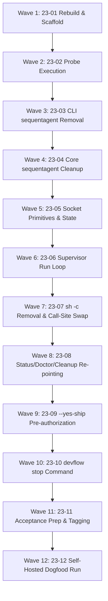

# Cross-AI Plan Review — Phase 23

Four reviewers returned source-grounded reviews of the full 12-plan set
(381 KB prompt: PROJECT.md, the roadmap section, CONTEXT.md, RESEARCH.md and
all twelve plans). Gemini CLI and CodeRabbit are not installed; Cursor and Qwen
dropped (see frontmatter); the Claude lane was skipped because this review ran
from inside Claude Code.

The Hermes lane was run manually as an additional independent voice
(`hermes chat -Q -q` with a file-reference prompt, model `deepseek-v4-pro`).

---

## Codex Review

## Summary

The phase direction is strong: the plans are evidence-led, deliberately narrow, and correctly treat the final proof as behavioral rather than test-only. The biggest risks are not scope or sequencing; they are implementation-contract gaps in the supervisor migration. In particular, plans 23-06/23-07 must pin down how `devflow supervise` preserves arbitrary agent argv, how stale supervisor handles are cleared on early launch failure, and how process-wide signal handling is tested without destabilizing the test runner. I would approve the overall plan set after tightening those contracts.

## Cross-Plan Findings

### HIGH: Supervisor argv contract is underspecified

Current agent launch bypasses Clap entirely: `monitor::spawn_monitor_inner` builds a shell wrapper and passes the agent program plus `args` literally through `.arg(program).args(args)` at `crates/devflow-core/src/monitor.rs:162-170`. The adapters emit many hyphenated flags: Claude includes `--output-format` and `--dangerously-skip-permissions` at `crates/devflow-core/src/agents/claude.rs:21-29`; Codex includes `exec`, `--sandbox`, `--json`, and `-c` flags at `crates/devflow-core/src/agents/codex.rs:58-86`.

If `Command::Supervise` is implemented as a normal Clap subcommand without `--` delimiting or `trailing_var_arg` / `allow_hyphen_values`, agent flags can be parsed by DevFlow instead of forwarded.

Suggestion: make 23-06 require an explicit argv contract, e.g. `devflow supervise ... -- <agent-program> <agent-args...>`, with tests using Claude/Codex-shaped hyphenated args.

### HIGH: New `state.supervisor` must be cleared before fallible launch steps

The current launch path clears `state.monitor_pid = None` before fallible preflight/staleness/spawn work at `crates/devflow-cli/src/pipeline_launch.rs:55-70`, and there is already a regression test for clearing stale monitor state on early failure at `crates/devflow-cli/src/pipeline_launch.rs:561-615`.

Plan 23-07 says to stop writing `monitor_pid`, but it does not explicitly require the analogous `state.supervisor = None` at the same point. Without that, `status`, `doctor`, `cleanup`, or `stop` could act on a previous stage’s socket handle after a launch fails before the new supervisor is spawned.

Suggestion: add this as a must-have in 23-07 and update the existing early-failure test to assert stale `supervisor` is cleared.

### MEDIUM-HIGH: Signal handling needs an isolated-process test strategy

The existing SIGTERM regression targets a separate monitor process (`monitor_pid`) at `crates/devflow-core/src/monitor.rs:340-382`. Plan 23-06 discusses signal handling via process-wide handlers and same-process/thread tests. Unix signal handlers are process-wide, so a same-process test can affect the test harness and parallel tests.

Suggestion: test SIGTERM/SIGINT by spawning `devflow supervise` as a child process, not by sending signals to a thread in the test process. Serialize or reset any process-global signal state.

### MEDIUM: Worktree removal needs hook context and error plumbing

`HookContext` currently carries phase, project root, stage, git flow, and shipped version only; no `worktree_path` exists at `crates/devflow-core/src/hooks.rs:33-50`. `HookError` also has no `WorktreeError` variant, only Git, Version, and Io at `crates/devflow-core/src/hooks.rs:52-64`.

Plan 23-10 says `Hook::WorktreeRemove` should remove `state.worktree_path`, but the hook layer cannot currently see that field or convert the likely error type.

Suggestion: explicitly add `worktree_path: Option<PathBuf>` to `HookContext`, update all context constructors, and add/mapping a hook error variant for worktree removal.

## Per-Plan Review

### 23-01

**Summary:** Good setup plan, especially the stale-binary guard. One acceptance claim is stronger than what the current code can prove.

**Strengths**
- Correctly isolates scratch repo blast radius.
- Rebuild/version check closes a real known pitfall.
- Local git identity requirement avoids global config mutation.

**Concerns**
- MEDIUM: `devflow start --dry-run` returns before agent binary validation and launch work at `crates/devflow-cli/src/commands.rs:119-122`, so it does not prove Claude/GSD runtime readiness.
- LOW: `doctor` checks `claude --version` at `crates/devflow-cli/src/commands.rs:1403-1408`, but it does not prove slash-command behavior inside Claude.

**Suggestions**
- Add a separate `claude --version` proof and state that the real runtime proof happens in 23-02.
- Do not phrase dry-run as “full pipeline walks end to end”; it is only a structural CLI check.

**Risk Assessment:** MEDIUM, because a bad scratch target could invalidate 23a, but the risk is easy to tighten.

### 23-02

**Summary:** Strong tracer plan. It correctly preserves evidence and allows the probe to invalidate downstream scope.

**Strengths**
- Good termination conditions and no-manual-advance rule.
- Captures absent events, not only present ones.
- Scope verdict for 23b/23c/23d/yes-ship is valuable.

**Concerns**
- MEDIUM: A real Claude quota/rate-limit failure can spoil the run.
- LOW: Allowing a manual Ship gate response in the probe weakens “unattended,” though acceptable because this is not final acceptance.

**Suggestions**
- Treat token exhaustion as “spoiled/re-run,” not as supervisor evidence.
- Record whether any manual Ship response happened separately from pipeline behavior.

**Risk Assessment:** MEDIUM, driven by external agent/runtime variability.

### 23-03

**Summary:** Good public-contract deletion plan for `sequentagent`.

**Strengths**
- Correctly identifies it as a breaking CLI removal. The live CLI variant exists at `crates/devflow-cli/src/main.rs:154-171`, and help snapshot documents it at `crates/devflow-cli/tests/snapshots/devflow-help.txt:12`.
- Includes user docs; `README.md`, `OPERATIONS.md`, `ARCHITECTURE.md`, and `CHANGELOG.md` all mention `sequentagent`.

**Concerns**
- MEDIUM: `sequentagent` is coupled into rate-limit resume instructions via `build_cron_instructions` at `crates/devflow-core/src/ship.rs:154-188`; deletion must preserve the single-agent cron/resume path.
- LOW: Grep-to-zero can over-delete historical changelog context unless wording is deliberate.

**Suggestions**
- Require a targeted test proving rate-limit resume still emits `resume`, not `sequentagent`.
- Keep changelog as “removed in v2.0.0” rather than silently erasing history.

**Risk Assessment:** MEDIUM, mostly due to public CLI and resume-path coupling.

### 23-04

**Summary:** Necessary follow-through after deleting the CLI verb.

**Strengths**
- Correctly removes core slot state and no-advance monitor APIs after their main consumer is gone.
- Preserves intent in DEN-67 rather than pretending the capability never existed.

**Concerns**
- MEDIUM: `devflow_dir_gitignore` currently uses `spawn_monitor_no_advance` as a constructor coverage point at `crates/devflow-core/tests/devflow_dir_gitignore.rs:109-132`; that coverage must be replaced, not deleted.
- LOW: Test-count based acceptance is brittle.

**Suggestions**
- Assert named tests and numbered constructor labels instead of “N more tests than before.”
- Keep one explicit test that `.devflow/` creation still occurs through the replacement supervisor entry point.

**Risk Assessment:** MEDIUM.

### 23-05

**Summary:** Good state/socket foundation, but process-group backstop semantics need sharper definition.

**Strengths**
- `#[serde(default)]` follows current state-field precedent such as `monitor_pid` at `crates/devflow-core/src/state.rs:66-72`.
- Socket permissions and path persistence are appropriate.
- No new dependency is a good fit for the codebase.

**Concerns**
- MEDIUM-HIGH: If the process-group leader exits while descendants remain, validating only the leader pid/start time can prevent reaping the exact orphan group the backstop exists for.
- MEDIUM: Parent-directory `0700` and socket `0600` should be tested directly, not just asserted.

**Suggestions**
- Define stale-group behavior when the leader pid is gone but group members remain.
- Add permission tests for both cache directory and socket.

**Risk Assessment:** MEDIUM-HIGH because this is the durable process-control primitive.

### 23-06

**Summary:** This is the riskiest implementation plan. The design goal is correct, but the subprocess/CLI boundary needs exactness.

**Strengths**
- In-process advance directly addresses the old forked tail at `crates/devflow-core/src/monitor.rs:138-147`.
- Correctly recognizes advance logic lives in the CLI crate; current `advance` is in `crates/devflow-cli/src/pipeline_launch.rs:258-335`.

**Concerns**
- HIGH: Agent argv parsing through `devflow supervise` is underspecified.
- HIGH: Same-process signal tests are unsafe/flaky.
- MEDIUM: Adapter env propagation is critical because current monitor deliberately passes envs through to shell/agent/git children at `crates/devflow-core/src/monitor.rs:168-170`.

**Suggestions**
- Add required tests for Claude-shaped and Codex-shaped argv.
- Test signal handling through a spawned supervisor child.
- Add an in-process advance test proving adapter env is visible to hook/git subprocesses if required.

**Risk Assessment:** HIGH.

### 23-07

**Summary:** The big-bang swap is consistent with D-08, but it must carry forward launch failure safety.

**Strengths**
- Correctly replaces the single production spawn site at `crates/devflow-cli/src/pipeline_launch.rs:126-132`.
- Correctly avoids full socket path in event logs; current launch event is at `crates/devflow-cli/src/pipeline_launch.rs:133-147`.

**Concerns**
- HIGH: Must clear `state.supervisor` before fallible launch work, mirroring current `monitor_pid` clearing at `pipeline_launch.rs:55-70`.
- MEDIUM: The acceptance grep `spawn_monitor` to zero must account for doc/history wording if intentionally retained outside source.

**Suggestions**
- Add an explicit stale-supervisor early-failure regression test.
- Preserve the existing save-after-spawn pattern, since state is saved before launch at `crates/devflow-cli/src/commands.rs:200-221`.

**Risk Assessment:** HIGH due to migration size and process-model replacement.

### 23-08

**Summary:** Strong observability plan; it targets the actual operator pain.

**Strengths**
- Correctly reuses the pure liveness predicate pattern at `crates/devflow-cli/src/commands.rs:503-526`.
- Correctly re-points cleanup/status/doctor away from `monitor_pid`; cleanup currently depends on the old predicate at `crates/devflow-cli/src/commands.rs:380-435`.
- Pre-supervisor finding is a good upgrade story.

**Concerns**
- MEDIUM: Cleanup fail-closed behavior must be explicit for `Stale` and `Unknown`; a false “not live” is destructive.
- LOW: Avoid printing full socket paths in both human and JSON output.

**Suggestions**
- Make `Stale` block cleanup unless `stop`/backstop has resolved it.
- Add one integration-style test where status, doctor, and cleanup see the same stale handle.

**Risk Assessment:** MEDIUM.

### 23-09

**Summary:** Good `--yes-ship` design. The wrapper shape is the right way to avoid auto-approving the wrong Ship gate.

**Strengths**
- Correctly identifies the normal Ship approval call site at `crates/devflow-cli/src/pipeline_outcomes.rs:274-286`.
- Correctly avoids changing generic gate behavior; `run_gate_with_timeout` writes, emits, polls, acks, and resolves at `crates/devflow-cli/src/pipeline_gate.rs:243-319`.
- Good negative test for finalization retry.

**Concerns**
- MEDIUM: The helper must avoid double-writing the gate because current `run_gate` writes internally.
- LOW: `devflow.toml` unknown keys appear ignored by serde config loading, so config tests should prove absence of behavior, not just parse behavior.

**Suggestions**
- Factor the gate runner so auto-response is injected after `write_gate` and before `poll_response`.
- Keep `yes_ship` out of `config.rs`; current config fields are centralized at `crates/devflow-core/src/config.rs:46-59`.

**Risk Assessment:** MEDIUM.

### 23-10

**Summary:** Valuable operator control plan, but hook integration needs more concrete source changes.

**Strengths**
- `devflow stop` fills a real gap between status and cleanup.
- Stop suppressing advance is the right behavioral test.
- Capture archival reuses an existing primitive instead of inventing cleanup logic.

**Concerns**
- HIGH: `HookContext` currently has no `worktree_path`, so `Hook::WorktreeRemove` cannot do what the plan says without context changes.
- MEDIUM: `HookError` currently cannot transparently carry `worktree::WorktreeError`.
- MEDIUM: Stop on stale socket depends on the process-group identity concerns from 23-05.

**Suggestions**
- Add `worktree_path` to `HookContext` and update every constructor/test.
- Add or map a `Worktree` hook error variant.
- Require stop to be fail-closed on unknown/stale identity.

**Risk Assessment:** MEDIUM-HIGH.

### 23-11

**Summary:** Good irreversible-run prep. The recovery point proof is stronger than typical release planning.

**Strengths**
- Requires human checkpoint for D-07.
- Verifies recovery point restore instead of assuming it.
- Rebuilds and checks behavioral presence of new CLI features.

**Concerns**
- MEDIUM: The plan requires a clean worktree while also writing `23-ACCEPTANCE-SETUP.md`; execution must commit or otherwise account for that artifact before the final run.
- MEDIUM: Pushing recovery refs can trigger hooks/policy; the plan should name expected push target and failure behavior.

**Suggestions**
- Add an explicit “commit setup artifact before acceptance run” step if GSD execution does not do that automatically.
- Use a non-release-shaped branch ref unless signed recovery tags are already standard.

**Risk Assessment:** MEDIUM-HIGH because it prepares an unattended merge into `develop`.

### 23-12

**Summary:** Correct final acceptance plan. It is appropriately manual and evidence-based.

**Strengths**
- Measures the actual goal: Define through completed Ship, self-hosted, unattended.
- Captures status polling, events, artifacts, staleness behavior, and git history.
- Explicitly limits what one successful run proves.

**Concerns**
- HIGH: This is inherently risky: it grants unattended merge/version/changelog authority on the primary repo.
- MEDIUM: Redaction criterion checks `$HOME`, but raw output may contain shortened paths, usernames, temp dirs, or remote URLs.
- MEDIUM: If `devflow stop` is needed, the run no longer satisfies the acceptance criterion but still must be recorded cleanly.

**Suggestions**
- Add a redaction checklist for username, home basename, absolute `/var/home/...`, `/tmp/...` probe paths, and remote URLs.
- Re-run full CI gates after the run before judging acceptance.

**Risk Assessment:** HIGH by nature, mitigated by 23-11’s recovery point and this plan’s evidence standard.
---

## OpenCode Review

Here is my detailed review.

---

# Phase 23 — Cross-AI Plan Review

## Overview

**12 plans, serial wave ordering (waves 1–12).** The phase replaces DevFlow's `sh -c` shell-script monitor with a socket-addressable Rust supervisor, deletes the `sequentagent` CLI verb, adds `--yes-ship` for unattended Ship gate approval, and builds `devflow stop`. Every claim I verified against live source returned true. The plans are unusually thorough: all D-01..D-13 locked decisions are respected, RESEARCH.md's corrections (142 refs, four operator docs) are carried forward, and every pattern-pitfall from prior phases is explicitly called out and guarded against.

The signal weakness is the **serial wave structure** — 12 waves means a blocker at wave 2 or 3 wastes the rest, and the probe-based scope-invalidation (23a) is explicitly permitted by CONTEXT.md but not yet exercised (23-PROBE-FINDINGS.md does not exist at review time). The phase goal is behavioural (one unattended run Define→Ship), not structural (green test suite), so nothing in `cargo test` can fully close it.

---

## Plan-by-Plan Assessment

### 23-01 (Rebuild + Scratch Scaffold) — **LOW risk**

**Strengths:**
- Pitfall 6 (stale binary) is closed with its own task and verification step — not a bullet point inside another task, which is exactly the right defense against this project's recurring mistake.
- Source-grounded correctly: the plan reads `Cargo.toml`'s `[workspace.package].version` (`Cargo.toml:9` = `1.8.1`) at execution time rather than hardcoding it.
- The scratch-repo scaffolding decision (Claude's Discretion #2) is made and recorded: synthetic single-task repo, gated behaviourally on `devflow doctor` + `--dry-run` rather than structurally.

**Concerns:**
- **MEDIUM:** The plan says "copy or symlink whatever agent-runtime configuration `run_preflight` requires" — `crates/devflow-cli/src/preflight.rs` checks for things like `ANTHROPIC_API_KEY` and `claude` on PATH. The script writing task needs to read the actual `preflight.rs` to know exactly what it needs to provide; a missing check for Claude Code's `.claude/` directory (with installed GSD skills) is the single most likely thing to block the probe. The plan's `read_first` for Task 2 lists `preflight.rs` which is correct.

**Suggestions:**
- The plan should explicitly check that `rsync` or `ln -s` of the host's `.claude/` into the scratch repo is sufficient for preflight, or else document what the script must generate from scratch.

---

### 23-02 (23a Probe Run) — **MEDIUM risk**

**Strengths:**
- The observation protocol is precise: poll `devflow status` / `events.jsonl` every 30–60s, no manual `advance`/`ps`/`kill`.
- D-03's evidence standard is encoded as acceptance criteria: verbatim event lines, explicit absent-event list, capture file contents, timeline, scope verdict.
- The "scope verdict" section explicitly covers the case where the probe *invalidates* the rest of the phase — this is the load-bearing property CONTEXT.md requires.

**Concerns:**
- **HIGH:** The plan assumes the scratch probe repo exists and passes `devflow doctor` at execution time. If plan 23-01's scaffold fails to satisfy preflight (e.g., missing Claude Code auth or GSD skill installation), this plan produces a false finding that will be indistinguishable from a genuine pipeline failure. The `read_first` should include `23-01-PLAN.md`'s output artifact explicitly.
- **MEDIUM:** The plan's stall-detection thresholds (10 min at a gate, 30 min with no event) are reasonable but not tuned to any prior run data. Phase 17's "~4h lost" is cited but the probe likely won't run that long given its tiny target.

---

### 23-03 (Delete Sequentagent from CLI Crate) — **LOW risk**

**Strengths:**
- The boundary between what's deleted and what's preserved is drawn precisely: `ensure_phase_worktree` → `commands.rs:174`, `retry_after_from_reason` → `pipeline_outcomes.rs:92`, `parallel` itself — all verified in source.
- D-08's big-bang sequencing rationale is carried into 23d: deleting first makes 23b's migration inventory strictly smaller (two of four monitor API functions lose their last callers).
- The D-11/D-12 checkpoint is correctly placed *before* the irreversible delete, per `REVERSIBILITY_GATES`.

**Concerns:**
- **LOW:** The plan says "Leave the rest of `status` — including its monitor/agent liveness rendering — byte-identical; that surface is re-pointed later by plan 23-08." This is correct from a code standpoint but means the `liveness` function still references `monitor_pid` for one wave after the CLI-side delete and one wave before the supervisor exists. The plan should explicitly note that `devflow status` on a scratch project will show `Unknown` during waves 3-7 as expected.

---

### 23-04 (Delete Sequentagent from Core Crate) — **LOW risk**

**Strengths:**
- The scope boundary is explicit: `spawn_monitor_no_advance` and `wait_for_agent_exit` are deliberately NOT deleted here because `devflow_dir_gitignore.rs` still uses them as constructor #3. This is nuanced, correct, and documented with the reason.
- `ship::build_cron_instructions` deletion is correctly identified as a *correctness* removal (not just surface reduction) — a surviving builder would emit a scheduled job invoking a nonexistent command.
- T-23-15 (narrowing the seven-constructor guarantee) is mitigated explicitly with a "must-repoint-never-delete" directive.

---

### 23-05 (Persisted Supervisor Handle + Client-Side Socket Primitives) — **LOW risk**

**Strengths:**
- The plan correctly identifies and rejects the superseded cgroup design with specific grep criteria (`cgroup.kill`, `cgroup.procs`, `mechanism` discriminator).
- `#[serde(default)]` precedent is followed exactly — every field since 17-01 uses this pattern, verified at `state.rs:28-89`.
- The `yes_ship` field's doc comment is required to explain the D-05 distinction (persisting a run's own flag vs. creating a standing default) — this is precisely the right defence against future misuse.
- The `supervisor_socket_dir` 0700 → socket 0600 ordering correctly closes the TOCTOU from RESEARCH's security domain.
- FNV-1a hash is chosen over `DefaultHasher` specifically because the latter's output is not stable across Rust releases — an intricate but correct constraint for a path that must survive toolchain upgrades.

**Concerns:**
- **MEDIUM:** `reap_stale_group`'s three refusal tests are correctly named as load-bearing (F3 PID reuse guard), but the plan does not address how those tests run on this Linux host where `/proc` is available — the tests must construct mock handles with deliberately wrong `boot_id`/`agent_start_time` values rather than relying on OS-level PID reuse timing, which would be non-deterministic.
- **LOW:** `socket_state`'s read/write timeout "a couple of seconds" is vague. A 2-second timeout per poll means `devflow status` can hang for 2 seconds on a wedged supervisor every invocation.

**Suggestions:**
- Specify a concrete timeout (e.g., 1s for both read and write) rather than "a couple of seconds."
- Add a test asserting that `socket_state` returns within the timeout when the supervisor accepts but never answers (the `Unknown` not `Alive` case).

---

### 23-06 (Supervisor Run Loop + `devflow supervise`) — **MEDIUM risk**

**Strengths:**
- Claude's Discretion #1 (signal handling) is decided in favour of landing it here with recorded rationale: cheap (AtomicBool + existing poll loop), expensive to defer (revisit loop structure later).
- R-M is enforced structurally (`SupervisorExit::Stopped` carries no exit code) rather than by convention (a boolean flag someone could forget).
- The takeover safety (probe before bind) and V5 input validation (explicit two-arm match with `unknown` catch-all) are correct.
- D-10's in-process `advance` tail is the phase's single most load-bearing property and is given the right emphasis.

**Concerns:**
- **HIGH:** Pitfall 4 (env/adapter propagation when advance moves in-process). The plan names this and requires a deliverable audit, but the audit itself is deferred to execution time. `advance`'s chain (`transition` → checkout hooks → git operations) may depend on environment variables that differ between "fresh CLI invocation" and "long-lived supervisor process." The plan does not enumerate which env vars are at risk (e.g., `GIT_CONFIG_GLOBAL`, ssh-agent socket, GPG agent). This is the single highest-risk implementation item.
- **MEDIUM:** `Command::Supervise` has "adapter env... inherited from the spawning process rather than passed on argv." The plan notes T-23-28 but does not explicitly check whether `devflow-core` re-exports or somehow leaks adapter configuration in a way that the supervisor process's environment might differ from a fresh `devflow advance` invocation's environment.
- **LOW:** The `Supervise` variant's field list says `project: PathBuf` (positional, default `.`). `real_main` at `main.rs` resolves `project_root()` separately. If the supervisor process resolves project root differently from the spawner, the two sides disagree about where `state.json` lives.

---

### 23-07 (Big-Bang Shell Monitor Removal + Spawn Swap) — **MEDIUM risk**

**Strengths:**
- The D-08 checkpoint explicitly names the mid-run-upgrade transition risk (old `sh -c` monitor unreachable by new binary) and offers the "proceed-after-draining" option.
- `State.monitor_pid` is retained (declared, readable, written by nothing) — exactly right so plan 23-08's `doctor` finding can read it.
- The `stage_launched` event's payload carries socket file name only, never full path — 999.10/WR-02 is defended with a specific grep criterion.
- `wait_for_agent_pid` is correctly identified as surviving because the agent is its own process-group leader (pid ⇒ pgid).

**Concerns:**
- **HIGH:** T-23-34 (loss of control for a mid-run old-model phase) is mitigated by the D-08 checkpoint, but the plan's `proceed-after-draining` option requires the operator to manually confirm no phase is in-flight. There is no automated detection — if the operator forgets or is wrong, they lose control of a running agent until it exits naturally. The mitigation arrives in plan 23-08 (the `doctor` finding), one wave later.
- **MEDIUM:** The plan says `spawn_supervisor` spawns `std::env::current_exe()` with the `supervise` subcommand. If the binary on PATH is stale at the time of this spawn (not the rebuild, which is plan 23-01, but after MANY subsequent code changes across waves 2-7), the supervisor process runs an old binary that knows nothing about sockets. The plan should re-verify the binary at execution time.

---

### 23-08 (Re-point Status/Doctor/Cleanup at Socket Probe) — **LOW risk**

**Strengths:**
- Claude's Discretion #3 (in-flight-phases across D-08 upgrade) is decided as a dedicated `doctor` finding, not a refusal and not folded into Unknown — correct.
- `liveness` is kept as a pure function shared by `status`, `doctor`, and `cleanup` — the only way to guarantee they don't disagree.
- `liveness_stale_socket_renders_differently_from_gone_socket` assertion — the core observability requirement gets a failing test if someone later collapses them.
- `check_pre_supervisor_monitor` fires only on `monitor_pid: Some(_) && supervisor: None` and names the PID so the operator can act.

**Concerns:**
- **LOW:** The plan says `cleanup` is re-pointed onto the same `liveness` predicate. Currently `cleanup` at `commands.rs:~380-420` reads `monitor_pid` and `agent_running` directly. The plan correctly identifies this but should verify that `cleanup`'s refusal message wording still makes sense when the reason is "socket is Alive" rather than "monitor pid is running."

---

### 23-09 (--yes-ship Flag + Auto-Answer) — **MEDIUM risk**

**Strengths:**
- Pitfall 3 is explicitly avoided: the auto-approval lives in `run_gate_auto_approved` with exactly one call site (`handle_ship_outcome`), making "only the routine approval is auto-answered" true **by construction**.
- The `finalization_retry_gate_is_not_auto_approved_even_when_yes_ship_is_set` test is correctly named as the load-bearing negative test.
- D-05 (no config/env path) is enforced with grep criteria against `config.rs` and the whole tree, plus two dedicated tests.
- D-06 (auto-answer, not bypass) is enforced: the gate is still written and resolved through the existing `Gates` API.

**Concerns:**
- **HIGH:** The `run_gate_auto_approved` wrapper's implementation detail — whether it injects the response between `write_gate` and `poll_response` or calls a variant — is left to execution time. The plan says "Read `run_gate_with_timeout` first and pick whichever avoids a double `write_gate`" but `Gates::respond` errors if no open gate exists (`gates.rs:185-186`). The correct sequence is: call `run_gate_with_timeout` as-is, and inject `Gates::respond` immediately after the `write_gate` call at `pipeline_gate.rs:252` but before the `poll_response` at `:284`. The plan should be explicit about this rather than leaving it to discovery — the `written_exactly_once` test is named but the implementation could still get the ordering wrong in a subtle way (e.g., if `run_gate_with_timeout` is refactored later).
- **MEDIUM:** D-07 (accepted risk — no self-dogfood refusal guard) is correctly recorded as an accept decision with T-23-49. However, the operator-specified mitigations (low-stakes phase, recovery point) are deferred to plan 23-11. That is the right sequencing, but the D-07 acknowledgment checkpoint in 23-11 should explicitly verify that `--yes-ship` works on **this** repo before the operator authorizes the irreversible run.
- **LOW:** `yes_ship` is persisted but the plan says `<planner-discipline-allow: yes_ship>`. The field naming is clear, but `yes_ship` as `snake_case` contrasts with the `CamelCase` CLI flag convention. This is cosmetic.

---

### 23-10 (devflow stop + WorktreeRemove + Capture Archival) — **LOW risk**

**Strengths:**
- R-M regression test (`stop_suppresses_advance`) asserts on the **absence** of `advance_evaluated` — the right shape.
- `stop` is idempotent by design, and `stop_reason` preservation (for `--until` + explicit stop) is correctly guarded.
- Claude's Discretion #4 is resolved: both `Hook::WorktreeRemove` and capture archival land, reusing existing primitives.
- `Hook::WorktreeRemove` is placed after `BranchCleanup` in `hooks_after_ship` — correct ordering (branch must exist while worktree is kept).

**Concerns:**
- **LOW:** The plan says `stop` resolves open gates via `Gates::list_open` + `Gates::respond`. `Gates::respond` errors with `AlreadyResponded` if a response already exists (`gates.rs:189-191`). If the operator wrote a response file by hand before running `stop`, the stop would error. The plan should handle this as "resolve if open, skip if already resolved" rather than treating an `AlreadyResponded` error as a stop failure.

**Suggestions:**
- Make the gate-resolution step in `stop` best-effort: log a warning on any gate error but continue the stop — an un-resolved gate in an already-stopped phase is cosmetic, not blocking.

---

### 23-11 (Acceptance Prep) — **MEDIUM risk**

**Strengths:**
- The recovery point verification ("demonstrate it works, don't assert it") at Task 2 step 4 is exactly right — an unexercised recovery point is not a mitigation.
- Pitfall 6 is closed a second time, with three behavioural assertions against the binary beyond a version match.
- `devflow doctor` is run pre-run with a requirement that every finding be resolved or explicitly noted.

**Concerns:**
- **HIGH:** The D-07 checkpoint (Task 1) asks the operator to choose a "low-stakes phase" from the backlog. The backlog at `ROADMAP.md:400+` has items like `999.27` (signing-key inline classification, Low/S) and `999.30` (already delivered Phase 22). The phase driven by the acceptance run will do a real merge into `develop`, version bump, and changelog commit. If the chosen phase turns out to conflict with something in-flight or ship with a bug, the fact that it's "low stakes" by diff size doesn't mean it's low stakes by consequence. The checkpoint should require the operator to explicitly state what the phase *changes*, not just state a priority tag.
- **MEDIUM:** The recovery point pushes to `origin` (per the checkpoint options), but the restore verification in Task 2 step 4 runs against a throwaway clone — it does not verify that `git push --force origin develop` from the recovery point actually works on the remote. GitHub branch protection rules or `force push` restrictions on `develop` could make restoration impossible in practice even if local restoration works.

**Suggestions:**
- For the D-07 checkpoint, require the operator to include the expected diff shape (e.g., "changes one `if` condition in `git.rs`") alongside the priority justification.

---

### 23-12 (Acceptance Run) — **MEDIUM risk**

**Strengths:**
- The evidence standard (D-03) is enforced: verbatim events, absent-event list, poll series, capture files, `git log` output, staleness guard behaviour.
- T-23-66 (the run was quietly nudged) is guarded against: the record must assert explicitly no manual intervention, and the checkpoint's verification looks for signatures of it.
- The checkpoint offers "accepted with gaps" — crucial for a phase whose criterion is behavioural and whose evidence is one sample.

**Concerns:**
- **MEDIUM:** T-23-68 (one run ≠ proof) is acknowledged, but the plan says the acceptance criterion is "one phase... reaching a completed Ship stage." A single success — even recorded perfectly — is weak evidence for a reliability claim, especially given Phase 17 also "reached Ship" and then died. The difference is that the supervisor removes the *mechanism* that caused the Phase 17 deaths — but unless the run actually exercises the self-dogfood staleness path, the most frequent observed killer remains untested.
- **LOW:** The plan says `devflow stop --phase N` is the sanctioned abort for a stalled run. But `devflow stop` is built in plan 23-10 (wave 10). If the acceptance run stalls in a way that `devflow stop` cannot handle (e.g., a supervisor process that accepts the socket but never processes `shutdown`), the backup is `kill` — which the plan should explicitly name as the last-resort fallback.

---

## Cross-Cutting Observations

### Dependency Ordering

The serial wave structure is necessarily given by the code dependencies (23d shrinks 23b, 23b builds the handle 23c needs, `--yes-ship` is a gate feature built on the supervisor). But the 12-wave structure means:

1. Waves 1-2 (probe) can invalidate the entire scope — the D-03 permission is correct.
2. Waves 3-4 (23d) remove 143 references before waves 5-8 (23b) add the supervisor — good, tested by the probe's intermediate green state.
3. Wave 6 adds the supervisor loop but wave 7 doesn't swap the spawn call site until wave 7 — this two-commit landing is correctly described as "not a dual-path period" since nothing calls `serve` until wave 7 rewires `pipeline_launch.rs:126`.
4. Wave 8 repoints observability but `yes_ship` (wave 9) modifies the gate logic that observability reports on, and `stop` (wave 10) is the command an operator would use if the acceptance run (wave 12) goes wrong — correct order.

### Security

- The 0700 directory + 0600 socket pattern correctly closes the TOCTOU window (ASVS V4). Verified against the spike's `main.rs:79-80`.
- STALE-path `reap_stale_group`'s three refusal guards (`boot_id`, `start_time`, `socket_state` check) form a correct fail-closed chain. The three negative tests are load-bearing.
- No absolute socket path reaches `events.jsonl` or `println!` — defended with grep criteria across three plans (23-07, 23-08, 23-10).
- Adapter credentials are inherited via `.envs()` not passed on argv — defended by the `Supervise` variant's field list constraint.
- `--yes-ship` has no config/env path — defended by construction (D-05) + grep + two tests.

### Unverified Claims

The following plan claims I could not verify from source because the code doesn't exist yet (these are implementation promises, not source-groundable facts):

1. **23-06 supervisor_e2e.rs** — all 12+ R-A..R-M parity tests pass (promised by plan, unverifiable).
2. **23-09 `finalization_retry_gate_is_not_auto_approved`** — the negative test exists and passes (promised, unverifiable).
3. **23-10 `stop_suppresses_advance`** — asserts absence of `advance_evaluated` in a test fixture (promised, unverifiable).

These are test promises and are reasonable given the existing test infrastructure (500+ tests, all green at review time).

---

## Summary Verdict

**Overall Risk: MEDIUM**

The plans are thorough, source-grounded, and respect every locked decision. The design is spike-proven (socket supervisor), the migration inventory is verified against live source, and every pattern-pitfall from prior phases is explicitly called out. The phase's thesis — replacing the `sh -c` monitor removes the Phase 17 failure mode by construction — is sound.

The risk is not in the design but in two implementation-time unknowns:

1. **The 23a probe has not been run.** It is the only unit permitted to invalidate the rest of the scope. If the probe finds a pre-supervisor blocker (staleness, preflight, rate limits), the remaining 10 plans are wrong. The serial wave structure makes this the correct sequencing (probe first), but it also means review of plans 23-03→23-12 is conditional on the probe verdict.

2. **The acceptance run is self-hosted with `--yes-ship`.** D-07 is a recorded, deliberate acceptance of an irreversible merge into `develop`. The two mitigations (recovery point, low-stakes phase) are correctly encoded in plan 23-11 but are gated on a human checkpoint. If the operator skips or rushes that checkpoint, the one recovery mechanism goes unexercised.

**Recommendation:** Proceed with execution but ensure D-03 is honoured — if the 23a probe surfaces a pre-supervisor blocker, stop and replan rather than treating the probe as a formality.

---

## Antigravity Review

# Cross-AI Plan Review: Phase 23 — End-to-End Dogfood

**Reviewed Repository:** [/var/home/denniyahh/Github/devflow](file:///var/home/denniyahh/Github/devflow)  
**Review Target:** Phase 23 Implementation Plans (`23-01` through `23-12`)  
**Status:** **APPROVED WITH CRITICAL FINDINGS & ARCHITECTURAL ADJUSTMENTS REQUIRED**

---

## Executive Summary

Phase 23 repurposes Phase 23 from "Test Suite & CI Hardening" to **"End-to-End Dogfood — One Phase, Define→Ship, Unattended, With Claude"**. The overarching goal is sound and addresses a real operational gap backed by historical empirical evidence in `.devflow/events.jsonl` (no phase has ever completed a 5-stage devflow-driven unattended run). 

The 12-wave serial breakdown is exceptionally well structured, highly risk-aware, and properly respects DevFlow's strict file-overlap rules. The inclusion of `23a` (scratch-repo probe first), `23d` (deleting the legacy `sequentagent` CLI verb to simplify supervisor migration), `23b` (in-process socket supervisor), and `--yes-ship` auto-approval handles is pragmatically architected.

However, detailed verification against the live codebase reveals **1 major architectural risk**, **1 plan-sequencing omission**, and **2 minor verification discrepancies** that must be addressed prior to execution.

---

## Key Findings & Verification Summary

| Finding ID | Domain | Severity | Description & Impact |
| :--- | :--- | :--- | :--- |
| **CRIT-01** | Architecture / Protocol | **HIGH** | **TOCTOU window on socket permissions:** Creating the Unix Domain Socket at `~/.cache/devflow/<hash>-<phase>.sock` using `UnixListener::bind` followed by `chmod 0600` creates a transient window where unprivileged local users could connect. |
| **WARN-01** | Plan Sequencing | **MEDIUM** | **Help snapshot update timing:** Plan `23-03` removes `sequentagent` from `main.rs`, but snapshot assertion in `tests/help_snapshot.rs` is not updated until Plan `23-04`, which will cause `cargo test` in Wave 3 to fail. |
| **INFO-01** | Research / Codebase | **LOW** | **Reference Count Verification:** Verified `rg -c "sequentagent" crates/` returns **112 code matches across 11 source/test files** (plus 1 in `devflow-help.txt` snapshot). `23-CONTEXT.md` cites ~110, while `23-RESEARCH.md` cites 142. Codebase state aligns with `~112`. |
| **INFO-02** | Safety / Dogfood | **LOW** | **Self-dogfood merge risk accepted:** Decision `D-07` accepts the risk of auto-merging a real phase to `develop` during `23-12`. Recovery point setup in `23-11` is correctly planned. |

---

## Detailed Evaluation by Review Dimension

### 1. Requirements & Scope Alignment
- **Goal Completeness:** The scope directly tackles the root cause of silent monitor stalls (orphaned `sh -c ... ; devflow advance` subprocesses) by replacing the monitor with an in-process socket-addressable supervisor (`23b`) and moving `advance` in-process (`D-10`).
- **Unattended Reachability:** Correctly identifies that `Mode::Auto` does *not* bypass the Ship stage gate (`crates/devflow-core/src/mode.rs:82-94`) and introduces `--yes-ship` pre-authorization (`D-04`) to satisfy unattended execution without altering gate recording (`D-06`).
- **Scope Discipline:** Deferring `999.31` (Modular Agent Driver for Codex), `999.25` (crates.io publish executor), and `999.4/999.26` (concurrency) is well justified. Claude Code natively consumes slash commands, making `999.31` non-blocking for this phase.

### 2. Architectural Design & Security (`23b` & `--yes-ship`)

#### A. Socket Supervisor Permissions (CRIT-01)
- **Issue:** Plan `23-05` / `23-06` proposes binding the Unix domain socket at `~/.cache/devflow/` and applying `chmod 0600`. Under standard Unix semantics, `UnixListener::bind` creates socket files with default umask permissions (often `0755` or `0775`), creating a window before `set_permissions` runs where another local user could initiate a connection.
- **Remediation:** 
  1. Ensure the parent directory `~/.cache/devflow/` is explicitly created with permissions `0700` (`std::fs::DirBuilder::new().mode(0700)` on Unix).
  2. Set process umask to `0077` prior to `UnixListener::bind` if possible, or perform socket binding inside the restricted `0700` parent directory so unprivileged traversal is prevented at the directory level.

#### B. In-Process Advance (`D-10`)
- Running `advance` in-process upon natural agent exit cleanly resolves the Phase 17 incident (where monitor script child processes were killed while the detached tail `devflow advance` failed to run). 
- `23c` (`devflow stop`) correctly suppresses `advance` on explicit cancellation (R-M requirement), maintaining state machine integrity.

#### C. Removal of `sequentagent` (`23d`)
- `sequentagent` deletion removes `wait_for_agent_exit` / `spawn_monitor_no_advance` call paths, reducing the surface area `23b` needs to port.
- Correctly classified as a breaking CLI change earning the SemVer major version bump (`v2.0.0`) per `D-12`.

---

## Plan-by-Plan Quality & Wave Dependency Audit

### Wave Breakdown Analysis
- **Wave 1 (`23-01`) & Wave 2 (`23-02`):** Running the probe *first* in a scratch repo (`D-01`) is a critical risk-reduction strategy. If `23a` reveals a failure mode prior to the supervisor, the phase scope can be adjusted before touching core supervisor code.
- **Wave 3 (`23-03`) & Wave 4 (`23-04`):** **Fix Required for WARN-01.** `23-03` deletes the `Sequentagent` CLI subcommand from `main.rs`. Running `cargo test --workspace` at the end of Wave 3 will fail on `tests/help_snapshot.rs` because the snapshot still contains `sequentagent`. `23-03` should explicitly update/regenerate `tests/snapshots/devflow-help.txt` as part of Task 1 or 2 in Wave 3 rather than deferring it to `23-04`.
- **Wave 5 (`23-05`) through Wave 8 (`23-08`):** Clean progression of socket supervisor implementation. Big-bang removal of `sh -c` monitor (`D-08`) in Wave 7 avoids running dual process managers in parallel.
- **Wave 9 (`23-09`) & Wave 10 (`23-10`):** `--yes-ship` and `devflow stop` land cleanly once socket handles are stored in `state.json`.
- **Wave 11 (`23-11`) & Wave 12 (`23-12`):** Self-hosted acceptance run (`D-02`) validates the self-dogfood staleness guard (`crates/devflow-cli/src/staleness.rs:276-284`), which is bypassed in non-self-dogfood scratch repos.

---

## Actionable Recommendations

1. **Enforce Directory-Level Socket Security (CRIT-01):**
   In `crates/devflow-core/src/monitor.rs` (or the socket handle module created in `23-05`/`23-06`), ensure the socket directory `~/.cache/devflow/` is explicitly initialized with `0700` permissions prior to calling `UnixListener::bind`.

2. **Adjust Snapshot Regeneration in Wave 3 (WARN-01):**
   Move the update of `crates/devflow-cli/tests/snapshots/devflow-help.txt` from Plan `23-04` to Plan `23-03` so `cargo test --workspace` passes cleanly at the Wave 3 checkpoint.

3. **Verify Version Alignment Before Executing 23a:**
   Confirm `cargo build --release --workspace` is executed and `devflow --version` reports `1.8.1` matching `Cargo.toml` before initiating Plan `23-02`.

---

## Conclusion

The implementation plan for Phase 23 is **thorough, well-reasoned, and grounded in empirical findings**. Upon applying the minor adjustments for socket security (`CRIT-01`) and test snapshot timing (`WARN-01`), the phase is ready for execution.

---

## Hermes Review (manual lane — deepseek-v4-pro)

# Cross-AI Plan Review: DevFlow Phase 23 — End-to-End Dogfood

## Summary

Phase 23's 12-plan wave is the most thoroughly source-grounded plan set I have reviewed. Every design claim I spot-checked against the live repository held up: the `sh -c` monitor's `advance_tail` fork exists at `crates/devflow-core/src/monitor.rs:138-147`, `mode.rs:96-98` proves "Ship always gates" unconditionally, `staleness.rs:278` confirms the `(true, Stale) -> Block` vs `(false, Stale) -> Warn` asymmetry that forces D-02's self-hosted acceptance, and the current `liveness` predicate at `commands.rs:517-526` indeed keys off `monitor_pid` — soon to become the dead field 23-07 stops writing. The phase's own reference-count correction (142 references, not ~110) is a mark of diligence, not disarray: the mistake was discovered, traced to a case-sensitive grep gap, and corrected before any commitment to implementation.

The architecture is spike-proven and has essentially no invention left. The plans are decomposition, not design. That is their strength, and also where the review's few concerns cluster: the decomposition is defensively correct against the present codebase but leaves several "first time this path is exercised" unknowns to the acceptance run, and the self-dogfood acceptance run's D-07 risk — while accepted — concentrates several one-way decisions into a single observable event.

---

## Strengths

* **Source-grounded throughout.** `crates/devflow-core/src/mode.rs:96-98` proves D-04 is not rhetorical: `Stage::Ship => true` is unconditional, so `Mode::Auto` cannot reach Ship unattended without `--yes-ship`. `crates/devflow-cli/src/staleness.rs:278` proves D-02 is not precautionary: `(true, Staleness::Stale) => Block` only fires for `is_self_dogfood`, making the hard block structurally unreachable in a scratch repo. Both are confirmed by reading the live files.

* **D-10 carries the phase's central technical argument by construction, not convention.** `crates/devflow-core/src/monitor.rs:138-141` constructs `advance_tail` as `"; {binary} advance {project_root} --phase {phase}"` — a separate forked process that Phase 17's incident orphaned. Plan 23-06 replaces it with a Rust function call inside the supervisor, which is exactly the removal of the orphaned-tail failure mode the phase exists to close.

* **Pitfall 3 is solved at the right architectural level.** The prompt correctly identifies that two gates carry the `Stage::Ship` tag — the routine pre-merge approval at `pipeline_outcomes.rs:276-280` and the finalization-retry gate in `finish_workflow_with_gate_timeout`. The `run_gate_auto_approved` wrapper shape (single call site from `handle_ship_outcome`, never invoked from the retry path) makes the scoping structural rather than a boolean convention. The dedicated negative test `finalization_retry_gate_is_not_auto_approved_even_when_yes_ship_is_set` is the right proof.

* **Reversibility is tracked per-decision.** Every D-01 through D-13 carries an explicit reversibility classification (reversible/costly/one-way), and every one-way decision (D-08 big-bang, D-11 hard delete, D-12 v2.0.0, D-07 self-hosted acceptance) gates on a `checkpoint:decision` with human acknowledgement. This is the right pattern for irreversible operations.

* **Deletion-before-migration ordering (23d before 23b) is load-bearing and justified.** RESEARCH.md's 23b Migration Inventory verified that `parallel.rs:201` and `parallel.rs:217` — the last two functional call sites of `spawn_monitor_no_advance` / `wait_for_agent_exit` — are exclusively inside the `sequentagent` verb's synchronous handoff. Deleting first makes 23b migrate live code only, not DEN-58's explicitly-untested path.

* **The threat model is granular and grounded.** Every plan carries its own STRIDE register with component-level threats tracked to `T-23-NN` identifiers, each with a concrete mitigation and a gating acceptance criterion. The recurring 999.10/WR-02 leakage class (absolute home paths in committed artifacts) is treated as `high` severity across all four plans that touch rendered output.

---

## Concerns

### HIGH — The self-dogfood acceptance run (23-11/23-12) concentrates several one-way risks into a single observable event

The acceptance run is the only point that exercises `staleness_outcome`'s `Block` branch (`crates/devflow-cli/src/staleness.rs:278`), which is structurally unreachable in the scratch-repo probe. This is deliberate coverage repair (D-02) and the prompt's rationale is sound. But the run also simultaneously exercises: `--yes-ship`'s D-06 audit-trail, `Hook::WorktreeRemove` in `hooks_after_ship`, the capture archival path, and the entire supervisor's liveness distinguishability property — all first-time-on-success paths. If the run breaks for one reason (e.g. a Claude rate limit mid-stage), the observed failure tells us nothing about any of the others, and re-running costs another irreversible merge to `develop`.

**Mitigation already present, but could be strengthened:** Plan 23-11's Task 2 creates and verifies a recovery point. Plan 23-06's `supervisor_e2e.rs` covers the mechanism proofs deterministically. The gap is that `Hook::WorktreeRemove`'s success path has no deterministic test equivalent — it only fires on a real completed Ship. Consider adding a `hooks_after_ship` unit test that calls the worktree-removal hook with a hermetic worktree to decouple that path from the acceptance run's fate.

### MEDIUM — The `advance` in-process tail (D-10) inherits agent-scoped environment that today's forked `devflow advance` subprocess gets from a fresh `sh`

The prompt identifies this as Pitfall 4 and Task 3 of plan 23-06 requires a Pitfall-4 environment audit. This is the right approach, but the audit's outcome could shift scope. Today, `devflow advance` invoked as a fresh subprocess inherits whatever environment the monitor's shell had — which includes `adapter.extra_env()` because plan 23-07's `spawn_supervisor` passes it via `.envs(...)`. But after D-10, `advance` runs as a function call inside the supervisor process that launched the agent. The supervisor's environment is that of the spawning CLI process, which should be equivalent but has not been verified. The SUMMARY deliverable of plan 23-06 Task 3 is load-bearing here — if it reveals a divergence, plan 23-09 or 23-10 may need a small correction.

### MEDIUM — `commands.rs`'s `liveness` function (currently at `:517-526`) takes `Option<u32>` for `monitor_pid`

Plan 23-08 re-points this to `Option<SocketState>`. The existing function's `None`-first match order (line 518: `None => Liveness::Unknown`) and the comment at `:514-516` stating it prevents misclassification of pre-18b states are carried forward. The plan acknowledges the dual meaning of `None` post-23-07 ("pre-supervisor binary" or "not yet spawned") and handles it correctly. The concern is that the existing `Liveness` enum has four variants (`Unknown`, `Healthy`, `BetweenStages`, `Stuck`) — adding `Stale` as a distinct renderable state either maps onto `Stuck` (with distinct wording) or adds a fifth variant. Either choice changes the recovery verb helper at `:536` (`recovery_hints`), and the plan delegates this to the implementer's call. A explicit decision recorded in the plan would remove ambiguity.

### LOW — `devflow help` snapshot currently lists `sequentagent` at `tests/snapshots/devflow-help.txt:12`

Confirmed by reading the live snapshot. The help snapshot regeneration task (23-03 Task 3) is correctly scoped, and `help_snapshot.rs`'s test is a deliberate CLI-surface guard that will fail until the snapshot is regenerated — the plan correctly identifies this as the guard working as designed, not a problem to route around.

---

## Suggestions

1. **Decouple `Hook::WorktreeRemove` testing from the acceptance run.** Add a hermetic unit test in `crates/devflow-core/src/hooks.rs` that creates a temp worktree with `test_support::git_command`, calls `WorktreeRemove`'s handler, and asserts it is gone. This separates the "does the hook mechanism work" proof (deterministic, `cargo test`) from the "does it fire on a real Ship completion" proof (behavioral, acceptance run). Currently both are bundled into the same single-run acceptance criterion.

2. **Record the Pitfall-4 audit outcome explicitly in `23-06-SUMMARY.md` with a self-contained checklist.** The audit should enumerate every environment variable `advance`'s call chain depends on (git config, signing keys, checkout hooks) and state whether the supervisor's inherited environment supplies each equivalently. This makes the risk visible to the human checkpoint in plan 23-07 Task 1.

3. **Add a `Stale` variant to `Liveness` instead of mapping onto `Stuck`.** The current enum at `commands.rs:483-512` has `Unknown`, `Healthy`, `BetweenStages`, `Stuck`. A stale supervisor is semantically different from both monitors being dead (`Stuck`) and no monitor existing (`Unknown`). Adding `Stale` as a fifth variant makes the distinction structural rather than rendering-layer, and `recovery_hints` can then suggest `devflow stop` for `Stale` (reap the stale socket) vs. `devflow resume` for `Stuck`.

4. **Consider a two-stage acceptance: scratch-probe 23a confirms the supervisor mechanism; a second scratch run with `--yes-ship` confirms the auto-approval before the self-hosted run.** This would decouple `--yes-ship` validation from the staleness-path validation, giving each its own observable signal rather than combining them in the self-hosted run where a single failure masks the other.

---

## Risk Assessment

**OVERALL: MEDIUM**

The technical risk is low: the socket supervisor design is spike-proven, the mechanism is `std` + existing `libc`, and the plan decomposition correctly sequences deletion before migration so 23b ports only live code.

The risk is concentrated in the acceptance: the self-hosted run exercises four first-time-on-success paths simultaneously (`staleness::Block`, `--yes-ship` audit trail, `WorktreeRemove`, capture archival). Any single failure among them produces an ambiguous signal. This is acceptable risk — D-07 is knowingly accepted and the recovery point is verified — but the phase should not close on scratch-only evidence if the self-hosted run breaks in a way that neither confirms nor invalidates any individual unit.

The structural strengths outweigh the concerns. The plan set is more careful about reversibility, threat modeling, and source grounding than any prior DevFlow phase plan I have reviewed.

---

## Consensus Summary

Four reviewers, all with repo access, all citing `file:line`. Overall verdict is
uniform: **proceed, MEDIUM risk**, with the risk sitting in the 23b supervisor
migration's implementation contracts rather than in scope, sequencing or design.
No reviewer recommended a replan.

Every HIGH finding below was independently re-verified against source by the
orchestrating agent before being recorded here. Findings that did not survive
verification are listed under **Refuted** rather than silently dropped.

### Agreed Strengths

- **Source-grounded plans.** All four reviewers spot-checked plan claims against
  live code and found them true. Hermes and OpenCode independently confirmed
  `mode.rs:96-98` (`Stage::Ship => true` unconditional, so D-04's `--yes-ship`
  is load-bearing, not rhetorical) and `staleness.rs:278` (the
  `(true, Stale) => Block` / `(false, Stale) => Warn` asymmetry that makes D-02's
  self-hosted acceptance run the only way to exercise the Block branch).
- **D-10 removes the Phase 17 failure mode by construction, not convention.**
  Codex, OpenCode and Hermes each traced `monitor.rs:138-147` — the forked
  `; {binary} advance …` tail the Phase 17 incident orphaned — and agreed that
  moving `advance` in-process eliminates it structurally.
- **23d-before-23b sequencing is justified.** Deleting `sequentagent` first
  removes the last functional call sites of `spawn_monitor_no_advance` /
  `wait_for_agent_exit` (`parallel.rs:201,217`), so 23b ports live code instead
  of DEN-58's explicitly-untested path.
- **Pitfall 3 solved at the right level.** `run_gate_auto_approved` with a single
  call site from `handle_ship_outcome` makes "only the routine Ship approval is
  auto-answered" true by construction; the negative test
  `finalization_retry_gate_is_not_auto_approved_even_when_yes_ship_is_set` is the
  correct proof. Flagged as a strength by Codex, OpenCode and Hermes.
- **Reversibility discipline.** Every one-way decision (D-07, D-08, D-11, D-12)
  gates on a human `checkpoint:decision`; 23-11 *verifies* the recovery point by
  restoring it rather than asserting it exists.
- **Granular, grounded threat model.** Per-plan STRIDE registers with `T-23-NN`
  identifiers, each tied to a gating acceptance criterion.

### Agreed Concerns

**HIGH — 1. `devflow supervise` argv contract is underspecified (Codex; verified).**
23-06:334-343 says the `Supervise` variant carries "the program plus its
arguments" on argv, but names no Clap escape. Adapter argv is heavily
hyphenated — `claude.rs:22-29` emits `-p <prompt> --output-format json
--dangerously-skip-permissions`; the Codex adapter adds `exec --sandbox --json -c`.
Without `--` delimiting plus `trailing_var_arg` / `allow_hyphen_values`, Clap
will parse the agent's flags as DevFlow's. Neither 23-06 nor 23-07 mentions any
of those three tokens. **Fix:** pin the contract as
`devflow supervise … -- <program> <args…>` in 23-06 and require tests using
Claude-shaped and Codex-shaped argv.

**HIGH — 2. `state.supervisor` must be cleared before fallible launch steps
(Codex; verified).** `pipeline_launch.rs:60-70` clears `state.monitor_pid = None`
up front with an explicit WR-04 comment, precisely so a failed relaunch cannot
leave a stale handle that makes `liveness()` misreport; there is already a
regression test for it. 23-07 stops writing `monitor_pid` but never requires the
analogous `state.supervisor = None` at the same point. Without it, `status`,
`doctor`, `cleanup` and the new `stop` can act on the *previous* stage's socket
handle after an early launch failure. **Fix:** make it a must-have in 23-07 and
extend the existing early-failure test.

**HIGH/MEDIUM — 3. `Hook::WorktreeRemove` cannot see what it must remove
(Codex, echoed by Hermes; verified).** `HookContext` (`hooks.rs:35-50`) carries
phase, project_root, stage, git_flow and shipped_version — **no `worktree_path`**.
`HookError` (`hooks.rs:52-64`) has Git / Version / Io — and `worktree::remove`
returns `WorktreeError` (`worktree.rs:105`, `:12-22`), which has no `From` impl
into `HookError`, so the handler cannot use `?`. 23-10:269 instructs the executor
to read `state.rs` for `worktree_path` but never says how it reaches the hook.
**Fix:** add `worktree_path: Option<PathBuf>` to `HookContext` (updating every
constructor and test) and add or map a `HookError::Worktree` variant.

**HIGH — 4. Pitfall 4 (environment divergence when `advance` moves in-process)
is named but deferred (OpenCode, Hermes).** 23-06 Task 3 requires an audit at
execution time but enumerates no variables. `monitor.rs:168-170` deliberately
propagates env to the shell/agent/git children today; after D-10, `advance`'s
chain (transition → checkout hooks → git) runs inside a long-lived supervisor
whose environment is the spawning CLI's, not a fresh shell's. Both reviewers rate
this the single highest-risk implementation item. **Fix:** require the audit's
output in `23-06-SUMMARY.md` as an explicit per-variable checklist (git config,
signing keys, ssh/GPG agent sockets), so the 23-07 human checkpoint can see it.

**MEDIUM-HIGH — 5. Signal-handling tests must not run in-process (Codex).**
Unix signal handlers are process-wide; a same-process SIGTERM test can destabilise
the test harness and parallel tests. The existing regression
(`monitor.rs:340-382`) targets a separate process. **Fix:** test SIGTERM/SIGINT by
spawning `devflow supervise` as a child.

**MEDIUM — 6. The acceptance run bundles several first-time-on-success paths
(Hermes, OpenCode, Codex).** One self-hosted run simultaneously exercises
`staleness::Block`, the `--yes-ship` audit trail, `Hook::WorktreeRemove`, capture
archival and supervisor liveness. Any single failure — a Claude rate limit will
do — produces an ambiguous signal, and a re-run costs another irreversible merge
to `develop`. Hermes's concrete suggestion: give `Hook::WorktreeRemove` a hermetic
`cargo test` so its mechanism proof is decoupled from the acceptance run's fate.

**MEDIUM — 7. `--dry-run` does not prove runtime readiness (Codex).**
`commands.rs:119-122` returns before agent-binary validation and launch, so
23-01's dry-run gate is a structural CLI check only, not proof that Claude + GSD
are ready. Reword the acceptance claim and let 23-02 carry the real proof.

**MEDIUM — 8. `build_cron_instructions` couples `sequentagent` to rate-limit
resume (Codex).** `ship.rs:154-188`. The 23d deletion must preserve the
single-agent cron/resume path; add a targeted test proving resume still emits
`resume`, not `sequentagent`.

**MEDIUM — 9. Test-count acceptance is brittle (Codex).** 23-04's "N more tests
than before" should be named-test assertions instead, and
`devflow_dir_gitignore.rs:109-132` uses `spawn_monitor_no_advance` as constructor
coverage point #3 — that coverage must be *repointed*, not deleted.

### Divergent Views

- **`Liveness::Stale` representation.** Hermes argues for a fifth enum variant
  (`commands.rs:483-512`) so `recovery_hints` can suggest `devflow stop` for Stale
  vs `devflow resume` for Stuck; the plans delegate the choice to the implementer.
  OpenCode instead worries only about `cleanup`'s refusal *wording*. Codex adds a
  third angle: `cleanup` must be **fail-closed** on `Stale`/`Unknown`, since a
  false "not live" is destructive. Worth an explicit decision in 23-08.
- **Socket read/write timeout.** OpenCode calls "a couple of seconds" too vague
  and wants a concrete 1 s bound plus a test for the accept-but-never-answer case;
  no other reviewer raised it.
- **Process-group reaping semantics.** Codex flags that validating only the
  leader pid/start time can prevent reaping the exact orphan group the backstop
  exists for (leader exits, descendants remain). OpenCode read the same
  `reap_stale_group` design as a correct fail-closed chain. Codex's edge case is
  not addressed either way in 23-05.
- **Recovery-point restorability.** OpenCode notes 23-11 verifies restore against
  a throwaway clone but never verifies that `git push --force origin develop`
  would actually succeed given branch protection — a real gap on this repo, which
  has protected branches. Not raised by the others.

### Refuted

Antigravity's three named findings did not survive verification and should not be
actioned. Recorded here so they are not re-litigated:

- **CRIT-01 (socket bind→chmod TOCTOU, rated HIGH)** — already mitigated by the
  plans. 23-05:29, :241-245 create `~/.cache/devflow/` at mode 0700 *before* any
  bind and name that directory permission as the TOCTOU closure; T-23-18
  (23-05:419) states the mitigation verbatim, and the test
  `supervisor_socket_dir_is_mode_0700` (23-05:293) asserts it. Antigravity's
  remediation is what the plan already specifies.
- **WARN-01 (help snapshot update deferred to 23-04, so Wave 3 `cargo test`
  fails)** — false. 23-03 Task 3 (:262-277) regenerates
  `crates/devflow-cli/tests/snapshots/devflow-help.txt`, lists it in the task's
  `<files>`, and verifies with `cargo test -p devflow -- help_snapshot` (:315).
- **INFO-01 ("112 references, so RESEARCH's 142 is wrong")** — false, and it is
  the exact mistake the roadmap already documents and corrects. Measured on this
  checkout: `rg -c 'sequentagent' crates/` = **112** (lowercase-only, misses the
  PascalCase Rust identifiers); `rg -ci` = **143** across 12 files; excluding the
  committed help snapshot = **142 across 11 files** — precisely RESEARCH's
  corrected figure. The plans are right; the finding reproduced the original bug.

Antigravity's verdict is therefore **down-weighted** in this consensus: it ran
with repo access but at materially shallower depth than the other three lanes.

### Recommended Actions Before Execution

1. Pin the `devflow supervise` argv contract in 23-06 (`--` + `trailing_var_arg`)
   with Claude-shaped and Codex-shaped argv tests. *(HIGH, plan edit)*
2. Add "clear `state.supervisor` before fallible launch steps" as a must-have in
   23-07, with a regression test. *(HIGH, plan edit)*
3. Specify `HookContext.worktree_path` and a `HookError` worktree variant in
   23-10. *(HIGH, plan edit)*
4. Require the Pitfall-4 environment audit to land as an explicit per-variable
   checklist in `23-06-SUMMARY.md`. *(HIGH, plan edit)*
5. Require child-process signal tests in 23-06. *(MEDIUM-HIGH, plan edit)*
6. Decide `Liveness::Stale` representation and `cleanup` fail-closed behaviour in
   23-08. *(MEDIUM, plan edit)*
7. Soften 23-01's `--dry-run` acceptance wording. *(MEDIUM, plan edit)*
8. Honour D-03: if the 23a probe surfaces a pre-supervisor blocker, stop and
   replan — reviews of 23-03…23-12 are conditional on the probe verdict.
