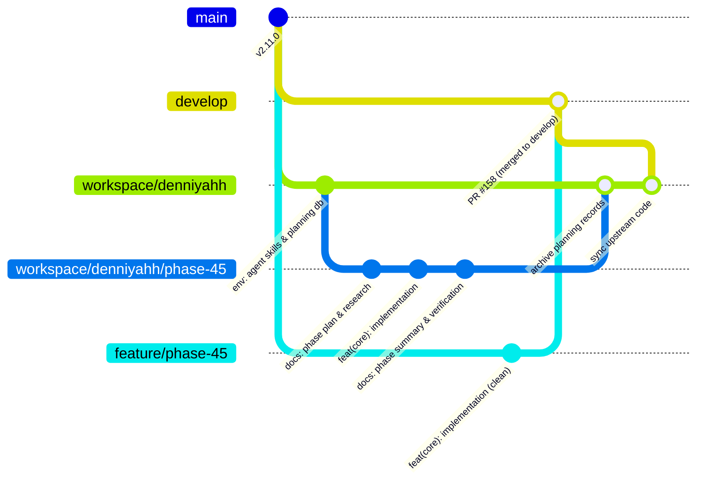

# Feature Specification: Dual-Tier Workspace Branching & Automated PR Extraction

**Status:** Proposed / Active  
**Author:** Pair Programming Session  
**Target Components:** `.planning/`, `scripts/sync-workspace.sh`, `scripts/cut-pr-branch.sh`, `CONTRIBUTING.md`, `crates/devflow-core/src/` (`worktree.rs`, `ship.rs`)  
**Related Documents:** `scripts/hooks/pre-commit`, `scripts/hooks/pre-push`, `CONTRIBUTING.md`, `ROADMAP.md` (item 999.110)  

---

## 1. Executive Summary & Problem Statement

Modern agentic engineering environments (e.g., GSD, Claude Code, Codex, Antigravity, Hermes) require extensive local development harnesses:
* State and roadmap databases (`.planning/config.json`, `ROADMAP.md`, `STATE.md`, phase dossiers).
* Agent specifications and skills (`.agents/`, `.claude/`, `.codex/`, `skills/`).
* Personal productivity scripts and hooks.

These artifacts **must be tracked in version control** so that an operator's development environment can be reproduced across workstations and sessions. However:
1. **Shared upstream branches (`develop`, `main`, and public feature PRs) must remain clean.** Upstream must not be polluted with machine-specific configurations, transient planning scratchpads, or personal agent prompts. This is enforced by DevFlow's fail-closed `pre-commit` and `pre-push` hooks.
2. **Worktrees branched directly from `develop` break agent tooling.** If an agent or operator starts a feature in a worktree branched directly off `develop`, `.planning/config.json` and agent skills are absent. Autopilot and phase tools crash or refuse to launch.
3. **Branches forked from `workspace/<handle>` cannot be pushed directly upstream.** If a worktree forks off `workspace/<handle>` into a standard branch like `feature/phase-45`, `pre-commit` and `pre-push` reject commits and pushes containing personal artifacts. If pushed, the PR diff attempts to merge the entire personal commit history into `develop`.
4. **Tree-checkout sync scripts break Git ancestry.** Previous attempts to synchronize `develop` into `workspace` using `git checkout origin/develop -- <paths>` bypassed Git's commit graph (DAG). Git continued to view the branches as diverged, triggering "branch not fully merged" warnings and deleting untracked workspace scripts.

---

## 2. Target Architecture: The Dual-Tier Workspace Model

The architecture separates **personal working environment tracking** from **upstream contribution delivery** through structured branch naming and automated PR extraction:



### Tier 1: Personal Development Workspace (`workspace/*` and `personal/*`)
* **Base Workspace Branch (`workspace/<handle>`):** The primary long-lived personal branch. Tracks personal agent harnesses, `.planning/`, and local scripts. Kept in sync with `origin/develop` via true Git merge commits.
* **Feature Development Branch (`workspace/<handle>/<feature>`):** Created as an isolated Git worktree forked from `workspace/<handle>`.
  * **Benefit:** Because the branch name begins with `workspace/` or `personal/`, `scripts/hooks/pre-commit` and `scripts/hooks/pre-push` allow all planning and agent files.
  * **Benefit:** Agents have immediate access to `.planning/config.json`, skills, and roadmap context.
  * **Benefit:** The branch can be pushed to GitHub to back up WIP state without triggering pre-push security rejections.

### Tier 2: Pristine Upstream Delivery (`feature/*` and `origin/develop`)
* **Clean PR Branch (`feature/<feature>`):** A transient branch created directly off `origin/develop`.
* **Automated Extraction:** A tool (`scripts/cut-pr-branch.sh`) inspects the commits between `origin/develop` and `workspace/<handle>/<feature>`, cherry-picks code commits, and strips out all personal directories (`.planning/`, `.agents/`, `.claude/`, etc.).
* **Validation & Push:** The clean branch runs through `scripts/check-in-container.sh` and pushes to GitHub. The pre-push hook passes cleanly because the branch carries zero forbidden files.

---

## 3. End-to-End Lifecycle Workflow

### Phase A: Start a Feature
1. Ensure the base workspace is up to date:
   ```bash
   git checkout workspace/<handle>
   ./scripts/sync-workspace.sh
   ```
2. Create an isolated worktree for the feature:
   ```bash
   git worktree add .worktrees/<feature> -b workspace/<handle>/<feature> workspace/<handle>
   cd .worktrees/<feature>
   ```

### Phase B: Develop with Agent Tooling
1. Run agent workflows (e.g., GSD planning, coding, verification).
2. Commit code and planning artifacts freely. Both `pre-commit` and `pre-push` permit personal files on `workspace/*` branches.

### Phase C: Extract & Open Upstream PR
1. Run the extraction script from within the worktree:
   ```bash
   ./scripts/cut-pr-branch.sh
   ```
2. The script:
   * Validates clean working tree state.
   * Forks `feature/<feature>` from `origin/develop`.
   * Replays/cherry-picks non-personal commits.
   * Verifies absence of forbidden paths.
   * Runs local test/check suite.
   * Prompts or automatically pushes `feature/<feature>` and opens the GitHub PR.

### Phase D: Post-Merge Reconciliation
Once the PR is merged into `develop`:
1. Switch back to the base workspace checkout:
   ```bash
   git checkout workspace/<handle>
   ```
2. Merge the feature worktree branch into `workspace/<handle>` to permanently preserve planning summaries, retro notes, and verification logs:
   ```bash
   git merge workspace/<handle>/<feature> -m "chore: archive <feature> planning records"
   ```
3. Sync the newly merged upstream code from `develop`:
   ```bash
   ./scripts/sync-workspace.sh
   ```
4. Clean up the feature worktree and branch:
   ```bash
   git worktree remove .worktrees/<feature>
   git branch -d workspace/<handle>/<feature>
   ```

---

## 4. Automation & Guard Implementation

### 1. `scripts/sync-workspace.sh` (Fixed)
Replaces tree-checkout (`git checkout origin/develop -- <paths>`) with a true `git merge`:
* Connects the Git DAG so Git recognizes upstream commits as merged ancestors.
* Avoids clobbering new local scripts or personal files.
* Includes executable bit (`chmod +x`).

### 2. `scripts/cut-pr-branch.sh` (New)
* Automates cherry-pick filtering of commits between `origin/develop` and `workspace/<handle>/<feature>`.
* Strips paths matching:
  `^(\.agents|\.bg-shell|\.claude|\.codex|\.gemini|\.omx|\.opencode|CLAUDE\.md|\.mcp\.json|skills/|skills-lock\.json|\.gsd|\.planning|\.devflow|\.worktrees)`
* Executes verification checks before push.

### 3. Native DevFlow Integration (Proposed for CLI)
To incorporate this into DevFlow's Rust core:
* **`devflow worktree add <phase>`:** Detect if current branch tracks `.planning/`. If so, base the worktree on `workspace/<handle>/phase-<N>` instead of hardcoding `develop`.
* **`devflow ship`:** When shipping from a `workspace/*` branch, automatically execute the clean PR branch extraction and verification before opening the PR.
