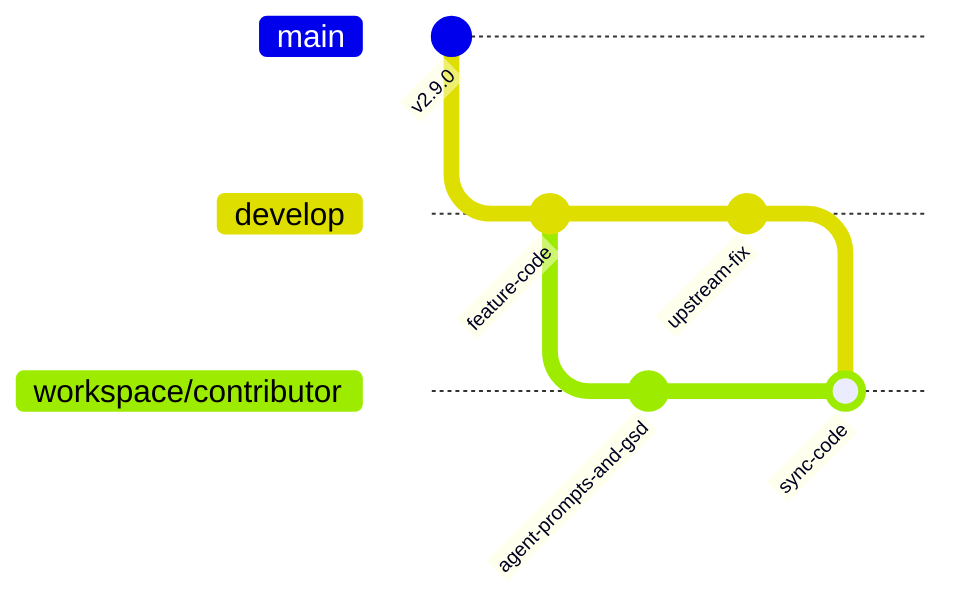

# Contributing to DevFlow

Thanks for your interest! DevFlow is an opinionated AI-driven development workflow automation CLI written in Rust — it bakes in one developer's specific take on branching, gating, and verification rather than trying to be a universal platform.

## Setup

```bash
git clone https://github.com/denniyahh/devflow.git
cd devflow
cargo build
cargo test
```

### Pre-push hook (optional, recommended)

A tracked hook at [`scripts/hooks/pre-push`](scripts/hooks/pre-push) runs the
same fmt/clippy/test checks CI requires, before the push leaves your machine:

```bash
git config core.hooksPath scripts/hooks
```

Two things this hook does that are load-bearing:

- It clears git's repository-local `GIT_*` variables before running the
  tests. Git exports `GIT_DIR` into hooks when you push **from a linked
  worktree**, and `GIT_DIR` outranks a process's working directory when git
  decides which repository to act on — so without the scrub, every test
  fixture that shells out to git in a tempdir retargets *your real checkout*
  instead. This is not hypothetical: it once flipped this repository to
  `core.bare=true`, moved a worktree's HEAD onto a fixture branch and
  rewrote the committer identity.
- [`scripts/hooks/pre-commit`](scripts/hooks/pre-commit) delegates to
  whatever pre-commit hook you already had. `core.hooksPath` replaces the
  hooks directory wholesale, so without that shim the command above would
  silently switch off a global secret scanner. It is a no-op if you have no
  such hook.
- [`scripts/hooks/post-commit`](scripts/hooks/post-commit) warns when a commit
  lands a plan `*-SUMMARY.md` while `.planning/STATE.md`'s authored prose still
  describes an earlier wave. It only warns — it never edits a tracked file, so
  it cannot break a plan's `git diff --name-only` scope fence. It delegates to a
  prior `post-commit` the same way. Silent on commits that land no summary.

### Repository git policy

Git cannot version `.git/config`, so settings that must survive a fresh clone
live in the tracked [`.gitconfig`](.gitconfig) and are pulled in once:

```bash
git config --local include.path ../.gitconfig
```

(the path is relative to `.git/config`). This turns on SSH-format signing for
both commits and tags, and configures the git-flow branch model. It
deliberately does **not** set `user.signingkey` — that is per-contributor and
this repository is public.

Because the model is supplied by that include, **do not run `git flow init -d`**:
its default production branch is `master` and this repository's is `main`, so
the defaults would misconfigure git-flow against a branch that does not exist,
surfacing only later at release or hotfix time. With the include in place,
`git flow feature start <name>` works directly.

### Release signing

Releases and `main` are restricted to the maintainer's key, enforced by
`scripts/hooks/pre-push`.

This matters here more than in most repositories because DevFlow is developed
with an AI agent that commits under **its own** signing key. Two keys are
therefore in play, and they are not interchangeable:

| Config | Signs | Whose key |
|---|---|---|
| `user.signingkey` | ordinary commits | the agent's, on a machine where it works |
| `devflow.releaseSigningKey` | release tags, `main` | the maintainer's — the only key permitted |

Both are configured with the same `user.email`, so a tag signed with the wrong
key looks correct everywhere a human checks: `git log`, `git tag -v`'s signer
line, and GitHub's "Verified" badge all show the maintainer. Only the key
fingerprint differs, which is why the hook compares fingerprints.

If you cut releases, set your key once:

```bash
git config --local devflow.releaseSigningKey ~/.ssh/<your-key>.pub
```

Then tag with it explicitly, since `user.signingkey` may point elsewhere:

```bash
git -c user.signingkey="$(git config --get devflow.releaseSigningKey)" \
    tag -s vX.Y.Z -m "vX.Y.Z"
```

Leaving `devflow.releaseSigningKey` unset disables the check entirely, so a
contributor who never cuts a release needs no configuration. Once set there is
no override flag — an override is what a mistaken release would reach for. To
push a rejected tag, re-sign it with the right key.

### Distrobox (optional)

If you use [distrobox](https://github.com/89luca89/distrobox), you can create an isolated environment:

```bash
distrobox create --name devflow-dev --image fedora:41
distrobox enter devflow-dev
# install Rust, build, test as above
```

### Dev Container (optional)

The repo includes a [`.devcontainer/devcontainer.json`](.devcontainer/devcontainer.json)
with the `rust-toolchain.toml`-pinned stable toolchain (`clippy` + `rustfmt`) preinstalled and
cargo registry/`target` caches persisted across rebuilds. Open the repo in VS Code and choose
"Reopen in Container", or run `devcontainer up --workspace-folder .` (via the
[Dev Containers CLI](https://github.com/devcontainers/cli)) to get a reproducible build/test
environment without installing Rust locally.

## Development

```bash
# Build
cargo build

# Run all tests
cargo test

# Lint (must include --all-targets, or test code goes unlinted)
cargo clippy --workspace --all-targets -- -D warnings

# Format check
cargo fmt --check

# Run a specific command
cargo run -- status
```

### Testing notes

The git-flow tests create throwaway fixture repositories. If you sign commits
or tags globally, disable signing for these fixtures so the tests don't block
on a GPG prompt. The test harness sets this per-fixture, but if you run any
manual git steps against a fixture, use:

```bash
git config commit.gpgsign false
git config tag.gpgsign false
```

See [§ AI Change Acceptance](#ai-change-acceptance) for what a test must
demonstrate to be accepted, and which test shapes are rejected outright.

## Workspace Architecture & Branching Strategy

DevFlow uses a **Dual-Tier Workspace Architecture** to keep shared branches clean, contributor-friendly, and reproducible, while allowing maintainers and AI agent operators to version-control their personal workflows, prompts, and planning databases.



### 1. Shared Clean Base (`main`, `develop`, `feature/*`)
The default shared branches contain **only** source code, tests, documentation, and the baseline development container. They are kept strictly free of personal AI agent configs, prompts, local SQLite planning databases, and machine-specific MCP tool definitions.

- **Pre-commit & Pre-push guards (enforced)**: `scripts/hooks/pre-commit` and `scripts/hooks/pre-push` actively refuse commits and pushes that contain personal artifacts (`.agents/`, `.codex/`, `.claude/`, `.planning/`, `.gsd/`, `.mcp.json`, `CLAUDE.md`, `skills/`) on any non-workspace branch.

### 2. Personal Workspace Branches (`workspace/<handle>`)
If you use AI agent harnesses (Claude Code, Codex, Antigravity, Hermes), custom MCP servers, or local workflow planners (GSD), keep them versioned on a personal workspace branch:

- Name your branch after your GitHub handle (e.g. `workspace/<handle>` or `personal/<handle>`).
- You can commit your agent definitions, custom prompts, skills, and planning dossiers to your workspace branch and push it to GitHub so your environment is accessible anywhere.

### Contributor Workflows

#### Workflow A: Standard Code Contributions (No AI tooling required)
1. Fork and clone the repository.
2. Cut a feature branch from `develop`:
   ```bash
   git checkout -b feature/my-feature develop
   # or with tracked alias: git feature-start my-feature
   ```
3. Implement changes, add regression tests, and run `cargo test`.
4. Submit a PR against `develop`.

#### Workflow B: AI-Driven & Agent Workspace Contributions
1. Keep your primary orchestrator/agent checkout on your personal workspace branch (`workspace/<handle>`).
2. When creating code to submit upstream, develop inside a clean worktree branched from `develop`:
   ```bash
   git worktree add .worktrees/my-feature -b feature/my-feature develop
   # or with tracked alias: git feature-start my-feature
   ```
3. Commit only source, test, and documentation changes in the feature worktree.
4. Submit the PR from `feature/my-feature` into `develop`.
5. After your PR is merged, sync upstream changes into your workspace branch without deleting your tracked personal artifacts:
   ```bash
   git checkout workspace/<handle>
   git workspace-sync
   # or run: ./scripts/sync-workspace.sh
   git commit -m "chore: sync upstream develop into workspace"
   git push origin workspace/<handle>
   ```

## Project Structure

```
crates/
├── devflow-core/     ← Library crate: state machine, config, git, versioning, agents
└── devflow-cli/      ← Binary crate: clap CLI wrapper
```

## Code Style

- Rust edition 2024
- All public items must be documented
- Error handling via `thiserror`
- No `unwrap()` in library code — use `Result`
- Structured output from core, formatting in CLI

## PR Process

1. Fork the repo
2. Create a feature branch: `git checkout -b feature/my-feature develop`
3. Write code, add tests
4. Ensure `cargo test` passes and `cargo clippy --workspace --all-targets -- -D warnings` is clean
5. `cargo fmt`
6. Submit a PR against `develop`
7. CI runs tests + clippy + format check

**Required checks** — a PR must pass all four CI jobs before it can merge
(mirrors [`.github/workflows/ci.yml`](.github/workflows/ci.yml) and [`.github/workflows/devcontainer.yml`](.github/workflows/devcontainer.yml)):

- `cargo test`
- `cargo clippy --workspace --all-targets -- -D warnings`
- `cargo fmt --check`
- `Build + test in devcontainer`

`devflow test` runs these checks locally, and
[`scripts/hooks/pre-push`](scripts/hooks/pre-push) runs them before a push.
The `--all-targets` scope is load-bearing: the narrower `cargo clippy -- -D
warnings` does not compile test targets, so lints inside `#[cfg(test)]`
modules pass it and then fail CI. Regression guards for this live in
`crates/devflow-cli/tests/devcontainer_ci_failfast.rs`.

Ordinary code contributions need no agent credentials or API keys — the build
and the full test suite run offline. Agent CLIs (Claude, Codex, OpenCode) are
only needed to exercise `devflow start` against a live agent, not to build,
test, or pass CI.

## AI Change Acceptance

Effectively every change to this repository is authored or substantially
modified by an AI agent — that is the default, not a special case — so the
acceptance bar for a change is written down here rather than assumed.

A change is accepted only when it demonstrates all five of the following:

1. A regression test that fails before the change.
2. At least one assertion at a public or otherwise stable boundary, not only
   a private helper.
3. Evidence the test fails for the intended reason — not a setup error, a
   compile failure, or an unrelated panic.
4. Full affected-package tests, `cargo clippy --workspace --all-targets -- -D
   warnings`, and `cargo fmt --check`, all clean.
5. Independent review of both the implementation and the test signal — a
   correct-looking implementation reviewed alone is exactly how a test that
   cannot fail gets through.

A test is rejected outright, regardless of whether it currently passes, if it
does any of the following:

1. Asserts only constants, never an implementation's actual output.
2. Reproduces the production algorithm inside the test body, so the test and
   the code fail together and pass together.
3. Compares a function call with itself.
4. Greps implementation text as a substitute for a runtime contract that
   could have been asserted directly.

Enforcement lives at the existing review-before-Ship gate:
`/gsd-code-review` runs before Ship and refuses to ship on Critical findings
— this contract is applied there, not aspirational.

The single source of truth for this contract is
[`.claude/skills/ai-change-acceptance/`](.claude/skills/ai-change-acceptance/),
which spells out the check a reviewer performs and the failure signature for
each requirement and rejection pattern above, plus worked examples drawn from
this repository's own history. If this section and the skill ever disagree,
**the skill wins** — this section is prose for a human contributor, not a
second copy of the contract.

## Cutting a Release

**Both `develop` and `main` are protected branches** — direct pushes are
rejected ("Changes must be made through a pull request", plus required status
checks) even for the maintainer. Every step below that changes a branch goes
through a PR.

> **Commit guard (enforced, not just documented):** `scripts/hooks/pre-commit`
> refuses to commit directly on `develop` or `main` — both are PR-protected, so
> such a commit would be rejected at push time anyway. There is no override;
> the fix is `git switch -c <branch>` first. This makes step 2's "put the work
> on a branch" mandatory at the commit level rather than a convention an
> inattentive release cut can skip.

1. Bump the version in **two** places in the root `Cargo.toml`: `version`
   under `[workspace.package]`, **and** `devflow-core`'s `version` under
   `[workspace.dependencies]`. Bumping only the first is the easy miss;
   `crates/devflow-cli/tests/workspace_version_pin.rs` guards the pair, but
   only after the fact. Then `cargo build` to sync `Cargo.lock`, and add a new
   top `## X.Y.Z` section to `CHANGELOG.md`.
2. Since `develop` is protected, put step 1 (and any work being released) on a
   branch and open a PR into `develop`. Merge it once CI is green.
3. Open a PR from `develop` into `main` titled
   `release: vX.Y.Z — <short description>`.
4. Once CI is green, squash-merge it (this repo's branch settings only
   allow squash merges into `main` — real merge commits are disabled).
5. Tag the resulting commit on `main` with the maintainer key, using the same
   explicit key-selection form documented in [§ Release
   signing](#release-signing) — never a bare `git tag -s`, which signs with
   whatever `user.signingkey` happens to be on the machine running it (the
   agent's, on a machine where the agent works):

   ```bash
   git -c user.signingkey="$(git config --get devflow.releaseSigningKey)" \
       tag -s vX.Y.Z <commit> -m "vX.Y.Z"
   git push origin vX.Y.Z
   ```

   Use `-s` with the explicit key selection, not `-a`: signing is already on
   by repository policy (`.gitconfig`'s `[tag] gpgsign = true`), so the risk
   here is not an unsigned tag but a tag signed with the *wrong* key — one
   that looks correct in `git log`, `git tag -v`'s signer line, and GitHub's
   "Verified" badge, because both keys share the same `user.email`. Only the
   key fingerprint differs, which is why `scripts/hooks/pre-push` compares
   fingerprints rather than trusting the signer string. Verify with
   `git tag -v vX.Y.Z`.
6. **Immediately run `scripts/sync-main-to-develop.sh`** from a clean
   `develop` checkout. It produces a merge commit locally; because `develop`
   is protected you cannot push it directly — put it on a `sync/` branch and
   open a PR into `develop`.

   > **The sync PR must be merged with a merge commit, NOT squashed.**
   > Squashing collapses the two parents into one and discards the ancestry
   > link, which is the entire point of the step.
   >
   > **Do not use auto-merge on this PR.** It defaults to squash, which is
   > exactly how the v2.0.0 sync failed on 2026-07-27 — the PR merged, the
   > link was destroyed, and a second PR was needed to repair it. Use the
   > **"Create a merge commit"** button explicitly. This is not a repository
   > restriction to work around: `allow_merge_commit` is `true` and the
   > `develop` ruleset permits `["merge","squash"]`; auto-merge simply does
   > not pick the one this step requires.

   Confirm the step actually worked — a squashed sync looks successful:

   ```bash
   git merge-base --is-ancestor origin/main origin/develop && echo OK
   ```

   If that prints nothing, the link was not created and the sync must be redone.

7. Create a GitHub Release for the tag (convention since v1.7.0, and how the
   CHANGELOG section reaches users who don't read the repo).

Step 6 is not optional. Because `main` only accepts squash merges, its new
release commit has no parent relationship back to `develop` — skip this
step and the *next* release PR will conflict against a stale merge-base
(this happened going into v1.5.0: main and develop had silently diverged
since v1.4.0, producing conflicts across 11 files including core Rust
source). The script performs a content-preserving `-X ours` merge — it
verifies the resulting tree is byte-identical to develop's before allowing
itself to proceed — so it only ever links history, never changes content.
Confirm it worked with `git merge-base --is-ancestor origin/main
origin/develop`.

To publish to crates.io after tagging: `cargo publish -p devflow-core`
**first**, then `cargo publish -p devflow`. This ordering is a hard
requirement, not a convention — `devflow`'s manifest depends on
`devflow-core` by version rather than by path once packaged, and as of
v1.8.1 `devflow-cli` also carries a dev-dependency on it for the
`test-support` feature. Publishing out of order fails to build. `cargo
publish` waits for the registry to make the crate available before
returning, so the second command can follow immediately.

## Commit Conventions

DevFlow uses [Conventional Commits](https://www.conventionalcommits.org/):
`type(scope): description`, imperative mood, no period at the end.

Common types in this repo: `feat`, `fix`, `docs`, `test`, `ci`, `chore`,
`refactor`. Scope is typically a crate/module (`cli`, `core`) or a phase/plan
identifier (`15-05`, `phase-15`). Phase 11's per-phase branching/merge scheme
(feature branches completed through the gate-driven Ship flow) works alongside
Conventional Commits, not as a replacement for it — every commit in this
project's own history follows the format.

## Logging Conventions

DevFlow uses the [`tracing`](https://docs.rs/tracing) crate for structured
diagnostic logging. All log output goes to **stderr**; stdout is reserved for
agent/system output.

### Writing log events

```rust
use tracing::{info, debug, warn, error};

// State transitions and milestones
info!(before = %old_step, after = %new_step, phase = phase, "step_entered");

// I/O and detail operations
debug!(path = %path, "saved state to disk");

// Recoverable anomalies
warn!("force-pushing branch {branch}");

// Fatal conditions
error!("failed to load config: {err}");
```

### Structured events for state transitions

State transitions in `workflow.rs` should emit paired `step_entered` /
`step_exited` events at `INFO` level with `(before, after, phase)` fields:

```rust
info!(before = %current, after = %next, phase = state.phase, "step_entered");
```

### Controlling log output

| Variable | Purpose |
|---|---|
| `RUST_LOG` | Controls verbosity. Set to `error`, `warn`, `info`, `debug`, or `trace`. Use targeted directives like `devflow_core=debug,devflow=info` to filter by crate. |
| `DEVFLOW_LOG_FORMAT` | Set to `json` for machine-readable JSON output (one JSON object per line on stderr). |

### Do's and Don'ts

- **Do** use `tracing` macros (`info!`, `debug!`, `warn!`, `error!`) — never
  `println!` or `eprintln!` for diagnostic output.
- **Do** log to stderr; reserve stdout for structured results and agent output.
- **Do** use structured fields (`field = value`) instead of string interpolation
  for machine-parseable log entries.
- **Do** add `#[tracing::instrument]` to key state-machine functions so call
  chains appear in log output.
- **Don't** log secrets, tokens, or API keys.

## Architecture

See [ARCHITECTURE.md](ARCHITECTURE.md) for design documentation.

### Adding a New Agent

DevFlow supports four agents today (Claude Code, Codex, OpenCode, Pi) through the
modular `AgentDriver` contract; agent-specific code lives only under
`crates/devflow-core/src/agents/`. Adding a backend today is
a short checklist — keep these in sync or tests/builds fail:

1. Add a driver file in `crates/devflow-core/src/agents/` implementing the `AgentDriver` trait
2. Add a variant to the `AgentKind` enum in `state.rs`
3. Update the `FromStr` parser, `Display`, and `AgentParseError` text in `state.rs`
4. Add a match arm in `agents::driver_for()`
5. Add the `pub mod` / `pub use` exports in `agents/mod.rs`
6. Extend tests (driver name, parser aliases, prompt-sharing)
7. Update docs (README, this file, ARCHITECTURE.md, DEPENDENCIES.md)

See [ARCHITECTURE.md](ARCHITECTURE.md#extension-points--adding-an-agent) for the
authoritative version of this checklist.

## Questions?

Open an issue or start a discussion.
