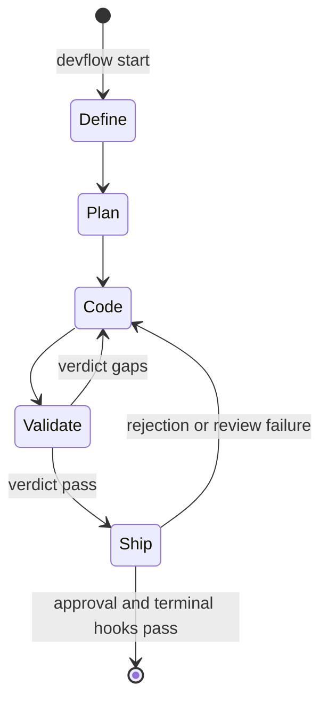

# State Machine

DevFlow persists one state file per active phase and walks a fixed pipeline.

| Stage | Primary result | Human interaction |
|---|---|---|
| `Define` | Context artifact | Failure opens a gate |
| `Plan` | Plan artifacts | Failure opens a gate |
| `Code` | Code plus configured external probes | Failure opens a gate |
| `Validate` | `DEVFLOW_RESULT` with `verdict: "pass"` or `"gaps"` | `supervise` mode gates before advance; gaps return to Code |
| `Ship` | Review with no Critical finding, then GSD ship work | Always pauses for merge approval |

## Persisted State

State lives at `.devflow/state-NN.json`; an old single `.devflow/state.json`
is migrated when read. The file records the current stage, phase, selected
agent, mode, gate status, start time, project root, and optional worktree.

`auto` gates at Ship and on unexpected failures. `supervise` adds a Validate
gate. Neither mode can bypass the terminal Ship approval.
