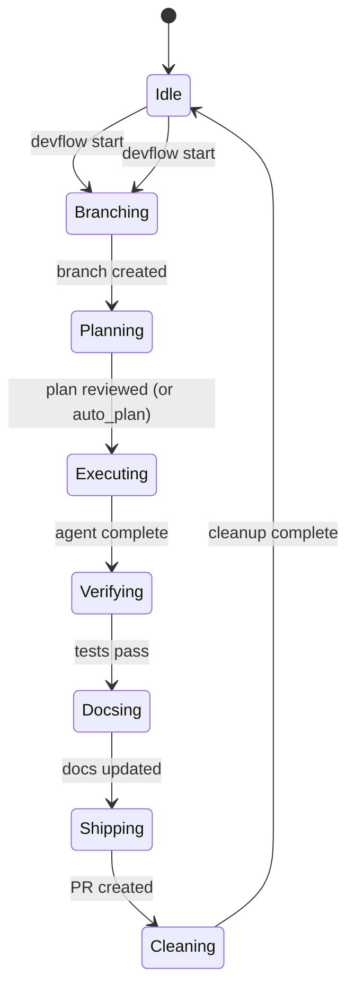

# State Machine

The workflow is a deterministic sequence of steps.

## Step Transitions



## Step Properties

| Step | Waits On | Skippable | Config Toggle |
|------|----------|-----------|---------------|
| `Idle` | — | No | — |
| `Branching` | Git branch creation | No | `auto_branch` |
| `Planning` | User review | Yes | `auto_plan` |
| `Executing` | Agent completion | No | — |
| `Verifying` | Test/lint pass | Yes | `auto_verify` |
| `Docsing` | Doc generation | Yes | `auto_docs` |
| `Shipping` | PR creation | Yes | `auto_ship` |
| `Cleaning` | Worktree/branch cleanup | No | `auto_cleanup` |

## State Serialization

State is serialized to `.devflow/state.json`:

```json
{
  "step": "Executing",
  "phase": 3,
  "agent": "Claude",
  "pids": [12345],
  "label": "Add monitor module",
  "project_root": "/home/user/project",
  "worktree": null
}
```

## Gate Modes

- **`auto`** — gates advance automatically when conditions are met
- **`manual`** — gates pause until `devflow check` is called (or user confirms)
- **`continue_on_error`** — when true, errors are non-fatal and the pipeline continues
