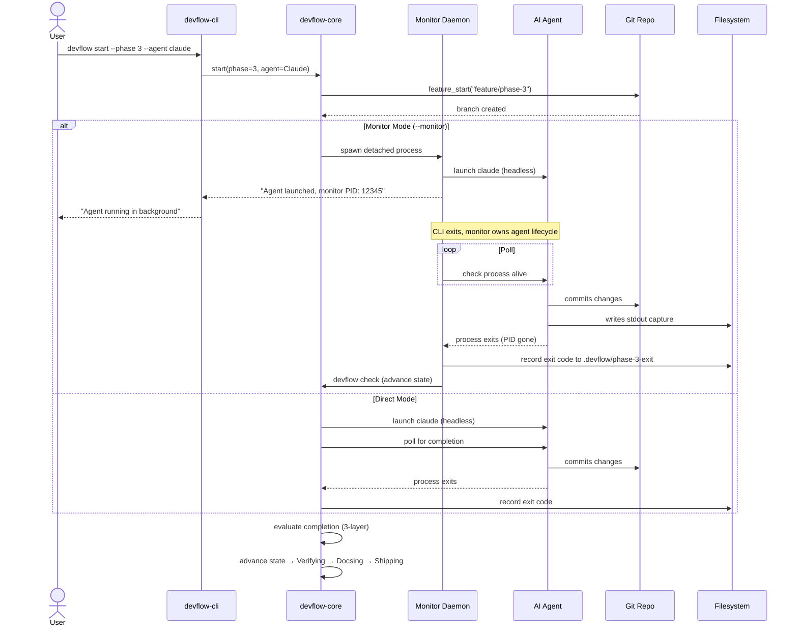
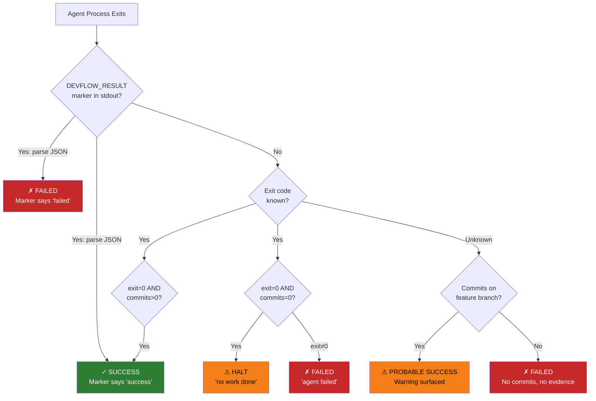

# Agent Lifecycle

How DevFlow launches, monitors, and evaluates AI coding agents.

## Lifecycle Sequence



## Three-Layer Evaluation



## Agent Trait

All agents implement a shared interface:

```rust
pub trait Agent {
    fn name(&self) -> &str;
    fn kind(&self) -> AgentKind;
    fn exec_command(&self, phase: u32) -> (String, Vec<String>);
    fn completion_signal_detected(&self, output: &str) -> bool;
}
```

| Method | Purpose |
|--------|---------|
| `name()` | Human-readable name ("Claude Code") |
| `kind()` | Enum variant for matching/dispatch |
| `exec_command()` | Returns (program, args) for headless launch |
| `completion_signal_detected()` | Scans agent output for completion markers |

## DEVFLOW_RESULT Protocol

Agents signal completion by emitting a JSON marker to stdout:

```json
DEVFLOW_RESULT: {"status": "success", "commits": 3, "summary": "added tests for monitor module"}
```
