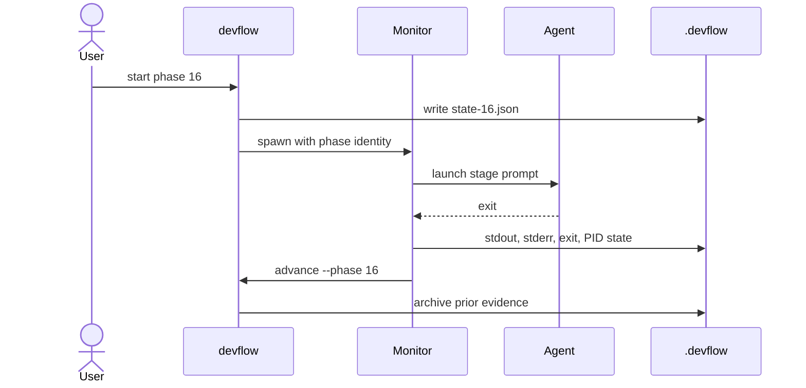
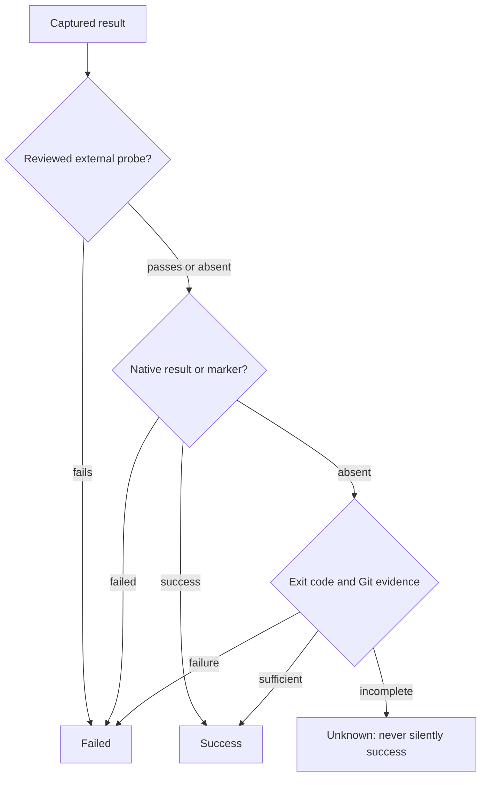

# Agent Lifecycle

Each phase uses a detached monitor so the agent can finish after the invoking
terminal exits.

## Completion Evidence

An external verification probe is allowed only when its exact command was
reviewed and supplied by the parent process. Validate additionally requires a
`pass` or `gaps` verdict; Ship reads its review artifact before it can proceed.
