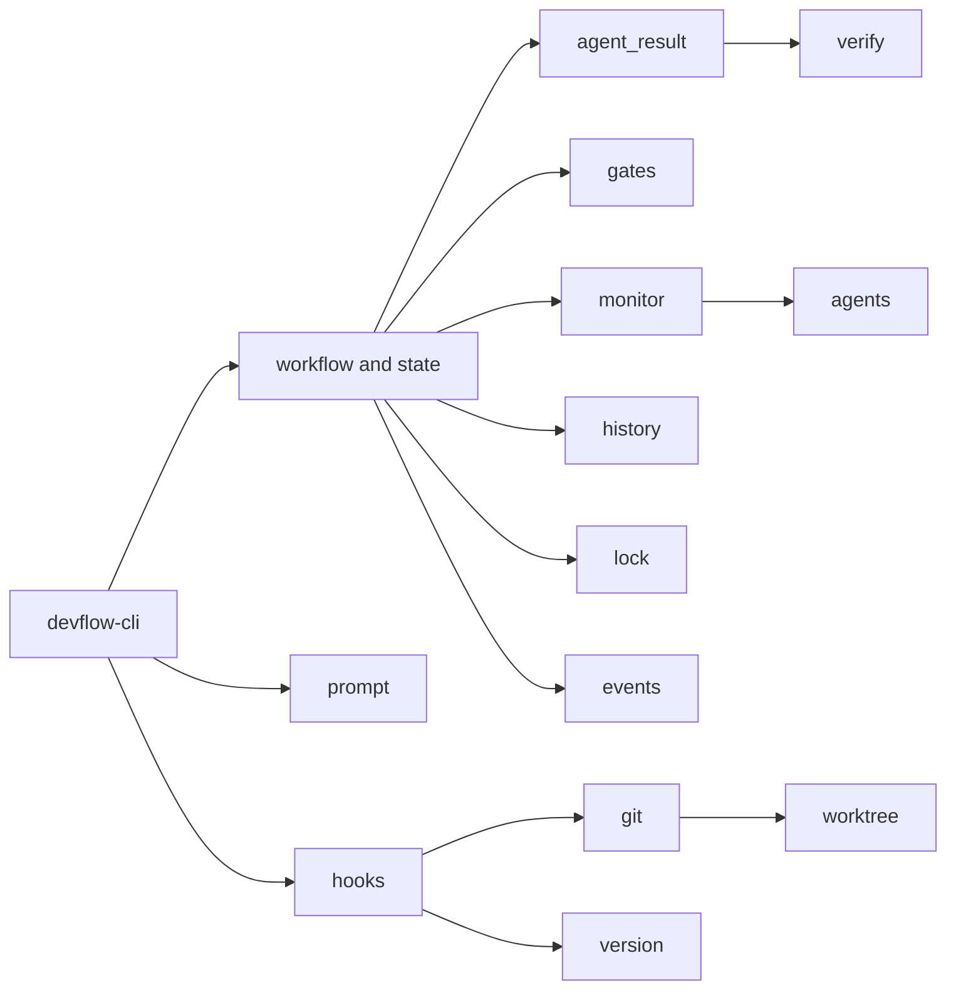

# Module Map

The core crate keeps workflow concerns in focused modules.

| Area | Modules | Role |
|---|---|---|
| State and control | `state`, `stage`, `workflow`, `lock` | Persist and safely advance each phase |
| Agent execution | `agents`, `prompt`, `monitor`, `agent_result` | Build prompts, launch agents, capture and evaluate outcomes |
| Reliability | `verify`, `history`, `events`, `gates`, `recover` | External probes, durable evidence, operations visibility, recovery |
| Git lifecycle | `git`, `worktree`, `hooks`, `version`, `ship` | Branches, worktrees, terminal hooks, versioning, and rate-limit metadata |
| Configuration | `config` | Minimal `devflow.toml` reliability knobs |

`devflow-core` does not depend on the CLI. The CLI composes these modules and
owns terminal-facing command parsing and presentation.
