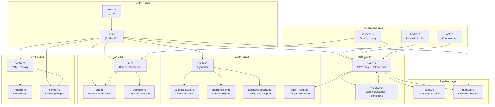
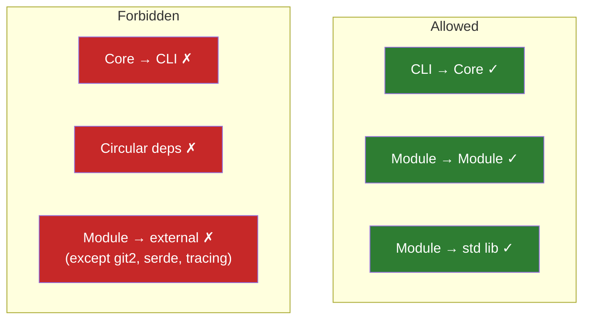

# Module Map

Internal dependency graph of `devflow-core` modules.

## Core Module Dependencies

## Dependency Rules

## External Dependencies

| Crate | Purpose | Module |
|-------|---------|--------|
| `clap` | CLI argument parsing | `devflow-cli` |
| `serde` / `serde_json` | State serialization | `workflow.rs` |
| `git2` | Git operations | `git.rs` |
| `tracing` / `tracing-subscriber` | Structured logging | all modules |
| `tempfile` | Test isolation | tests |
| `chrono` | Timestamps | `state.rs` |

## File Sizes

| File | Lines | Purpose |
|------|-------|---------|
| `main.rs` | ~600 | CLI dispatch |
| `git.rs` | ~400 | Git operations |
| `monitor.rs` | ~350 | Daemon |
| `ship.rs` | ~300 | Release workflow |
| `workflow.rs` | ~250 | State persistence |
| `state.rs` | ~200 | State machine |
| `agent.rs` | ~150 | Agent trait |
| `config.rs` | ~200 | YAML config |
| `worktree.rs` | ~150 | Worktree ops |
| `agent_result.rs` | ~100 | 3-layer eval |
| `gates.rs` | ~80 | Stage gates |
| `prompt.rs` | ~80 | Shared prompts |
| `version.rs` | ~80 | SemVer |
| `recover.rs` | ~80 | State recovery |
| `hooks.rs` | ~60 | Lifecycle hooks |
| `lock.rs` | ~60 | Concurrency |
