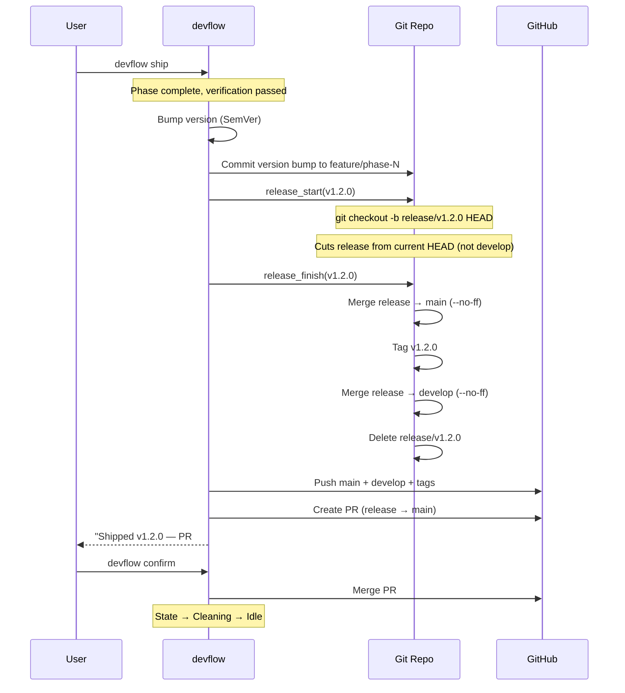
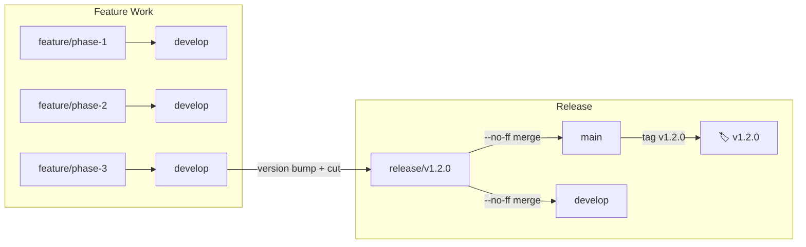

# Ship Flow

Git-flow release process from version bump to merged PR.

## Release Workflow



## Branch Strategy

```mermaid
gitGraph
    commit id: "main: v1.1.0"
    branch develop
    checkout develop
    commit id: "merge feat-A"
    commit id: "merge feat-B"
    branch feature/phase-3
    checkout feature/phase-3
    commit id: "Phase 3: impl"
    commit id: "Phase 3: tests"
    checkout develop
    merge feature/phase-3
    commit id: "version bump"
    branch release/v1.2.0
    checkout release/v1.2.0
    checkout main
    merge release/v1.2.0 tag: "v1.2.0"
    checkout develop
    merge release/v1.2.0
```

## Version Flow



## Ship States

| State | Action | Reversible? |
|-------|--------|-------------|
| `Shipped` | Version bumped, release branch created, PR opened | Yes → `devflow rejectpr` |
| `Confirmed` | PR merged to main, tags pushed | No (history is immutable) |
| `Rejected` | PR closed, release branch deleted, version reverted | No (clean slate) |

## Last-Ship Recovery

`devflow ship` writes `.devflow/last-ship.json`:

```json
{
  "version": "1.2.0",
  "pr_number": 42,
  "feature_branch": "feature/phase-3",
  "release_branch": "release/v1.2.0"
}
```

This enables `devflow rejectpr` to unwind a shipped-but-unmerged release.
