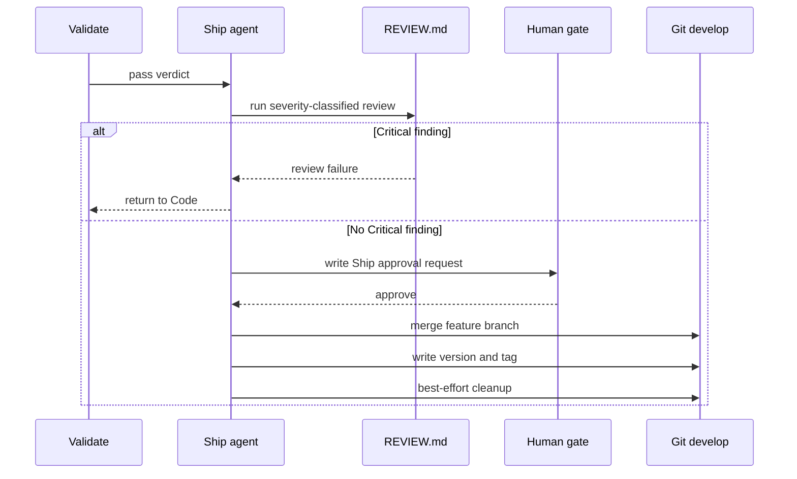

# Ship Flow

Ship is a stage with a mandatory human merge gate, not a standalone command.

## Terminal Guarantees

- A failed merge stops terminal bookkeeping and reopens an actionable Ship gate.
- The version is computed after the feature branch has been merged into `develop`.
- A missing feature branch is not treated as proof of a merge.
- Branch cleanup never force-deletes unmerged work.

PR creation belongs to the GSD Ship workflow. DevFlow records the gate and
proves the local terminal Git effects.
