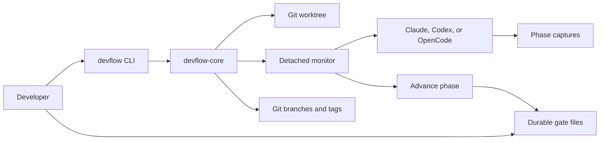
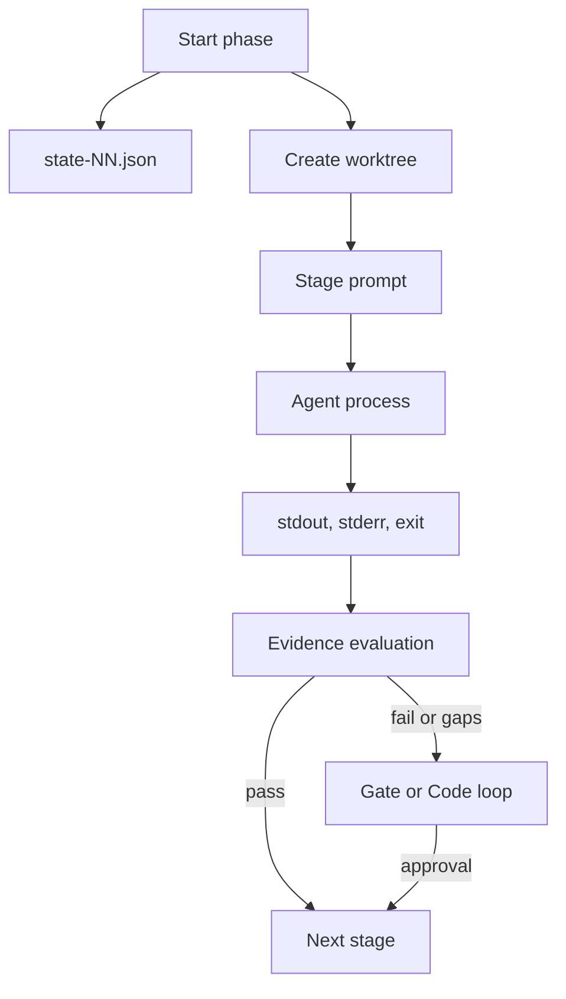

# System Architecture

DevFlow separates operator interaction from reusable workflow mechanics.

## Components

| Component | Responsibility |
|---|---|
| `devflow-cli` | Commands, stage transitions, status, logs, and gate responses |
| `devflow-core` | State, prompts, adapters, result evaluation, Git operations, hooks, history, and recovery |
| Detached monitor | Owns the agent process, captures output, records exit status, and advances its phase |
| `.devflow/` | Per-phase state, gate request/response files, event log, captures, and archived evidence |
| `.worktrees/` | Isolated execution directories for phase agents |

The primary checkout owns workflow state and terminal Git mutations. The
worktree is the execution location for an agent, not a second source of truth.

## Data Flow

