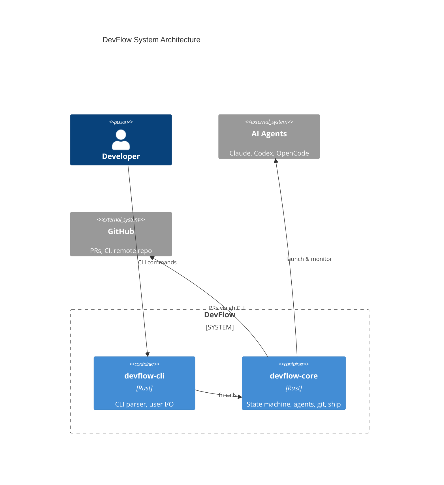
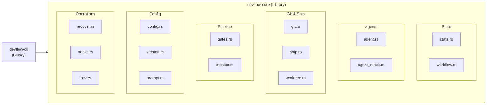
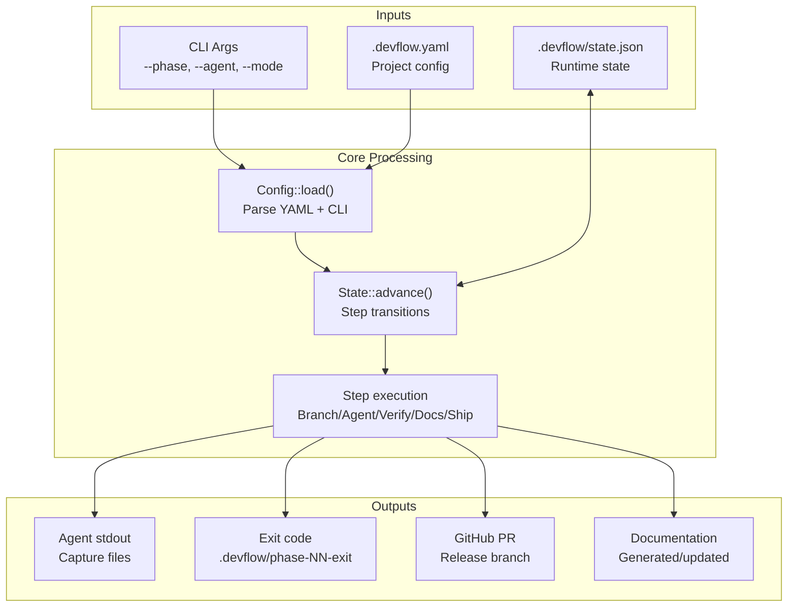

# System Architecture

C4 Container diagram showing DevFlow's runtime components and their relationships.

## Crate Structure

## Module Groups

| Group | Modules | Purpose |
|-------|---------|---------|
| **State** | `state.rs`, `workflow.rs` | Step transitions + JSON persistence |
| **Agents** | `agent.rs`, `agent_result.rs` | Agent trait + 3-layer evaluation |
| **Git & Ship** | `git.rs`, `ship.rs`, `worktree.rs` | Branch/release ops, version bump, worktree isolation |
| **Pipeline** | `gates.rs`, `monitor.rs` | Auto/manual gates, daemon process |
| **Config** | `config.rs`, `version.rs`, `prompt.rs` | YAML parsing, SemVer, shared prompts |
| **Operations** | `recover.rs`, `hooks.rs`, `lock.rs` | Recovery, lifecycle hooks, concurrency |

## Data Flow

## Key Design Patterns

| Pattern | Implementation |
|---------|---------------|
| **Agent trait** | `Agent` trait with `name()`, `exec_command()`, `completion_signal_detected()` |
| **State machine** | Deterministic `Step::next()` transitions, serialized to JSON |
| **Strategy pattern** | Agent adapters isolated behind trait, selected by `AgentKind` enum |
| **Observer** | Monitor daemon watches agent process, triggers `devflow check` on exit |
| **Command pattern** | Each CLI subcommand delegates to a core function with clear inputs/outputs |
