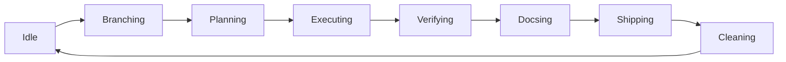

# DevFlow

**Agent-agnostic development workflow automation.**

DevFlow automates the mechanical steps of AI-assisted development — branching, monitoring, verifying, documenting, shipping — so you and your coding agents can focus on building.

## Pipeline Overview

## Quick Links

- [System Architecture](diagrams/system.md) — High-level component diagram
- [State Machine](architecture/state-machine.md) — Workflow steps and transitions
- [Agent Model](architecture/agent-model.md) — How agents integrate
- [Ship Flow](diagrams/ship-flow.md) — Git-flow release process
- [Adding an Agent](guides/adding-agent.md) — Extension guide

## Supported Agents

| Agent | CLI | Flag |
|-------|-----|------|
| Claude Code | `claude` | `--agent claude` |
| OpenAI Codex | `codex` | `--agent codex` |
| OpenCode | `opencode` | `--agent opencode` |

## Key Design Decisions

- **Agent-agnostic** — All agents implement the same `Agent` trait
- **Worktree isolation** — Agents run in isolated git worktrees
- **Monitor daemon** — Detached process owns agent lifecycle, no cron/polling
- **Three-layer evaluation** — Agent results evaluated by marker → exit code → heuristic
- **Shared prompts** — All agents receive identical prompt text
