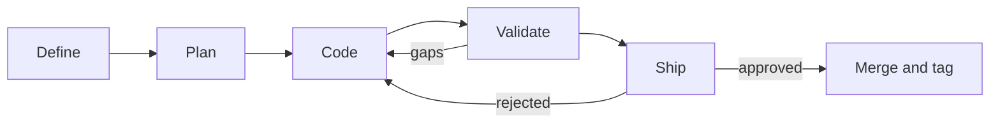

# DevFlow

**A durable execution loop for AI-assisted development.** DevFlow runs a
phase through planning, implementation, validation, and human-approved
shipping while preserving the evidence needed to understand what happened.

## Pipeline Overview

Define, Plan, and Code launch an agent in an isolated worktree. Validate
requires an explicit pass verdict. Ship runs review and always pauses for a
human decision before DevFlow performs terminal Git operations.

## Quick Links

- [System Architecture](diagrams/system.md) — Runtime components and boundaries
- [State Machine](architecture/state-machine.md) — Stages, verdicts, and gates
- [Agent Model](architecture/agent-model.md) — Adapters and completion evidence
- [Ship Flow](diagrams/ship-flow.md) — Review, approval, and terminal hooks
- [Quick Start](guides/quickstart.md) — Install and operate DevFlow

## Supported Agents

| Agent | CLI | Flag |
|-------|-----|------|
| Claude Code | `claude` | `--agent claude` |
| OpenAI Codex | `codex` | `--agent codex` |
| OpenCode | `opencode` | `--agent opencode` |

## Key Design Decisions

- **Agent-agnostic** — Claude Code, Codex, and OpenCode implement one adapter contract.
- **Worktree-first** — each phase runs in its own Git worktree by default.
- **Evidence-first** — external probes, agent results, exits, and Git state are evaluated in order.
- **Never-silent failures** — failures open an actionable gate instead of stalling invisibly.
- **Durable operations** — phase state, captures, review artifacts, gates, and history survive restarts.
